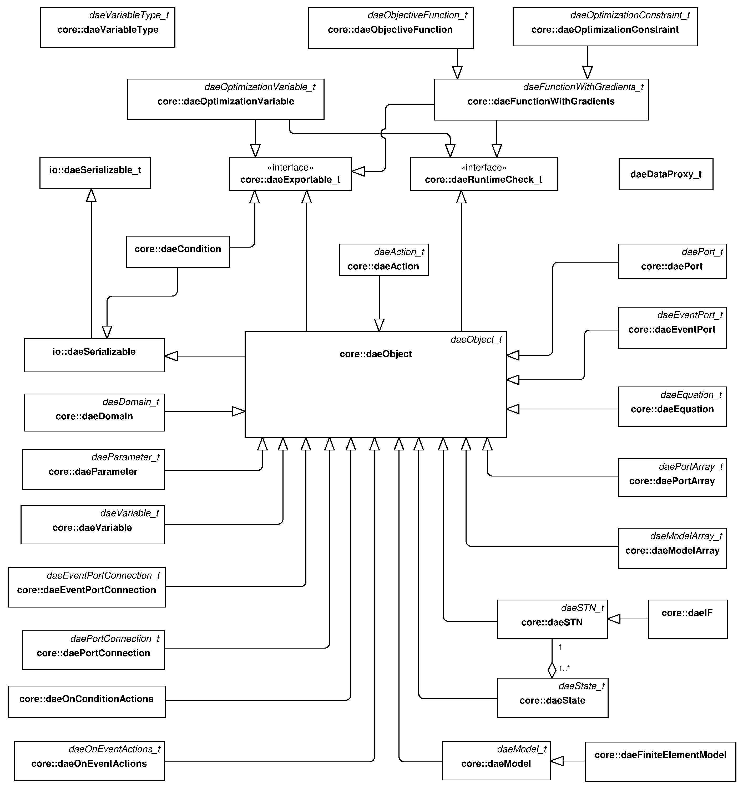
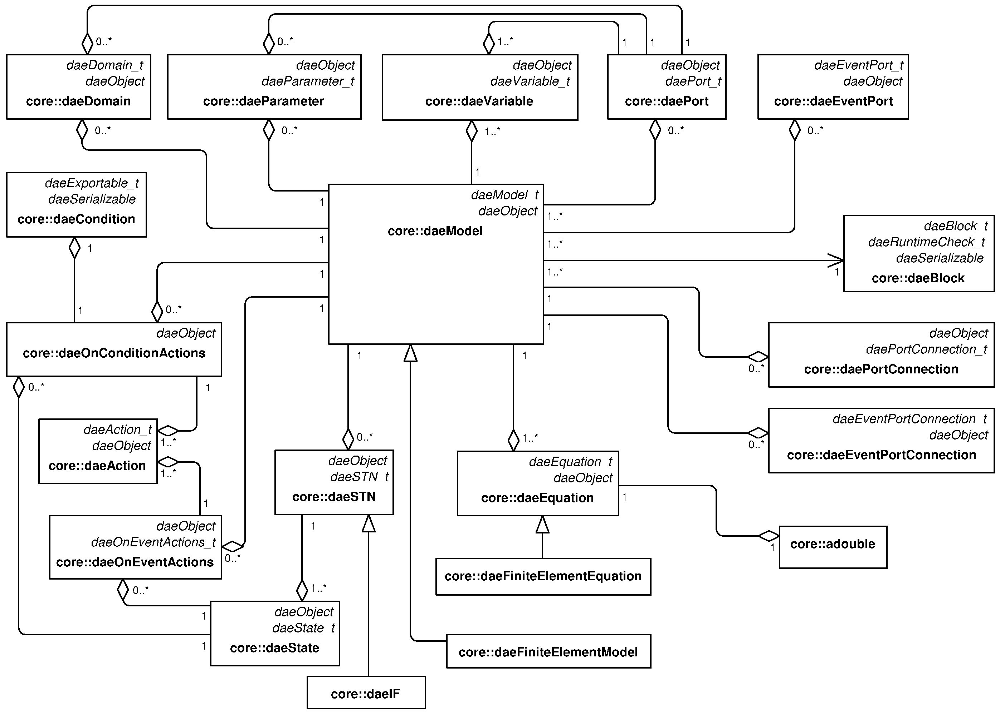
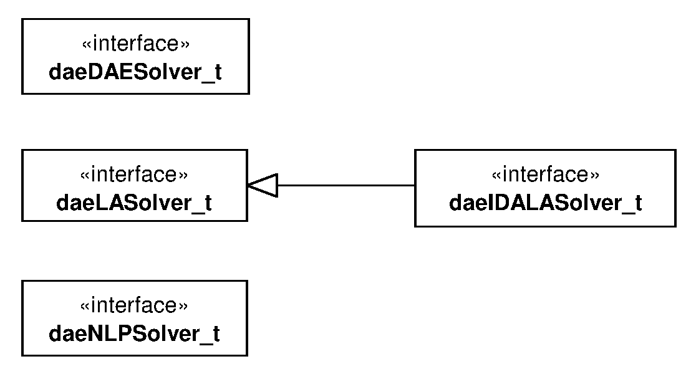
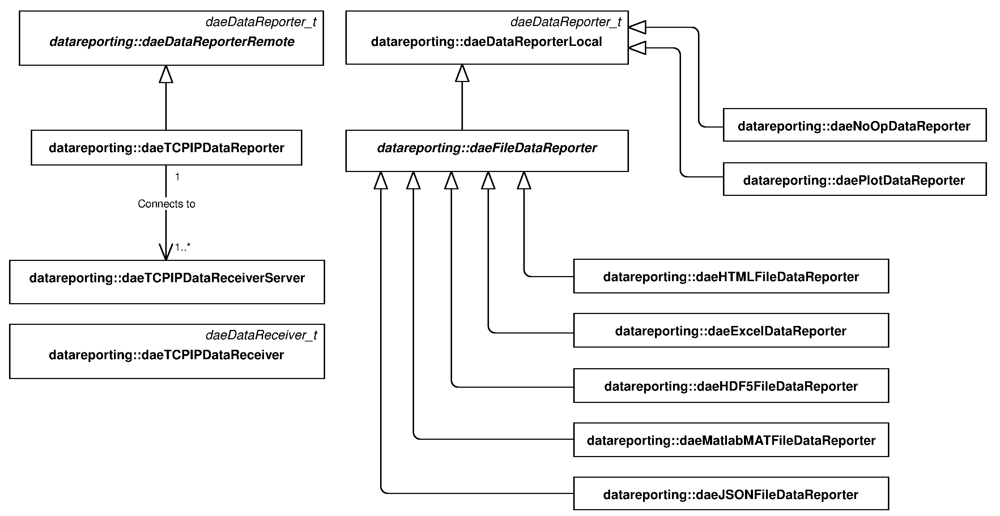
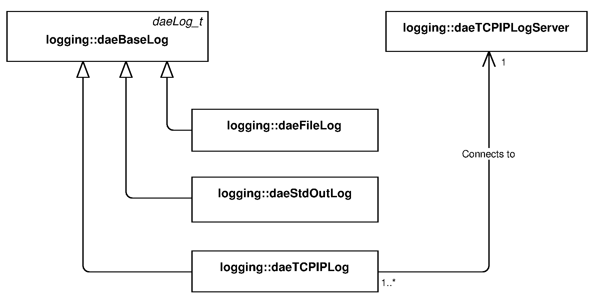

.. _architecture:

************
Architecture
************
..
    Copyright (C) Dragan Nikolic, 2016
    DAE Tools is free software; you can redistribute it and/or modify it under the
    terms of the GNU General Public License version 3 as published by the Free Software
    Foundation. DAE Tools is distributed in the hope that it will be useful, but WITHOUT
    ANY WARRANTY; without even the implied warranty of MERCHANTABILITY or FITNESS FOR A
    PARTICULAR PURPOSE. See the GNU General Public License for more details.
    You should have received a copy of the GNU General Public License along with the
    DAE Tools software; if not, see <http://www.gnu.org/licenses/>.

DAE Tools consists of six packages: :py:mod:`core<pyCore>`, :py:mod:`activity <pyActivity>`, :py:mod:`solvers <pyIDAS>`,
:py:mod:`datareporting <pyDataReporting>`, :py:mod:`logging <pyCore>`, and :py:mod:`units <pyUnits>`.
All packages provide a set of interfaces (abstract classes) that define the required functionality.
Interfaces are realised by the implementation classes.
The implementation classes share the same name with the interface they realise
with the suffix *\_t* dropped (i.e. the class *daeVariable* implements interface *daeVariable\_t*).

Package “core”
--------------

This package contains the key modelling concepts. The class diagram with interfaces (abstract classes) and their
interdepedency is presented in :ref:`Figure-Arch-1`. The key modelling concepts in DAE Tools are given in :ref:`Table-Arch-1`.
Interface realisations are given in :ref:`Figure-Arch-2`.

.. _Figure-Arch-1:
.. figure:: _static/architecture_1.png
   :width: 600 pt
   :figwidth: 650 pt
   :align: center

   UML class diagram: the **core** package interfaces

.. _Table-Arch-1:
.. list-table:: The key modelling concepts in DAE Tools
    :widths: 20 20 80
    :header-rows: 1

    * - Concept
      - Implementation class
      - Description
    * - *daeVariableType\_t*
      - :py:class:`~pyCore.daeVariableType`
      - Defines a variable type that has the units, lower and upper bounds, a default value and an absolute tolerance
    * - *daeDomain\_t*
      - :py:class:`~pyCore.daeDomain`
      - Defines ordinary arrays or spatial distributions such as structured and unstructured grids;
        parameters, variables, equations and even models and ports can be distributed on domains
    * - *daeParameter\_t*
      - :py:class:`~pyCore.daeParameter`
      - Defines time invariant quantities that do not change during a simulation, such as
        a physical constant, number of discretisation points in a domain etc.
    * - *daeVariable\_t*
      - :py:class:`~pyCore.daeVariable`
      - Defines time varying quantities that change during a simulation
    * - *daePort\_t*
      - :py:class:`~pyCore.daePort`
      - Defines connection points between model instances for exchange of continuous
        quantities; similar to the models, ports can contain domains, parameters and variables
    * - *daeEventPort\_t*
      - :py:class:`~pyCore.daeEventPort`
      - Defines connection points between model instances for exchange of discrete messages/events;
        events can be triggered manually or when a specified condition is satisfied;
        the main difference between event and ordinary ports is that the former allow a discrete
        communication between models while latter allow a continuous exchange of information
    * - *daePortConnection\_t*
      - :py:class:`~pyCore.daePortConnection`
      - Defines connections between two ports
    * - *daeEventPortConnection\_t*
      - :py:class:`~pyCore.daeEventPortConnection`
      - Defines connections between two event ports
    * - *daeEquation\_t*
      - :py:class:`~pyCore.daeEquation`
      - Defines model equations given in an implicit/acausal form
    * - *daeSTN\_t*
      - :py:class:`~pyCore.daeSTN`, :py:class:`~pyCore.daeIF`
      - Defines state transition networks used to model discontinuous equations, that is equations that
        take different forms subject to certain conditions; symmetrical/non-symmetrical and
        reversible/irreversible state transitions are supported
    * - *daeOnConditionActions\_t*
      - :py:class:`~pyCore.daeOnConditionActions`
      - Defines actions to be performed when a specified condition is satisfied
    * - *daeOnEventActions\_t*
      - :py:class:`~pyCore.daeOnEventActions`
      - Defines actions to be performed when an event is triggered on the specified event port
    * - *daeState\_t*
      - :py:class:`~pyCore.daeState`
      - Defines a state in a state transition network; contains equations and on\_event/condition action handlers
    * - *daeModel\_t*
      - :py:class:`~pyCore.daeModel`
      - Represents a model

.. _Figure-Arch-2:

   UML class diagram: the **core** package interface implementations

Models in DAE Tools are represented by the :py:class:`~pyCore.daeModel` class and contain the following elements: domains,
parameters, variables, equations, state transition networks, ports, event ports, actions to be performed when a given
condition is satisfied, actions to be performed when an event is triggered on a given event port, and components
(instances of other models, used to form a hierarchy of models). The :py:class:`~pyCore.daeModel` UML class diagram
is presented in :ref:`Figure-Arch-3`.

.. _Figure-Arch-3:

   UML class diagram: *daeModel* class

Package “activity”
------------------

This package contains interfaces that define an API for activities that can be performed on developed
models. To date, only two interfaces are defined and implemented:
:py:class:`~pyActivity.daeSimulation_t` (defines a functionality used to perfom simulations) and
:py:class:`~pyActivity.daeOptimization_t` (defines a functionality used to perform optimisations).

Package “solvers”
-----------------

This package contains interfaces that define an API for numerical solution of systems of differential
algebraic equations (DAE), systems of linear equations (LA), and (mixed-integer) nonlinear programming problems
(NLP or MINLP), and auxiliary classes. The class diagram with the defined interfaces is presented in :ref:`Figure-Arch-4`.

.. _Figure-Arch-4:

   UML class diagram: the **solvers** package interfaces

.. _Table-2:
.. list-table:: The key concepts in the **solvers** pakage
    :widths: 40 80
    :header-rows: 1

    * - Concept
      - Description
    * - *daeDAESolver\_t*
      - Defines a functionality for the solution of DAE systems
    * - *daeNLPSolver\_t*
      - Defines a functionality for the solution of (MI)NLP problems
    * - *daeLASolver\_t*
      - Defines functionality for the solution of systems of linear equations
    * - *daeIDALASolver\_t*
      - Derived from *daeLASolver\_t,* used by Sundials IDAS linear solvers

Interface realizations are given in :ref:`Figure-Arch-5`.
Current implementations include Sundials IDAS DAE solver, IPOPT, BONMIN and NLOPT (MI)NLP
solvers and SuperLU, SuperLU_MT, PARDISO, Intel PARDISO and Trilinos (Amesos and AztecOO) sparse matrix linear
solvers. Since all these linear equation solvers use different sparse matrix representations, a generic interface
(template :cpp:class:`daeMatrix\<typename FLOAT\>`) has been developed for the basic
operations performed by DAE Tools software such as setting/getting the values and obtaining the matrix properties. This
way, DAE Tools objects can access the matrix data in a generic fashion while hiding the internal implementation
details. To date, three matrix types have been implemented:
:cpp:class:`daeDenseMatrix`, :cpp:class:`daeLapackMatrix` (basically wrappers around C/C++ and Fortran
two-dimensional arrays), a template class :cpp:class:`daeSparseMatrix\<typename FLOAT, typename INT\>` (sparse matrix)
and its realization :cpp:class:`daeCSRMatrix\<typename FLOAT, typename INT\>` implementing the compressed row storage
(CSR) sparse matrix representation.

.. _Figure-Arch-5:
.. figure:: _static/architecture_5.png
   :width: 400 pt
   :figwidth: 450 pt
   :align: center

   UML class diagram: the **solvers** package interface implementations

Package “datareporting”
-----------------------

This package contains interfaces that define an API for processing of simulation results by the *daeSimulation_t*
and *daeDAESolver\_t* classes, and the data structures available to access those data by the users.
Two interfaces are defined:
*daeDataReporter\_t* (defines a functionality used by a simulation object to report the simulation results) and
*daeDataReceiver_t* (defines a functionality/data structures for accessing the simulation results).
A number of data reporters have been developed for:
(a) sending the results via TCP/IP protocol to the DAE Tools Plotter application (:py:class:`~pyDataReporting.daeTCPIPDataReporter`),
(b) plotting the results using the Matplotlib Python library (:py:class:`~pyDataReporting.daePlotDataReporter`), and
(c) exporting the results to various file formats (such as Matlab MAT, Microsoft Excel, html, xml, json and HDF5).
An overview of the implemented classes is given in :ref:`Figure-Arch-6`.

.. _Figure-Arch-6:

   UML class diagram: the **datareporting** package interface implementations

Package “logging”
-----------------

This package contains only one interface *daeLog\_t* that define an API for sending messages from
the simulation to the user. Interface realizations are given in :ref:`Figure-Arch-7`. Three implementations exist:
:py:class:`~pyCore.daeStdOutLog` (prints messages to the standard output),
:py:class:`~pyCore.daeFileLog` (stores messages to the specified text file), and
:py:class:`~pyCore.daeTCPIPLog` (sends messages via TCP/IP protocol to the :py:class:`~pyCore.daeTCPIPLogServer`;
used when a simulation is running on a remote computer).

.. _Figure-Arch-7:

   UML class diagram: the **logging** interface implementations

Package “units”
---------------

Parameters and variables in DAE Tools have a numerical value in terms of a unit of measurement (quantity) and
units-consistency of equations and logical conditions is strictly enforced (although it can be switched off, if
required). The package contains only two classes: :py:class:`~pyUnits.unit` and :py:class:`~pyUnits.quantity`.
Both classes have overloaded operators +, -, \*, / and \*\* to support creation of derived units
and operations on quantities that contain a numerical value and units. In addition, the package defines the basic
mathematical functions that operate on :py:class:`~pyUnits.quantity` objects (such as *sin*, *cos*, *tan*,
*sqrt*, *pow*, *log*, *log10*, *exp*, *min*, *max*, *floor*, *ceil*, *abs* etc.).
