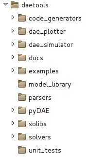
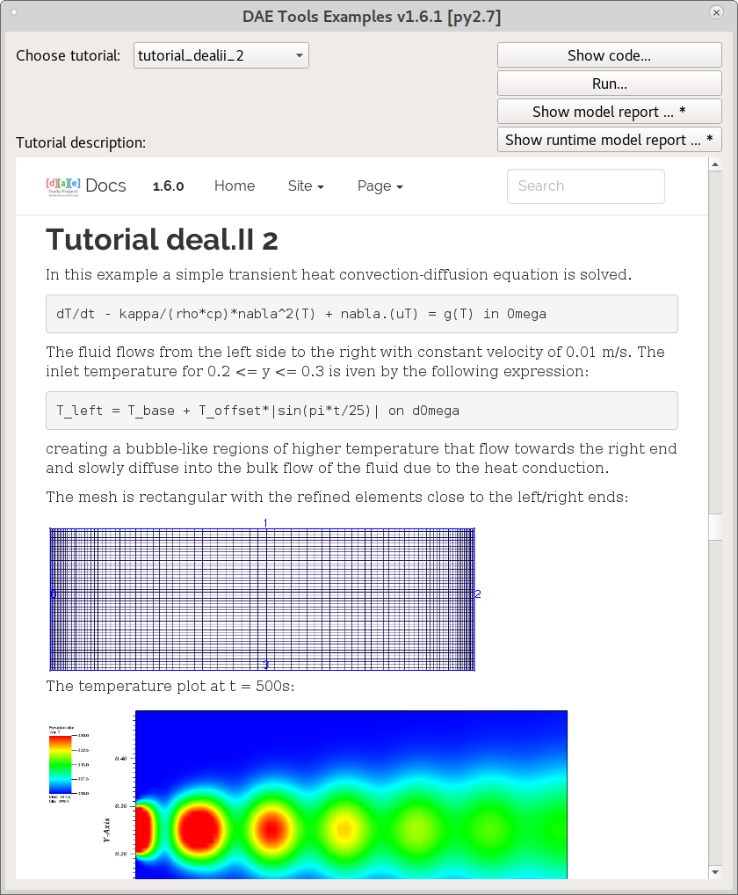
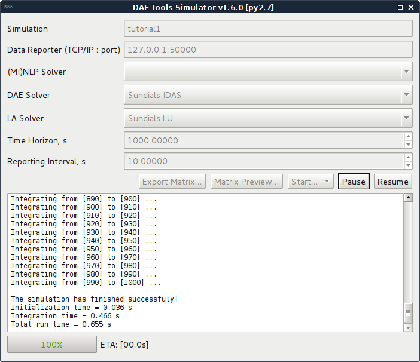
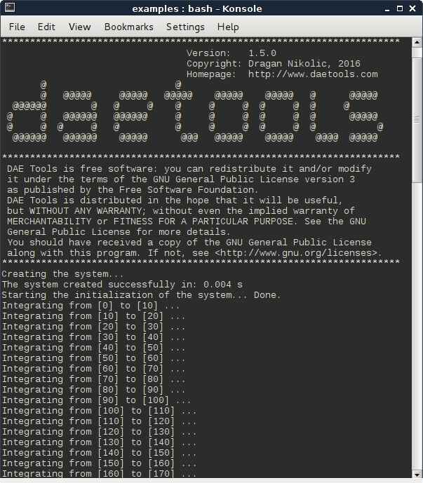
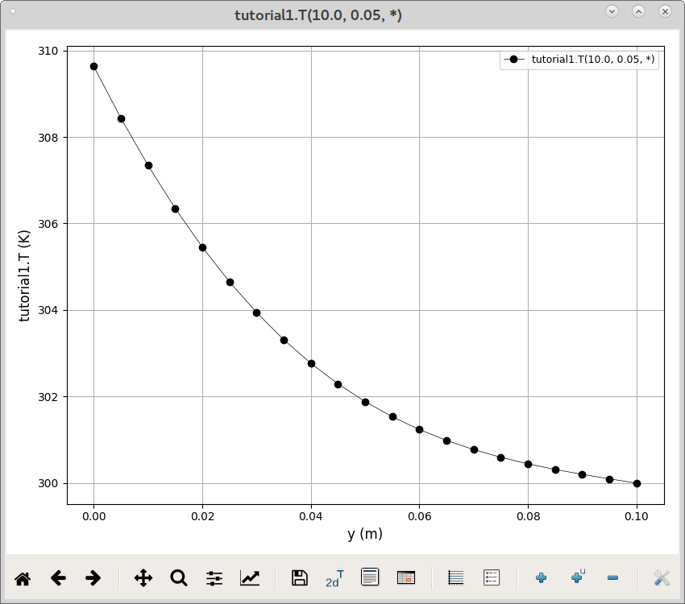
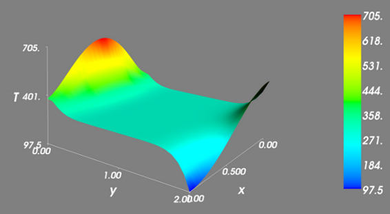

******************************
Getting Started with DAE Tools
******************************
..
    Copyright (C) Dragan Nikolic, 2016
    DAE Tools is free software; you can redistribute it and/or modify it under the
    terms of the GNU General Public License version 3 as published by the Free Software
    Foundation. DAE Tools is distributed in the hope that it will be useful, but WITHOUT
    ANY WARRANTY; without even the implied warranty of MERCHANTABILITY or FITNESS FOR A
    PARTICULAR PURPOSE. See the GNU General Public License for more details.
    You should have received a copy of the GNU General Public License along with the
    DAE Tools software; if not, see <http://www.gnu.org/licenses/>.

.. |br| raw:: html

    

This chapter gives the basic information about exploring examples/tutorials,
developing models, defining and running a simulation and plotting the simulation results.

**DAE Tools** (pyDAE module) is installed in ``daetools`` folder within ``site-packages`` (or ``dist-packages``)
folder under python. The structure of the folders is the following:

Running tutorials
=================

1. Start ``DAE Plotter``:

   * GNU/Linux:

     Run ``Applications/Development/daetools Plotter`` from the system menu or execute the following shell command:

     .. code-block:: bash

        daeplotter
      
   * MacOS:

     Execute the following shell command:

     .. code-block:: bash

        daeplotter

   * Windows:

     Run i.e. ``Start/Programs/DAE Tools/daePlotter_1.5.0_py27`` from the Start menu.

   The ``DAE Tools Plotter`` main window should appear (given in :numref:`Figure-GetStarted-1`)

   .. _Figure-GetStarted-1:
   .. figure:: _static/Screenshot-DAEPlotter.png
      :width: 250 pt
      :figwidth: 300 pt
      :align: center

      DAE Tools Plotter main window.

2. Start ``DAE Tools Tutorials`` program to try some examples:

   * GNU/Linux:

     Run ``Applications/Development/daetools Examples`` from the system menu or execute the following shell command:

     .. code-block:: bash

        daeexamples

   * MacOS:

     Execute the following shell command:

     .. code-block:: bash

        daeexamples

   * Windows:

     Run i.e. ``Start/Programs/DAE Tools/daeExamples_1.5.0_py27`` from the Start menu.

The main window of ``DAE Tools Examples`` application is given in :numref:`Figure-GetStarted-2a` while
the output from the simulation run in :numref:`Figure-GetStarted-2b`. There, tutorials can be run, their source code
inspected, and model reports generated.
Model reports open in a new window of the system's default web browser.

.. _Figure-GetStarted-2a:

   DAE Tools Examples main window

.. _Figure-GetStarted-2b:

   A typical optimization output from DAE Tools

Tutorials can also be started from the shell:

.. code-block:: bash

    cd /usr/local/lib/python2.7/dist-packages/daetools/examples
    # Or in windows:
    # cd C:\PythonX.Y\Lib\site-packages\daetools\examples
    
    python tutorial1.py console
    # or
    python tutorial1.py gui

The sample output is given in :numref:`Figure-GetStarted-3`:

.. _Figure-GetStarted-3:

   Shell output from the simulation

Processing the results
======================

DAE Tools provide a protocol for reporting the simulation results. It uses a concept of **data reporter** and
**data receiver** interfaces. **Data reporter** interface is used by a simulation to send the data, while the
**data receiver** interface is used to receive, store and provide the data to users.
There are two types of data reporters: local (store data locally) and remote (send data to a server,
i.e. via TCP/IP protocol).

There are three ways to obtain the results from the simulation:

* Through DAE Tools Plotter GUI
* Programmatically, using one of many different types of local data reporters
* Develop a custom user-defined data reporter by creating one of bese classes (daeDataReporter_t,
  daeDataReporterLocal, daeDataReporterFile)

DAE Tools Plotter
-----------------

The simulation/optimization results can be easily plotted using the **DAE Tools Plotter** application.
Three types of plots are supported: 2D, animated 2D and 3D plots.
After choosing a desired type, a **Choose variable** (given in :numref:`Figure-GetStarted-5`)
dialog appears where a variable to be plotted can be selected and information about domains
specified - some domains should be fixed while leaving another free by selecting ``*`` from the list
(to create a 2D plot one domain must remain free, while for a 3D plot two domains).

.. _Figure-GetStarted-5:
.. figure:: _static/Screenshot-ChooseVariable.png
    :width: 350 pt
    :figwidth: 400 pt
    :align: center

    Choose variable dialog for a 2D plot

Typical 2D and 3D plots are given in :numref:`Figure-GetStarted-6` and :numref:`Figure-GetStarted-7`.

.. _Figure-GetStarted-6:

    Example 2D plot (produced by Matplotlib)

.. _Figure-GetStarted-7:

    Example 3D plot (produced by Mayavi2)

2D plots can be saved as templates (.pt files) which store the information in JSON format.
  .. code-block:: javascript

      {
        "curves": [
            [
            "tutorial4.T",
            [
                -1
            ],
            [
                "*"
            ],
            "tutorial4.T(*)",
            {
                "color": "black",
                "linestyle": "-",
                "linewidth": 0.5,
                "marker": "o",
                "markeredgecolor": "black",
                "markerfacecolor": "black",
                "markersize": 6
            }
            ]
        ],
        "gridOn": true,
        "legendOn": true,
        "plotTitle": "",
        "updateInterval": 0,
        "windowTitle": "tutorial4.T(*)",
        "xlabel": "Time",
        "xmax": 525.0,
        "xmin": -25.0,
        "xscale": "linear",
        "xtransform": 1.0,
        "ylabel": "tutorial4.T",
        "ymax": 361.74772465755922,
        "ymin": 279.2499308975365,
        "yscale": "linear",
        "ytransform": 1.0
      }

Getting the results programmatically
------------------------------------

There is a large number of custom data reporters. Some of them are listed below.

* Data reporters that export the results to a specified file format:

  * Matlab .mat file (daeMatlabMATFileDataReporter)
  * Excell .xls file (daeExcelFileDataReporter)
  * JSON format (daeJSONFileDataReporter)
  * XML file (daeXMLFileDataReporter)
  * HDF5 file (daeHDF5FileDataReporter)

* Other types of data reporters

  * Pandas dataset (daePandasDataReporter)
  * Quick matplotlib plots (daePlotDataReporter)

Models
======

Developing a model
------------------

In **DAE Tools** models are developed by deriving a new class from the base model class (:py:class:`~pyCore.daeModel`).
The process consists of two steps:

1. Declare all domains, parameters, variables, ports etc.:

   * In **pyDAE** declare and instantiate in the :py:meth:`~pyCore.daeModel.__init__` function
   * In **cDAE** declare as class data members and instantiate in the constructor

2. Declare equations and state transition networks in the :py:meth:`~pyCore.daeModel.DeclareEquations` function

An example model developed in **pyDAE** (using python programming language):

.. code-block:: python

    from daetools.pyDAE import *

    class myModel(daeModel):
        def __init__(self, name, parent = None, description = ""):
            daeModel.__init__(self, name, parent, description)

            # Declaration/instantiation of domains, parameters, variables, ports, etc:
            self.m     = daeParameter("m",       kg,           self, "Mass of the copper plate")
            self.cp    = daeParameter("c_p",     J/(kg*K),     self, "Specific heat capacity of the plate")
            self.alpha = daeParameter("&alpha;", W/((m**2)*K), self, "Heat transfer coefficient")
            self.A     = daeParameter("A",       m**2,         self, "Area of the plate")
            self.Tsurr = daeParameter("T_surr",  K,            self, "Temperature of the surroundings")

            self.Qin   = daeVariable("Q_in",  power_t,       self, "Power of the heater")
            self.T     = daeVariable("T",     temperature_t, self, "Temperature of the plate")

        def DeclareEquations(self):
            # Declaration of equations and state transitions:
            eq = self.CreateEquation("HeatBalance", "Integral heat balance equation")
            eq.Residual = self.m() * self.cp() * self.T.dt() - self.Qin() + self.alpha() * self.A() * (self.T() - self.Tsurr())

The same model developed in **cDAE** (using c++ programming language):

.. code-block:: cpp

    class myModel : public daeModel
    {
    public:
        // Declarations of domains, parameters, variables, ports, etc:
        daeParameter mass;
        daeParameter c_p;
        daeParameter alpha;
        daeParameter A;
        daeParameter T_surr;
        daeVariable Q_in;
        daeVariable T;

    public:
        myModel(string strName, daeModel* pParent = NULL, string strDescription = "")
          : daeModel(strName, pParent, strDescription),

          // Instantiation of domains, parameters, variables, ports, etc:
          mass  ("m",       kg,            this, "Mass of the copper plate"),
          c_p   ("c_p",     J/(kg*K),      this, "Specific heat capacity of the plate"),
          alpha ("&alpha;", W/((m^2) * K), this, "Heat transfer coefficient"),
          A     ("A",       m ^ 2,         this, "Area of the plate"),
          T_surr("T_surr",  K,             this, "Temperature of the surroundings"),
          Q_in  ("Q_in",    power_t,       this, "Power of the heater"),
          T     ("T",       temperature_t, this, "Temperature of the plate")
        {
        }

        void DeclareEquations(void)
        {
            // Declaration of equations and state transitions:
            daeEquation* eq = CreateEquation("HeatBalance", "Integral heat balance equation");
            eq->SetResidual( mass() * c_p() * T.dt() - Q_in() + alpha() * A() * (T() - T_surr()) );
        }
    };

More information about developing models can be found in :doc:`pyDAE_user_guide` and :py:class:`pyCore.daeModel`.
Also, do not forget to have a look on :doc:`tutorials`.

Simulation
==========

Setting up a simulation
-----------------------

Definition of a simulation in **DAE Tools** requires the following steps:

1. Deriving a new simulation class from the base simulation class (:py:class:`~pyActivity.daeSimulation`)

   * Specification of a model to be simulated
   * Setting the values of parameters
   * Fixing the degrees of freedom by assigning the values to certain variables
   * Setting the initial conditions for differential variables
   * Setting the other variables' information: initial guesses, absolute tolerances, etc
   * Specifation of an operating procedure. It can be either a simple run for a specified period of time (default) or
     a complex one where various actions can be taken during the simulation

2. Specify DAE and LA solvers

3. Specify a data reporter and a data receiver, and connect them

4. Set a time horizon, reporting interval, etc

5. Do the initialization of the DAE system

6. Save model report and/or runtime model report (to inspect expanded equations etc)

7. Run the simulation

An example simulation developed in **pyDAE**:

.. code-block:: python

    class mySimulation(daeSimulation):
        def __init__(self):
            daeSimulation.__init__(self)

            # Set the model to simulate:
            self.m = myModel("myModel")

        def SetUpParametersAndDomains(self):
            # Set the parameters values:
            self.m.cp.SetValue(385 * J/(kg*K))
            self.m.m.SetValue(1 * kg)
            self.m.alpha.SetValue(200 * W/((m**2)*K))
            self.m.A.SetValue(0.1 * m**2)
            self.m.Tsurr.SetValue(283 * K)

        def SetUpVariables(self):
            # Set the degrees of freedom, initial conditions, initial guesses, etc.:
            self.m.Qin.AssignValue(1500 * W)
            self.m.T.SetInitialCondition(283 * K)

        def Run(self):
            # A custom operating procedure, if needed.
            # Here we use the default one:
            daeSimulation.Run(self)

The same simulation in **cDAE**:

.. code-block:: cpp

    class mySimulation : public daeSimulation
    {
    public:
        myModel m;

    public:
        mySimulation(void) : m("myModel")
        {
            // Set the model to simulate:
            SetModel(&m);
        }

    public:
        void SetUpParametersAndDomains(void)
        {
            // Set the parameters values:
            model.c_p.SetValue(385 * J/(kg*K));
            model.mass.SetValue(1 * kg);
            model.alpha.SetValue(200 * W/((m^2)*K));
            model.A.SetValue(0.1 * (m^2));
            model.T_surr.SetValue(283 * K);
        }

        void SetUpVariables(void)
        {
            // Set the degrees of freedom, initial conditions, initial guesses, etc.:
            model.Q_in.AssignValue(1500 * W);
            model.T.SetInitialCondition(283 * K);
        }

        void Run(void)
        {
            // A custom operating procedure, if needed.
            // Here we use the default one:
            daeSimulation::Run();
        }
    };

Simulations in **pyDAE** can be set-up to run in two modes:

1. From th PyQt4 graphical user interface (**pyDAE** only):

   Here the default log, and data reporter objects will be used, while the user can choose DAE and LA solvers and
   specify time horizon and reporting interval.

   .. code-block:: python

        # Import modules
        import sys
        from time import localtime, strftime
        from PyQt4 import QtCore, QtGui

        # Create QtApplication object
        app = QtGui.QApplication(sys.argv)

        # Create simulation object
        sim = mySimulation()

        # Report ALL variables in the model
        sim.m.SetReportingOn(True)

        # Show the daeSimulator window to choose the other information needed for simulation
        simulator  = daeSimulator(app, simulation=sim)
        simulator.show()

        # Execute applications main loop
        app.exec_()

2. From the shell:

   In **pyDAE**:

   .. code-block:: python

        # Import modules
        import sys
        from time import localtime, strftime

        # Create Log, Solver, DataReporter and Simulation object
        log          = daeStdOutLog()
        solver       = daeIDAS()
        datareporter = daeTCPIPDataReporter()
        simulation   = mySimulation()

        # Report ALL variables in the model
        simulation.m.SetReportingOn(True)

        # Set the time horizon (1000 seconds) and the reporting interval (10 seconds)
        simulation.SetReportingInterval(10)
        simulation.SetTimeHorizon(1000)

        # Connect data reporter
        # (use the default TCP/IP connection settings: localhost and 50000 port)
        simName = simulation.m.Name + strftime(" [m.%Y %H:%M:%S]", localtime())
        if(datareporter.Connect("", simName) == False):
            sys.exit()

        # Initialize the simulation
        simulation.Initialize(solver, datareporter, log)

        # Solve at time = 0 (initialization)
        simulation.SolveInitial()

        # Run
        simulation.Run()

        # Clean up
        simulation.Finalize()

   In **cDAE**:

   .. code-block:: cpp

        // Create Log, Solver, DataReporter and Simulation object
        boost::scoped_ptr<daeSimulation_t>    pSimulation(new mySimulation());
        boost::scoped_ptr<daeDataReporter_t>  pDataReporter(daeCreateTCPIPDataReporter());
        boost::scoped_ptr<daeIDASolver>       pDAESolver(daeCreateIDASolver());
        boost::scoped_ptr<daeLog_t>           pLog(daeCreateStdOutLog());

        // Report ALL variables in the model
        pSimulation->GetModel()->SetReportingOn(true);

        // Set the time horizon (1000 seconds) and the reporting interval (10 seconds)
        pSimulation->SetReportingInterval(10);
        pSimulation->SetTimeHorizon(1000);

        // Connect data reporter
        // (use the default TCP/IP connection settings: localhost and 50000 port)
        string strName = pSimulation->GetModel()->GetName();
        if(!pDataReporter->Connect("", strName))
            return;

        // Initialize the simulation
        pSimulation->Initialize(pDAESolver.get(), pDataReporter.get(), pLog.get());

        // Solve at time = 0 (initialization)
        pSimulation->SolveInitial();

        // Run
        pSimulation->Run();

        // Clean up
        pSimulation->Finalize();

Running a simulation
---------------------

Simulations are started by executing the following shell commands:

.. code-block:: bash

    cd "directory where simulation file is located"
    python mySimulation.py

Optimization
============

Setting up an optimization
--------------------------

To define an optimization problem it is first necessary to develop a model of the process and to define
a simulation (as explained above). Having done these tasks (working model and simulation) the optimization
in **DAE Tools** can be defined by specifying the objective function, optimization variables and optimization
constraints. It is intentionally chosen to keep simulation and optimization tightly coupled. The optimization
problem should be specified in the function :py:meth:`~pyActivity.daeSimulation.SetUpOptimization`.

Definition of an optimization in **DAE Tools** requires the following steps:

1. Specify the objective function

   * Objective function is defined by specifying its residual (similarly to specifying an equation residual);
     Internally the framework will create a new variable (V_obj) and a new equation (F_obj).

2. Specify optimization variables

   * The optimization variables have to be already defined in the model and their values assigned in the simulation;
     they can be either non-distributed or distributed.
   * Specify a type of optimization variable values. The variables can be ``continuous`` (floating point values in
     the given range), ``integer`` (set of integer values in the given range) or ``binary`` (integer value: 0 or 1).
   * Specify the starting point (within the range)

3. Specify optimization constraints

   * Two types of constraints exist in DAE Tools: ``equality`` and ``inequality`` constraints
     To define an ``equality`` constraint its residual and the value has to be specified;
     To define an ``inequality`` constraint its residual, the lower and upper bounds have to be specified;
     Internally the framework will create a new variable (V_constraint[N]) and a new equation (F_constraint[N])
     for each defined constraint, where N is the ordinal number of the constraint.

4. Specify NLP/MINLP solver

   * Currently BONMIN MINLP solver and IPOPT and NLOPT solvers are supported (the BONMIN
     solver internally uses IPOPT to solve NLP problems)

5. Specify DAE and LA solvers

6. Specify a data reporter and a data receiver, and connect them

7. Set a time horizon, reporting interval, etc

8. Set the options of the (MI)NLP solver

9. Initialize the optimization

10. Save model report and/or runtime model report (to inspect expanded equations etc)

11. Run the optimization

:py:meth:`~pyActivity.daeSimulation.SetUpOptimization` function should be declared in the simulation class:

In **pyDAE**:
    
.. code-block:: python

   class mySimulation(daeSimulation):
       ...

       def SetUpOptimization(self):
           # Declarations of the obj. function, opt. variables and constraints:
            ...

            
In **cDAE**:

.. code-block:: cpp

    class mySimulation : public daeSimulation
    {
        ...

        void SetUpOptimization(void)
        {
            // Declarations of the obj. function, opt. variables and constraints:
        }
    };

Optimizations, like simulations can be set-up to run in two modes:

1. From the PyQt4 graphical user interface (**pyDAE** only)

   Here the default log, and data reporter objects will be used, while the user can choose NLP, DAE and LA solvers and
   specify time horizon and reporting interval:

   .. code-block:: python

     # Import modules
     import sys
     from time import localtime, strftime
     from PyQt4 import QtCore, QtGui

     # Create QtApplication object
     app = QtGui.QApplication(sys.argv)

     # Create simulation object
     sim = mySimulation()
     nlp = daeBONMIN()

     # Report ALL variables in the model
     sim.m.SetReportingOn(True)

     # Show the daeSimulator window to choose the other information needed for optimization
     simulator = daeSimulator(app, simulation=sim, nlpsolver=nlp)
     simulator.show()

     # Execute applications main loop
     app.exec_()

2. From the shell:

   In **pyDAE**:

   .. code-block:: python

     # Create Log, NLPSolver, DAESolver, DataReporter, Simulation and Optimization objects
     log          = daePythonStdOutLog()
     daesolver    = daeIDAS()
     nlpsolver    = daeBONMIN()
     datareporter = daeTCPIPDataReporter()
     simulation   = mySimulation()
     optimization = daeOptimization()

     # Enable reporting of all variables
     simulation.m.SetReportingOn(True)

     # Set the time horizon and the reporting interval
     simulation.ReportingInterval = 10
     simulation.TimeHorizon = 100

     # Connect data reporter
     simName = simulation.m.Name + strftime(" [m.%Y %H:%M:%S]", localtime())
     if(datareporter.Connect("", simName) == False):
         sys.exit()

     # Initialize the opimization
     optimization.Initialize(simulation, nlpsolver, daesolver, datareporter, log)

     # Run
     optimization.Run()

     # Clean up
     optimization.Finalize()

   In **cDAE**:

   .. code-block:: cpp

    // Create Log, NLPSolver, DAESolver, DataReporter, Simulation and Optimization objects
    boost::scoped_ptr<daeSimulation_t>        pSimulation(new mySimulation());
    boost::scoped_ptr<daeDataReporter_t>      pDataReporter(daeCreateTCPIPDataReporter());
    boost::scoped_ptr<daeIDASolver>           pDAESolver(daeCreateIDASolver());
    boost::scoped_ptr<daeLog_t>               pLog(daeCreateStdOutLog());
    boost::scoped_ptr<daeNLPSolver_t>         pNLPSolver(new daeBONMINSolver());
    boost::scoped_ptr<daeOptimization_t>      pOptimization(new daeOptimization());

    // Report ALL variables in the model
    pSimulation->GetModel()->SetReportingOn(true);

    // Set the time horizon and the reporting interval
    pSimulation->SetReportingInterval(10);
    pSimulation->SetTimeHorizon(100);

    // Connect data reporter
    string strName = pSimulation->GetModel()->GetName();
    if(!pDataReporter->Connect("", strName))
        return;

    // Initialize the optimization
    pOptimization->Initialize(pSimulation.get(),
                              pNLPSolver.get(),
                              pDAESolver.get(),
                              pDataReporter.get(),
                              pLog.get());

    // Run
    pOptimization.Run();

    // Clean up
    pOptimization.Finalize();

More information about simulation can be found in :doc:`pyDAE_user_guide` and :py:class:`~pyActivity.daeOptimization`.
Also, do not forget to have a look on :doc:`tutorials`.

Starting an optimization
------------------------
Starting the optimization problems is analogous to running a simulation.
