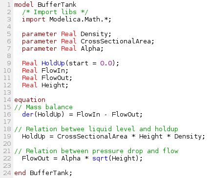
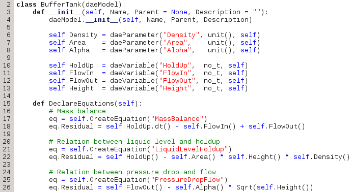

*********************
Programming paradigms
*********************
..
    Copyright (C) Dragan Nikolic, 2013
    DAE Tools is free software; you can redistribute it and/or modify it under the
    terms of the GNU General Public License version 3 as published by the Free Software
    Foundation. DAE Tools is distributed in the hope that it will be useful, but WITHOUT
    ANY WARRANTY; without even the implied warranty of MERCHANTABILITY or FITNESS FOR A
    PARTICULAR PURPOSE. See the GNU General Public License for more details.
    You should have received a copy of the GNU General Public License along with the
    DAE Tools software; if not, see <http://www.gnu.org/licenses/>.

.. _hybrid_approach:

The Hybrid approach
===================

In general, there are two types of approaches that can be applied to process modelling:
Domain Specific Language approach and a general-purpose programming language approach (such as
c/c++, Java or Python). A Domain Specific Language (DSL) is a special-purpose programming or
specification language dedicated to a particular problem domain and so designed that it directly
supports the key concepts necessary to describe the underlying problems. A domain-specific
language is created specifically to solve problems in a particular domain and is usually not
intended to be able to solve problems outside it (although that may be technically possible in
some cases). In contrast, general-purpose languages are created to solve problems in a wide
variety of application domains.

Domain-specific languages are languages with very specific goals in design and implementation and
commonly lack low-level functions for filesystem access, interprocess control, and other functions
that characterize full-featured programming languages, scripting or otherwise. 

A good example of a multi-domain modelling language is `Modelica <http://www.modelica.org>`_
while single-domain (chemical processing industry related) DSLs are `gPROMS <http://www.psenterprise.com/gproms>`_,
`Ascend <http://ascend4.org>`_, `SpeedUp <http://www.aspentech.com>`_ etc.

**DAE Tools** approach is a sort of the hybrid approach:

* it applies general-purpose programming languages such as c++ and Python
  
but offers:
    
* a class-hierarchy/API that resembles a syntax of a DSL as much as possible
* an access to the low-level functions
* an access to a large number of standard and third party libraries
* state of the art free/open-source software components to accomplish particular tasks (calculating
  derivatives and sensitivities, solving systems of differential and algebraic systems of equations and
  optimization problems, processing and plotting results etc).

                        
.. |gPROMS_model|   image:: _static/gPROMS_model.png
                     :width: 200 pt
                    

API comparison between `Modelica <http://www.modelica.org>`_, `gPROMS <http://www.psenterprise.com/gproms>`_
and **DAE Tools** for a very simple dynamical model (basically a tank with a liquid inside, an inlet and
an outlet flow where the outlet flowrate depends on the liquid level in the tank):

+-----------------------+---------------------+------------------------+
+-----------------------+---------------------+------------------------+
| |modelica_model|      | |gPROMS_model|      | |daetools_model|       |
+-----------------------+---------------------+------------------------+
| **a) Modelica**       | **b) gPROMS**       | **c) DAE Tools**       |
+-----------------------+---------------------+------------------------+

**DAE Tools** provide low-level concepts such as parameters, variables, equations, ports, models,
state transition networks, discrete events etc. so that the key concepts from new application domains
can be added on top of those low level concepts. For instance, the key modelling concepts from the
simulator-independent xml-based domain specific language for modelling of biological neural
networks `NineML <http://software.incf.org/software/nineml>`_ such as neurones, synapses, connectivity
patterns, populations of neurones, projections etc. are based on **DAE Tools** low-level concepts.

Side-by-side comparison between the DSL approach and the **DAE Tools** hybrid approach:
    
.. list-table::
    :widths: 80 80
    :header-rows: 1

    * - **DSL Approach**
      - **DAE Tools Approach**
    * - Domain-specific languages allow solutions to be expressed in the idiom and at the level of abstraction
        of the problem domain (direct support for all modelling concepts by the language syntax)
      - Modelling concepts cannot be expressed directly in the programming language and have to be emulated in
        the API or in some other way
    * - Clean, concise, ellegant and natural way of building model descriptions: the code can be self documenting
      - The support for modelling concepts is much more verbose and less elegant; however, DAE Tools can generate
        XML+MathML based model reports that can be either rendered in XHTML format using XSLT transformations
        (representing the code documentation) or used as an XML-based model exchange language.
    * - Domain-specific languages could enhance quality, productivity, reliability, maintainability and portability
      -
    * - DSLs could be and often are simulator independent making a model exchange easier
      - Programming language dependent; however, a large number of scientific software libraries exposes its
        functionality to Python via Python wrappers
    * - Cost of designing, implementing, and maintaining a domain-specific language as well as the tools required
        to develop with it (IDE): a compiler/lexical parser/interpreter must be developed with all burden that comes
        with it (such as error handling, grammar ambiguities, hidden bugs etc)
      - A compiler/lexical parser/interpreter is an integral part of the programming language (c++, Python) with a
        robust error handling, universal grammar and massively tested
    * - Cost of learning a new language vs. its limited applicability: users are required to master a new language
        (yet another language grammar)
      - No learning of a new language required (everything can get done in a favourite programming language)
    * - Increased difficulty of integrating the DSL with other components: calling external functions/libraries and
        interaction with other software is limited by the existence of wrappers around a simulator engine
        (for instance some scripting languages like Python or javascript)
      - Calling external functions/libraries is a natural and straightforward Interaction with other software is
        natural and straightforward
    * - Models usually cannot be created in the runtime/on the fly (or at least not easily) and cannot be modified
        in the runtime
      - Models can be created in the runtime/on the fly and easily modified in the runtime
    * - Setting up a simulation (ie. the values of parameters values, initial conditions, initially active states)
        is embedded in the language and it is typically difficult to do it on the fly or to obtain the values from
        some other software (for example to chain several software calls where outputs of previous calls represent
        inputs to the subsequent ones)
      - Setting up a simulation is done programmaticaly and the initial values can be obtained from some other software
        in a natural way (chaining several software calls is easy since a large number of libraries make Python wrappers
        available)
    * - Simulation operating procedures are not flexible; manipulation of model parameters, variables, equations,
        simulation results etc is limited to only those operations provided by the language
      - Operating procedures are completely flexible (within the limits of a programming language itself) and a
        manipulation of model parameters, variables, equations, simulation results etc can be done in any way which
        a user cosiders suitable for his/her problem
    * - Only the type of results provided by the language/simulator is available; custom processing is usually not
        possible or if a simulator does provide a way to build extensions it is limited to the functionality made
        available to them
      - The results processing can be done in any way which a user considers suitable(again within the limits of a
        programming language itself)

.. _equation_oriented_approach:
    
The Equation-Oriented approach
==============================

In general, three approaches to process modelling exist ([#Morton2003]_):

* Sequential Modular (**SeqM**) approach
* Simultaneous Modular (**SimM**) approach
* Equation-Oriented (**EO**) approach

The pros & cons of the first two approaches are extensively studied in the literature. Under the **EO** approach we generate
and gather together all equations and variables which constitute the model representing the process. The equations are solved
simultaneously using a suitable mathematical algorithm (Morton, 2003 [#Morton2003]_). Equation-oriented simulation requires
simultaneous solution of a set of differential algebraic equations (**DAE**) which itself requires a solution of a set of
nonlinear algebraic equations (**NLAE**) and linear algebraic equations (**LAE**). The Newton's method or some variant of it
is almost always used to solve problems described by NLAEs. A brief history of Equation-Oriented solvers and comparison of
**SeqM** and **EO** approaches as well as descriptions of the simultaneous modular and equation-oriented methods can be found
in Morton, 2003 ([#Morton2003]_). Also a good overview of the equation-oriented approach and its application in
`gPROMS <http://www.psenterprise.com/gproms>`_ is given by Barton & Pantelides ([#Pantelides1]_, [#Pantelides2]_, [#Pantelides3]_).

**DAE Tools** use the Equation-Oriented approach to process modelling, and the following types of processes can be modelled:

* Lumped and distributed
* Steady-state and dynamic

Problems can be formulated as linear, non-linear, and (partial) differential algebraic systems (of index 1).
The most common problems are initial value problems of implicit form. Equations can be ordinary or discontinuous,
where discontinuities are automatically handled by the framework. A good overview of discontinuous equations and
a procedure for location of equation discontinuities is given by Park & Barton ([#ParkBarton]_)
and in `Sundials IDA <https://computation.llnl.gov/casc/sundials/documentation/ida_guide/node3.html#SECTION00330000000000000000 documentation>`_
(used in DAE Tools).

The main characteristics of the Equation-oriented (acausal) approach:

* Equations are given in an implicit form (as a residual):

  .. math::

    F(\dot {x}, x, y, p) = 0

  where :math:`x` and :math:`\dot {x}` are state variables and their derivatives,
  :math:`y` are degrees of freedom and :math:`p` are parameters.

* Input-Output causality is not fixed

  The benefits are:
     
  * Increased model re-use
  * Support for different simulation scenarios (based on a single model) by specifying
    different degrees of freedom. For instance, an equation given in the following form:

    .. math::
       x_1 + x_2 + x_3 = 0

    can be used to determine either ``x1``, ``x2`` or ``x3`` depending on what combination
    of variables is known:

    .. math::
       x_1 = -x_2 - x_3 \newline

       \vee \newline

       x_2 = -x_1 - x_3 \newline

       \vee \newline

       x_3 = -x_1 - x_2

.. rubric:: Footnotes

.. [#Morton2003]  Morton, W., Equation-Oriented Simulation and Optimization. *Proc. Indian Natl. Sci. Acad.* 2003, 317-357.
.. [#Pantelides1] Pantelides, C. C., and P. I. Barton, Equation-oriented dynamic simulation current status and future perspectives, *Computers & Chemical Engineering*, vol. 17, no. Supplement 1, pp. 263 - 285, 1993.
.. [#Pantelides2] Barton, P. I., and C. C. Pantelides, gPROMS - a Combined Discrete/Continuous Modelling Environment for Chemical Processing Systems, *Simulation Series*, vol. 25, no. 3, pp. 25-34, 1993.
.. [#Pantelides3] Barton, P. I., and C. C. Pantelides, Modeling of combined discrete/continuous processes", *AIChE Journal*, vol. 40, pp. 966-979, 1994.
.. [#ParkBarton]  Park, T., and P. I. Barton, State event location in differential-algebraic models", *ACM Transactions on Modeling and Computer Simulation*, vol. 6, no. 2, New York, NY, USA, ACM, pp. 137-165, 1996.

.. _object_oriented_approach:
    
The Object-Oriented approach
============================

The Object-Oriented approach to process modelling is adopted in **DAE Tools**.
The main characteristics of such an approach are:

* Everything is an object

* Models are classes derived from the base daeModel class

* Basically all OO concepts supported by the target language (c++, Python) are allowed,
  except few exceptions
  
  * Multiple inheritance is supported
  * Models can be parametrized (using templates in c++)
  * Derived classes always inherit all declared parameters, variables, equations etc. (polymorphism achieved through virtual functions where the declaration takes place)
  * All parameters, variables, equations etc. remain public

* Hierarchical model decomposition

.. _python_programming_language:

Programming language
====================

**DAE Tools** core libraries are written in standard c++. However, `Python <http://www.python.org>`_ programming language is
used as the main modelling language. The main reason for use of Python is (as the authors say):
"*Python is an easy to learn, powerful programming language. It has efficient high-level data structures and a simple
but effective approach to object-oriented programming. Python's elegant syntax and dynamic typing, together with its
interpreted nature, make it an ideal language for scripting and rapid application development in many areas on
most platforms*" `link <http://docs.python.org/tutorial>`_.

And: *"Often, programmers fall in love with Python because of the increased productivity it provides. Since there is no
compilation step, the edit-test-debug cycle is incredibly fast*" `link <http://www.python.org/doc/essays/blurb>`_. Also, please
have a look on `a comparison to the other languages <http://www.python.org/doc/essays/comparisons>`_. Based on the information
available online, and according to the personal experience, the python programs are much shorter and take an order of magnitude
less time to develop it. Initially I developed daePlotter module in c++; it took me about one month of part time coding. But,
then I moved to python: reimplementing it in PyQt took me just two days (with several new features added), while the code size
shrank from 24 cpp modules to four python modules only!

"*Where Python code is typically 3-5 times shorter than equivalent Java code, it is often 5-10 times shorter than equivalent
C++ code! Anecdotal evidence suggests that one Python programmer can finish in two months what two C++ programmers can't
complete in a year. Python shines as a glue language, used to combine components written in C++*"
`link <http://www.python.org/doc/essays/comparisons>`_.
Obviously, not everything can be developed in python; a heavy c++ artillery is still necessary for highly complex projects.

