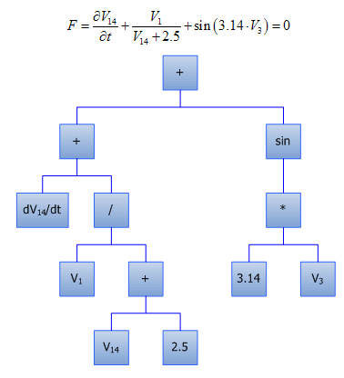

****************
pyDAE User Guide
****************
..
    Copyright (C) Dragan Nikolic, 2013
    DAE Tools is free software; you can redistribute it and/or modify it under the
    terms of the GNU General Public License version 3 as published by the Free Software
    Foundation. DAE Tools is distributed in the hope that it will be useful, but WITHOUT
    ANY WARRANTY; without even the implied warranty of MERCHANTABILITY or FITNESS FOR A
    PARTICULAR PURPOSE. See the GNU General Public License for more details.
    You should have received a copy of the GNU General Public License along with the
    DAE Tools software; if not, see <http://www.gnu.org/licenses/>.

Importing DAE Tools modules
===========================

pyDAE modules can be imported in the following way:
    
.. code-block:: python

    from daetools.pyDAE import *

This will set the python ``sys.path`` for importing the platform dependent c extension modules,
import ``pyDAE`` core modules:

* pyCore
* pyActivity
* pyDataReporting
* pyIDAS
* pyUnits

and import platfom independent modules:

* logs
* variable_types
* dae_simulator

Once the ``pyDAE`` module is imported, the other modules (such as third party linear solvers,
optimization solvers etc.) can be imported in the following way:

.. code-block:: python

    from daetools.pyDAE import *

    # Import Trilinos LA solvers (Amesos, AztecOO):
    from daetools.solvers.trilinos import pyTrilinos

    # Import SuperLU linear solver:
    from daetools.solvers.superlu import pySuperLU

    # Import SuperLU_MT linear solver:
    from daetools.solvers.superlu_mt import pySuperLU_MT

    # Import IPOPT NLP solver:
    from daetools.solvers.ipopt import pyIPOPT

    # Import BONMIN MINLP solver:
    from daetools.solvers.bonmin import pyBONMIN

    # Import NLOPT set of optimization solvers:
    from daetools.solvers.nlopt import pyNLOPT
   
Since domains, parameters and variables in **DAE Tools** have a numerical value in terms
of a unit of measurement (:py:class:`~pyUnits.quantity`) the modules containing definitions of
units and variable types must be imported. They can be imported in the following way:

.. code-block:: python

    from variable_types import length_t, area_t, volume_t
    from pyUnits import m, kg, s, K, Pa, J, W

For the complete list of units and variable types have a look in
:doc:`variable_types` and :doc:`units` modules.

Developing models
=================

In **DAE Tools** models are developed by deriving a new class from the base model class
(:py:class:`pyCore.daeModel`). A template/an empty model is given below:

.. code-block:: python

    class myModel(daeModel):
        def __init__(self, name, parent = None, description = ""):
            daeModel.__init__(self, name, parent, description)

            # Declaration/instantiation of domains, parameters, variables, ports, etc:
            ...

        def DeclareEquations(self):
            # Declaration of equations, state transition networks etc.:
            ...

The process consists of the following steps:

1. Call the base class constructor:

   .. code-block:: python

      daeModel.__init__(self, name, parent, description)
      
2. Declare all domains, parameters, variables, ports, components etc. in the
   :py:meth:`pyCore.daeModel.__init__` function:

   * One of the fundamental ideas in **DAE Tools** is separation of the model definition
     from the activities that can be carried out on that model: this way we can have one
     model definition and several simulation scenarios. Consequantly, all objects are defined in
     two stages:
         
     * Declaration in the :py:meth:`pyCore.daeModel.__init__` function
     * Initialization in the :py:meth:`pyActivity.daeSimulation.SetUpParametersAndDomains` and
       :py:meth:`pyActivity.daeSimulation.SetUpVariables` functions.

     Therefore, parameters, domains and variables are only declared here, while their initialization
     (setting the value, setting up the domain, assigning or setting an initial condition) is 
     postponed and will be done in the simulation class
   
   * These objects must be declared as data members of the model since the base :py:class:`pyCore.daeModel`
     class keeps only week references and does not own them. Therefore, use:

     .. code-block:: python

        def __init__(self, name, parent = None, description = ""):
            self.domain    = daeDomain(...)
            self.parameter = daeParameter(...)
            self.variable  = daeVariable(...)
            .. etc.

     and not:

     .. code-block:: python

        def __init__(self, name, parent = None, description = ""):
            domain    = daeDomain(...)
            parameter = daeParameter(...)
            variable  = daeVariable(...)
            .. etc.
         
    because at the exit from the :py:meth:`pyCore.daeModel.__init__` function the objects
    will go out of scope and get destroyed. However, the model still holds references to them
    which will result in the segmentation fault.
    
3. Declare equations, state transition networks and on_event/on_condition handlers
   in the :py:meth:`pyCore.daeModel.DeclareEquations` function.

   * The :py:meth:`pyCore.daeModel.DeclareEquations` function will be called automatically
     by the framework. Users must not call it directly!
     
   * An initialization of the simulation object is done in several phases. At the point when this function
     is called the model parameters, domains, variables etc. are fully initialized. Therefore, it is safe to
     get the values of the parameters or domain points and use them to create equations, for example.
     However, the **variable values** are obviously **not available** at this moment (for they get
     initialized at the later stage). Anyway, obtaining variable values while still developing a model
     is meaningless.

A simplest **DAE Tools** model with a description of all steps/tasks necessary to develop a model
can be found in the :ref:`whats_the_time` tutorial
(`whats_the_time.py <../../examples/whats_the_time.html>`_).

Parameters
----------

Parameters are time invariant quantities that do not change during
a simulation. Usually a good choice what should be a parameter is a
physical constant, number of discretization points in a domain etc.

There are two types of parameters in **DAE Tools**:

* Ordinary
* Distributed.

The process of defining parameters is two-fold:
    
* Declaring a parameter in the model
* Initialize it (by setting its value) in the simulation

Declaring parameters
~~~~~~~~~~~~~~~~~~~~
Parameters are declared in the :py:meth:`pyCore.daeModel.__init__` function.
An ordinary parameter can be declared in the following way:

.. code-block:: python

   myParam = daeParameter("myParam", units, parentModel, "description")

Parameters can be distributed on domains. A distributed parameter can be
declared in the following way:

.. code-block:: python

   myParam = daeParameter("myParam", units, parentModel, "description")
   myParam.DistributeOnDomain(myDomain)

Initializing parameters
~~~~~~~~~~~~~~~~~~~~~~~
Parameters are initialized in the :py:meth:`pyActivity.daeSimulation.SetUpParametersAndDomains`
function. To set a value of an ordinary parameter use the following:

.. code-block:: python

   myParam.SetValue(value)

while to set a value of distributed parameters (one-dimensional for example) use:

.. code-block:: python

   for i in range(0, myDomain.NumberOfPoints):
       myParam.SetValue(i, value)

where the ``value`` can be either a ``float`` or the :py:class:`pyUnits.quantity` object
(for instance ``1.34 * W/(m*K)``).

Using parameters
~~~~~~~~~~~~~~~~
The most commonly used functions are:

* The function call operator :py:meth:`pyCore.daeParameter.__call__` (``operator ()``)
  which returns the :py:class:`pyCore.adouble` object that holds the parameter value 
* The :py:meth:`pyCore.daeParameter.array` function which returns the :py:class:`pyCore.adouble_array`
  object that holds an array of parameter values
* Distributed parameters have the :py:attr:`pyCore.daeParameter.npyValues` property which
  returns the parameter values as a numpy multi-dimensional array (with ``numpy.float`` data type)
* The functions :py:class:`pyCore.daeParameter.SetValue` and :py:class:`pyCore.daeParameter.GetValue`
  which get/set the parameter value as ``float``

**Note**: The functions :py:meth:`pyCore.daeParameter.__call__` and :py:meth:`pyCore.daeParameter.array`
can only be used in equations residual expressions. On the other hand, the functions
:py:class:`pyCore.daeParameter.GetValue`, :py:class:`pyCore.daeParameter.SetValue` and
:py:attr:`pyCore.daeParameter.npyValues` can be use to access the parameters real data at any point.

1. To get a value of the ordinary parameter the :py:meth:`pyCore.daeParameter.__call__`
   function (``operator ()``) can be used. For instance, if we want the variable ``myVar`` to be
   equal to the sum of the parameter ``myParam`` and ``15``: :math:`myVar = myParam + 15`,
   we can write the following:

   .. code-block:: python

     # Notation:
     #  - eq is a daeEquation object
     #  - myParam is an ordinary daeParameter object (not distributed)
     #  - myVar is an ordinary daeVariable (not distributed)
     eq.Residual = myVar() - myParam() - 15

2. To get a value of a distributed parameter the :py:meth:`pyCore.daeParameter.__call__`
   function (``operator ()``) can be used again. For instance, if we want the distributed
   variable ``myVar`` to be equal to the sum of the parameter ``myParam`` and ``15`` at each
   point of the domain ``myDomain``: :math:`myVar(d) = myParam(d) + 15; \forall d \in [0, d_n]`,
   we can write:

   .. code-block:: python

     # Notation:
     #  - myDomain is daeDomain object
     #  - n is the number of points in the myDomain
     #  - eq is a daeEquation object distributed on the myDomain
     #  - d is daeDEDI object (used to iterate through the domain points)
     #  - myParam is daeParameter object distributed on the myDomain
     #  - myVar is daeVariable object distributed on the myDomain
     d = eq.DistributeOnDomain(myDomain, eClosedClosed)
     eq.Residual = myVar(d) - myParam(d) - 15

   This code translates into ``n`` equations that is equivalent to writing:

   .. code-block:: python

     for d = 0 to n:
         myVar(d) = myParam(d) + 15

   which internally transforms into ``n`` separate equations.

   Obviously, a parameter can be distributed on more than one domain. If we want to
   write an identical equation like in the previous case:
   :math:`myVar(d_1,d_2) = myParam(d_1,d_2) + 15; \forall d_1 \in [0, d_{1n}], \forall d_2 \in [0, d_{2n}]`
   we can write the following:

   .. code-block:: python

     # Notation:
     #  - myDomain1, myDomain2 are daeDomain objects
     #  - n is the number of points in the myDomain1
     #  - m is the number of points in the myDomain2
     #  - eq is a daeEquation object distributed on the domains myDomain1 and myDomain2
     #  - d is daeDEDI object (used to iterate through the domain points)
     #  - myParam is daeParameter object distributed on the myDomain1 and myDomain2
     #  - myVar is daeVariable object distributed on the myDomaina and myDomain2
     d1 = eq.DistributeOnDomain(myDomain1, eClosedClosed)
     d2 = eq.DistributeOnDomain(myDomain2, eClosedClosed)
     eq.Residual = myVar(d1,d2) - myParam(d1,d2) - 15

3. To get an array of parameter values the function :py:meth:`pyCore.daeParameter.array`
   can be used, which returns the :py:class:`pyCore.adouble_array` object.
   Arrays of values can only be used in conjunction with mathematical functions that operate
   on :py:class:`pyCore.adouble_array` objects such as:
   :py:meth:`pyCore.Sum`, :py:meth:`pyCore.Product`, :py:meth:`pyCore.Sqrt`, :py:meth:`pyCore.Sin`,
   :py:meth:`pyCore.Cos`, :py:meth:`pyCore.Min`, :py:meth:`pyCore.Max`, :py:meth:`pyCore.Log`, 
   :py:meth:`pyCore.Log10`, etc.

   For instance, if we want the variable ``myVar`` to be equal to the sum of values of the parameter
   ``myParam`` for all points in the domain ``myDomain``, we can use the function
   :py:meth:`pyCore.Sum` which accepts the :py:meth:`pyCore.adouble_array` objects.

   Arguments for the :py:meth:`pyCore.daeParameter.array` function are :py:class:`pyCore.daeIndexRange`
   objects obtained by the call to the :py:meth:`pyCore.daeDomain.__call__` function (``operator ()``).
   Thus, we can write the following:

   .. code-block:: python

     # Notation:
     #  - myDomain is daeDomain object
     #  - n is the number of points in the domain myDomain
     #  - eq is daeEquation object
     #  - myVar is daeVariable object
     #  - myParam is daeParameter object distributed on the myDomain
     eq.Residual = myVar() - Sum( myParam.array( myDomain() ) )

   This code translates into:
   :math:`myVar = \sum myParam.array( myDomain() )`.

   The above example could also be written in the following form:

   .. code-block:: python

     # points_range is daeDomainRange object
     points_range = daeDomainRange(myDomain)
     # arr is adouble_array object
     arr = myVar2.array(points_range)
     # Finally:
     eq.Residual = myVar() - sum(arr)

   On the other hand, if we want variable myVar to be equal to the sum of
   values of the parameter myParam only for certain points in the myDomain,
   there are two ways to do it:

   .. code-block:: python

     # Notation:
     #  - myDomain is daeDomain object
     #  - n is the number of points in the domain myDomain
     #  - eq is a daeEquation object
     #  - myVar is an ordinary daeVariable object
     #  - myParam is a daeParameter object distributed on the myDomain
     # 1) For a given array of points; the points must be in the range [0,n-1]
     eq.Residual = myVar() - sum( myParam.array( myDomain( [0, 5, 12] ) ) )
     # 2) For a given slice of points in the domain;
     #    slices are defined by 3 arguments: start_index, end_index, step
     #    in this example: start_index = 1
     #                     end_index = 10
     #                     step = 2
     eq.Residual = myVar() - sum( myParam.array( myDomain(1, 10, 2) ) )

   The code sample 1) translates into:
   :math:`myVar = myParam(0) + myParam(1) + ... + myParam(n)`

   The code sample 2) translates into:

   :math:`myVar = myParam(0) + myParam(5) + myParam(12)`

   '''NOTE: '''One may argue that the function `array` calls can be
   somewhat simpler and directly accept python lists or slices as its
   arguments. For instance it would be possible to write:

   .. code-block:: python

     eq.Residual = myVar() - sum( myParam.array( [0, 1, 3] ) )

   or:

   .. code-block:: python

     eq.Residual = myVar() - sum( myParam.array( slice(1,10,2) ) )

   However, that would be more error prone since it does not check whether
   a valid domain is used for that index and whether specified indexes lay
   within the domain bounds (which should be done by the user).

More information about parameters can be found in the API reference :py:class:`pyCore.daeParameter`
and in :doc:`tutorials`.

Variables
---------
There are two types of variables in **DAE Tools**: ordinary and distributed. Functions to get a variable value
(function call operator :py:meth:`~pyCore.daeVariable.__call__`), a time or a partial derivative
(:py:meth:`~pyCore.daeVariable.dt`, :py:meth:`~pyCore.daeVariable.d`, or :py:meth:`~pyCore.daeVariable.d2`) or
functions to obtain an array of values, time or partial derivatives (:py:meth:`~pyCore.daeVariable.array`,
:py:meth:`~pyCore.daeVariable.dt_array`, :py:meth:`~pyCore.daeVariable.d_array`, or :py:meth:`~pyCore.daeVariable.d2_array`)
have been defined. In addition, distributed variables have :py:attr:`~pyCore.daeVariable.npyValues` property to get
the values as a numpy multi-dimensional array.

Variables in **pyDAE** can be defined by the following statement:

.. code-block:: python

    myVar = daeVariable("myVar", variableType, Parent_Model_or_Port, "Description")

while in **cDAE**:

.. code-block:: cpp

    daeVariable myVar("myVar", variableType, &Parent_Model_or_Port, "Description");

More information about variables can be found in :doc:`pyDAE_user_guide` and :py:class:`pyCore.daeVariable`.
Also, do not forget to have a look on :doc:`tutorials`.

Distribution domains
--------------------
There are two types of domains in **DAE Tools**: simple arrays and distributed domains (commonly used to distribute variables,
parameters and equations in space). The distributed domains can have a uniform (default) or a user specified non-uniform grid.
At the moment, only the following finite difference methods can be used to calculate partial derivatives:

* Backward finite difference method (BFD)
* Forward finite difference method (FFD)
* Center finite difference method (CFD)

In **DAE Tools** just anything can be distributed on domains: parameters, variables, equations even models and ports.
Obviously it does not have a physical meaning to distribute a model on a domain, However that can be useful for modelling
of complex processes where we can create an array of models where each point in a distributed domain have a corresponding
model so that a user does not have to take care of number of points in the domain, etc. In addition, domain points values
can be obtained as a **NumPy** one-dimensional array; this way **DAE Tools** can be easily used in conjuction with other
scientific python libraries `NumPy <http://numpy.scipy.org>`_, `SciPy <http://www.scipy.org>`_, for instance and many
`other <http://www.scipy.org/Projects>`_.

Domains in **pyDAE** can be defined by the following statement:

.. code-block:: python

    myDomain = daeDomain("myDomain", Parent_Model_or_Port, Description)

while in **cDAE**:

.. code-block:: cpp

    daeDomain myDomain("myDomain", &Parent_Model_or_Port, Description);

More information about domains can be found in :doc:`pyDAE_user_guide` and :py:class:`pyCore.daeDomain`.
Also, do not forget to have a look on :doc:`tutorials`.

Equations
---------
There are three types of equations in **DAE Tools**:
* Ordinary
* Distributed
* Discontinuous

What makes distributed equations special is that an equation expression is valid on every point within
the domains that the equations is distriibuted on. Equations can be distributed on a whole domain,
on a part of it or only on some of the domain points.

ordinary The following statement is used in **pyDAE** to declare an ordinary
equation:

.. code-block:: python

    eq = model.CreateEquation("MyEquation")

while to declare a distributed equation the next statemets are used:

.. code-block:: python

    eq = model.CreateEquation("MyEquation")
    d = eq.DistributeOnDomain(myDomain, eClosedClosed)

Equations can be distributed on a whole domain or on a part of it.
Currently there are 7 options:

-  Distribute on a closed domain - analogous to: x ∈ '''[ '''x:sub:`0`,
   x\ :sub:`n` **]**
-  Distribute on a left open domain - analogous to: x ∈ '''(
   '''x:sub:`0`, x\ :sub:`n` **]**
-  Distribute on a right open domain - analogous to: x ∈ **[**
   x\ :sub:`0`, x\ :sub:`n` **)**
-  Distribute on a domain open on both sides - analogous to: x ∈ **(**
   x\ :sub:`0`, x\ :sub:`n` **)**
-  Distribute on the lower bound - only one point: x ∈ { x\ :sub:`0` }
   This option is useful for declaring boundary conditions.
-  Distribute on the upper bound - only one point: x ∈ { x\ :sub:`n` }
   This option is useful for declaring boundary conditions.
-  Custom array of points within a domain

where LB stands for the LowerBound and UB stands for the UpperBound of
the domain. An overview of various bounds is given in **Figures 1a. to
1h.**. Here we have an equation which is distributed on two domains:
**x** and **y** and we can see various available options. Green squares
represent the intervals included in the distributed equation, while
white squares represent excluded intervals.

| [[Image:EquationBounds CC CC.png\|thumb\|200px\|Figure 1a.
| x: eClosedClosed; y: eClosedClosed
| x ∈ [x:sub:`0`, x\ :sub:`n`], y ∈ [y:sub:`0`, y\ :sub:`n`] ]]
`thumb\|200px\|Figure 1b.
x: eOpenOpen; y: eOpenOpen
x ( x\ :sub:`0`, x\ :sub:`n` ), y ∈ ( y\ :sub:`0`, y\ :sub:`n`
) <Image:EquationBounds OO OO.png>`__ [[Image:EquationBounds CC
OO.png\|thumb\|200px\|Figure 1c.
| x: eClosedClosed; y: eOpenOpen
| x ∈ [x:sub:`0`, x\ :sub:`n`], y ∈ ( y\ :sub:`0`, y\ :sub:`n` ) ]]
[[Image:EquationBounds CC OC.png\|thumb\|200px\|Figure 1d.
| x: eClosedClosed; y: eOpenClosed
| x ∈ [x:sub:`0`, x\ :sub:`n`], y ∈ ( y\ :sub:`0`, y\ :sub:`n` ] ]]
`thumb\|200px\|Figure 1e.
x: LB; y: eClosedOpen
x = x\ :sub:`0`, y ∈ [ y\ :sub:`0`, y\ :sub:`n`
) <Image:EquationBounds LB CO.png>`__ [[Image:EquationBounds LB
CC.png\|thumb\|200px\|Figure 1f.
| x: LB; y: eClosedClosed
| x = x\ :sub:`0`, y ∈ [y:sub:`0`, y\ :sub:`n`] ]]
[[Image:EquationBounds UB CC.png\|thumb\|200px\|Figure 1g.
| x: UB; y: eClosedClosed
| x = x\ :sub:`n`, y ∈ [y:sub:`0`, y\ :sub:`n`] ]] `thumb\|200px\|Figure
1h.
x: LB; y: UB
x = x\ :sub:`0`, y = y\ :sub:`n` <Image:EquationBounds LB UB.png>`__

Defining equations (equation residual expression)
~~~~~~~~~~~~~~~~~~~~~~~~~~~~~~~~~~~~~~~~~~~~~~~~~

The following statement can be used in **pyDAE** to create a residual
expression of the ordinary equation:

.. code-block:: python

    # Notation:
    #  - V1, V3, V14 are ordinary variables
    eq.Residal = V14.dt() + V1() / (V14() + 2.5) + sin(3.14 * V3())

The above code translates into:

:math:``

To define a residual expression of the distributed equation the next
statements can be used:

.. code-block:: python

    # Notation:
    #  - V1, V3 and V14 are distributed variables on domains X and Y
    eq = model.CreateEquation("MyEquation")
    x = eq.DistributeOnDomain(X, eClosedClosed)
    y = eq.DistributeOnDomain(Y, eOpenOpen)
    eq.Residal = V14.dt(x,y) + V1(x,y) / ( V14(x,y) + 2.5) + sin(3.14 * V3(x,y) )

The above code translates into:

:math:``

Defining boundary conditions
~~~~~~~~~~~~~~~~~~~~~~~~~~~~

Assume that we have a simple heat conduction through a very thin
rectangular plate. At one side (Y = 0) we have a constant temperature
(500 K) while at the opposide end we have a constant flux (1E6
W/m\ :sup:`2`). The problem can be defined by the following statements:

.. code-block:: python

    # Notation:
    #  - T is a variable distributed on domains X and Y
    #  - ro, k, and cp are parameters
    eq = model.CreateEquation("MyEquation")
    x = eq.DistributeOnDomain(X, eClosedClosed)
    y = eq.DistributeOnDomain(Y, eOpenOpen)
    eq.Residual = ro() * cp() * T.dt(x,y) - k() * ( T.d2(X,x,y) + T.d2(Y,x,y) )

We can note that the equation is defined on the domain Y, which is open
on both ends. Now we have to specify the boundary conditions (2
additional equations). To do so, the following statements can be used:

.. code-block:: python

    # "Left" boundary conditions:
    lbc = model.CreateEquation("Left_BC")
    x = lbc.DistributeOnDomain(X, eClosedClosed)
    y = lbc.DistributeOnDomain(Y, eLowerBound)
    lbc.Residal = T(x,y) - 500  # Constant temperature (500 K)
    # "Right" boundary conditions:
    rbc = model.CreateEquation("Right_BC")
    x = rbc.DistributeOnDomain(X, eClosedClosed)
    y = rbc.DistributeOnDomain(Y, eUpperBound)
    rbc.Residal = - k() * T.d(Y,x,y) - 1E6  # Constant flux (1E6 W/m2)

The above statements transform into:

:math:``

and:

:math:``

**DAE Tools** introduce two types of equations: ordinary and distributed. What makes distributed
equations special is that an equation expression is valid on every point within the domains that
the equations is distriibuted on. Equations can be distributed on a whole domain, on a part of it
or on some of the points in a domain. Equations in **pyDAE** can be defined by the following statement:

.. code-block:: python

    eq = model.CreateEquation("myEquation", "Description")

while in **cDAE**:

.. code-block:: cpp

    daeEquation* eq = model.CreateEquation("myEquation", "Description");

To define an equation expression (used to calculate its residual and its gradient - which represent a single row in a
Jacobian matrix) **DAE Tools** combine the
`operator overloading <http://en.wikipedia.org/wiki/Automatic_differentiation#Operator_overloading>`_
technique for `automatic differentiation <http://en.wikipedia.org/wiki/Automatic_differentiation>`_
(adopted from `ADOL-C <https://projects.coin-or.org/ADOL-C>`_ library) with the concept of representing equations as
**evaluation trees**. Evaluation trees are made of binary or unary nodes, itself representing four basic mathematical
operations and frequently used mathematical functions, such as ``sin, cos, tan, sqrt, pow, log, ln, exp, min, max, floor, ceil,
abs, sum, product, ...``. These basic mathematical operations and functions are implemented to operate on **a heavily
modified ADOL-C** library class :py:class:`~pyCore.adouble` (which has been extended to contain information about
domains/parameters/variables etc). In adition, a new :py:class:`~pyCore.adouble_array` class has been introduced to apply all
above-mentioned operations on arrays of variables.
What is different here is that :py:class:`~pyCore.adouble`/:py:class:`~pyCore.adouble_array` classes and mathematical
operators/functions work in two modes; they can either **build-up an evaluation tree** or **calculate a value of an expression**.
Once built the evaluation trees can be used to calculate equation residuals or derivatives to fill a Jacobian matrix
necessary for a Newton-type iteration. A typical evaluation tree is presented in :ref:`Figure 4. <Figure-4>`.

.. _Figure-4:

:width: 250 pt
:figwidth: 300 pt
:align: center

**Figure 4.** DAE Tools equation evaluation tree

As it has been noted before, domains, parameters, and variables contain functions that return
:py:class:`~pyCore.adouble`/:py:class:`~pyCore.adouble_array` objects, which can be used to calculate
residuals and derivatives. These functions include functions to get a value of
a domain/parameter/variable (function call operator), to get a time or a partial derivative of a variable
(functions :py:meth:`~pyCore.daeVariable.dt`, :py:meth:`~pyCore.daeVariable.d`, or :py:meth:`~pyCore.daeVariable.d2`)
or functions to obtain an array of values, time or partial derivatives (:py:meth:`~pyCore.daeVariable.array`,
:py:meth:`~pyCore.daeVariable.dt_array`, :py:meth:`~pyCore.daeVariable.d_array`, or :py:meth:`~pyCore.daeVariable.d2_array`).
Another useful feature of **DAE Tools** equations is that they can be
exported into MathML or Latex format and easily visualized.

For example, the equation *F* (given in :ref:`Figure 4. <Figure-4>`) can be defined in **pyDAE** by using the following
statements:

.. code-block:: python

    F = model.CreateEquation("F", "F description")
    F.Residal = V14.dt() + V1() / (V14() + 2.5) + Sin(3.14 * V3())

while in **cDAE** by:

.. code-block:: cpp

    daeEquation* F = model.CreateEquation("F", "F description");
    F->SetResidal( V14.dt() + V1() / (V14() + 2.5) + sin(3.14 * V3()) );

More information about equations can be found in :doc:`pyDAE_user_guide` and :py:class:`pyCore.daeEquation`.
Also, do not forget to have a look on :doc:`tutorials`.

State Transition Networks
-------------------------
Discontinuous equations are equations that take different forms subject to certain conditions. For example,
if we want to model a flow through a pipe we may observe three different flow regimes:

* Laminar: if Reynolds number is less than 2,100
* Transient: if Reynolds number is greater than 2,100 and less than 10,000
* Turbulent: if Reynolds number is greater than 10,000

What we can see is that from any of these three states we can go to any other state. This type of discontinuities
is called a **reversible discontinuity** and can be described by the
:py:meth:`~pyCore.daeModel.IF`, :py:meth:`~pyCore.daeModel.ELSE_IF`, :py:meth:`~pyCore.daeModel.ELSE`
state transient network functions.
In **pyDAE** it is given by the following statement:

.. code-block:: python

    IF(Re() <= 2100)                      # (Laminar flow)
    #... (equations go here)

    ELSE_IF(Re() > 2100 and Re() < 10000) # (Transient flow)
    #... (equations go here)

    ELSE()                                # (Turbulent flow)
    #... (equations go here)

    END_IF()

while in **cDAE** by:

.. code-block:: cpp

    IF(Re() <= 2100);                      // (Laminar flow)
    //... (equations go here)

    ELSE_IF(Re() > 2100 && Re() < 10000);  // (Transient flow)
    //... (equations go here)

    ELSE();                                // (Turbulent flow)
    //... (equations go here)

    END_IF();

**Reversible discontinuities** can be **symmetrical** and **non-symmetrical**. The above example is **symmetrical**.
However, if we have a CPU and we want to model its power dissipation we may have three operating modes with the
following state transitions:

* Normal mode

* switch to **Power saving mode** if CPU load is below 5%
* switch to **Fried mode** if the temperature is above 110 degrees

* Power saving mode

* switch to **Normal mode** if CPU load is above 5%
* switch to **Fried mode** if the temperature is above 110 degrees

* Fried mode (no escape from here... go to the nearest shop and buy a new one!)

What we can see is that from the **Normal mode** we can either go to the **Power saving mode** or to the **Fried mode**.
The same stands for the **Power saving mode**: we can either go to the **Normal mode** or to the **Fried mode**.
However, once the temperature exceeds 110 degrees the CPU dies (let's say we heavily overclocked it) and there
is no going back. This type of discontinuities is called an **irreversible discontinuity** and can be described by
using  :py:meth:`~pyCore.daeModel.STN`, :py:meth:`~pyCore.daeModel.STATE`, :py:meth:`~pyCore.daeModel.END_STN`
functions while state transitions using :py:meth:`~pyCore.daeModel.ON_CONDITION` function.
In **pyDAE** this type of state transitions is given by the following statement:

.. code-block:: python

    STN("CPU")

    STATE("Normal")
    #... (equations go here)
    ON_CONDITION(CPULoad() < 0.05, switchToState = "PowerSaving")
    ON_CONDITION(T() > 110,        switchToState = "Fried")

    STATE("PowerSaving")
    #... (equations go here)
    ON_CONDITION(CPULoad() >= 0.05, switchToState = "Normal")
    ON_CONDITION(T() > 110,         switchToState = "Fried")

    STATE("Normal")
    #... (equations go here)

    END_STN()

while in **cDAE** by:

.. code-block:: cpp

    STN("CPU");

    STATE("Normal");
    //... (equations go here)
    ON_CONDITION(CPULoad() < 0.05, switchToState = "PowerSaving");
    ON_CONDITION(T() > 110,        switchToState = "Fried");

    STATE("PowerSaving");
    //... (equations go here)
    ON_CONDITION(CPULoad() >= 0.05, switchToState = "Normal");
    ON_CONDITION(T() > 110,         switchToState = "Fried");

    STATE("Normal");
    //... (equations go here)

    END_STN();

More information about state transition networks can be found in :doc:`pyDAE_user_guide` and :py:class:`pyCore.daeSTN`.
Also, do not forget to have a look on :doc:`tutorials`.

Ports
-----
Ports are used to connect two models. Like models, they may contain domains, parameters and variables. For instance,
in **pyDAE** ports can be defined by the following statements:

.. code-block:: python

    class myPort(daePort):
        def __init__(self, Name, Type, Parent = None, Description = ""):
            daePort.__init__(self, Name, Type, Parent, Description)
            #... (here go declarations of domains, parameters and variables)

while in **cDAE** by:

.. code-block:: cpp

    class myPort : public daePort
    {
    public:
    myPort(string strName, daeePortType eType, daeModel* pParent, string strDescription = "")
            : daePort(strName, eType, pParent, strDescription)
        {
            //... (here go additional properties of domains, parameters and variables)
        }

    public:
        //... (here go declarations of domains, parameters and variables)
    };

More information about ports can be found in :doc:`pyDAE_user_guide` and :py:class:`pyCore.daePort`.
Also, do not forget to have a look on :doc:`tutorials`.

Event Ports
-----------
Event ports are also used to connect two models; however, they allow sending of discrete messages (events) between
model instances. Events can be triggered manually or as a result of a state transition in a model. The main difference
between event and ordinary ports is that the former allow a discrete communication between model instances while
latter allow a continuous exchange of information. A single outlet event port can be connected to unlimited number
of inlet event ports. Messages contain a floating point value that can be used by a recipient (these actions are
specified in :py:meth:`~pyCore.daeModel.ON_EVENT` function); that value might be a simple number or an expression
involving model variables/parameters.

More information about event ports can be found in :doc:`pyDAE_user_guide` and :py:class:`pyCore.daeEventPort`.
Also, do not forget to have a look on :doc:`tutorials`.

Simulation
==========

Setting up a simulation
-----------------------

Setting up a data reporter
--------------------------

Setting up a DAE solver
-----------------------

Setting up a log
----------------

Optimization
============

Parameter estimation
====================

.. image:: http://sourceforge.net/apps/piwik/daetools/piwik.php?idsite=1&amp;rec=1&amp;url=wiki/
    :alt:

    