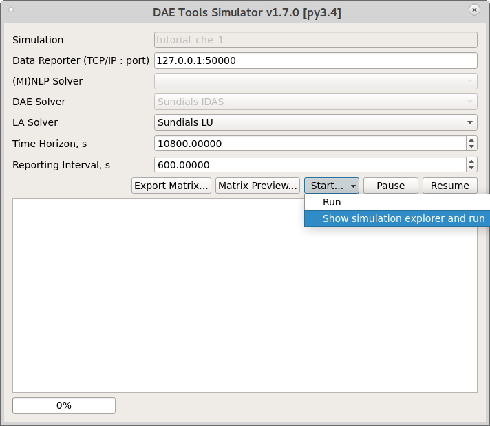
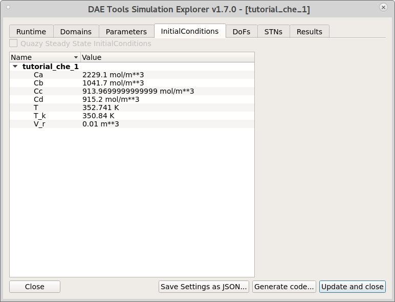
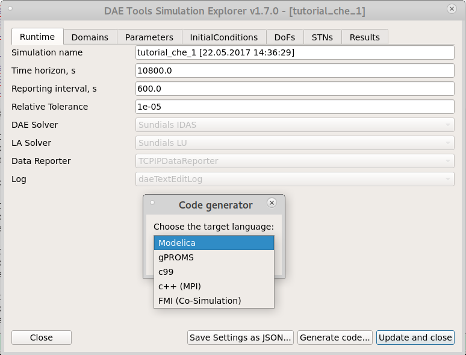

****************
pyDAE User Guide
****************
..
    Copyright (C) Dragan Nikolic
    DAE Tools is free software; you can redistribute it and/or modify it under the
    terms of the GNU General Public License version 3 as published by the Free Software
    Foundation. DAE Tools is distributed in the hope that it will be useful, but WITHOUT
    ANY WARRANTY; without even the implied warranty of MERCHANTABILITY or FITNESS FOR A
    PARTICULAR PURPOSE. See the GNU General Public License for more details.
    You should have received a copy of the GNU General Public License along with the
    DAE Tools software; if not, see <http://www.gnu.org/licenses/>.

    
.. contents:: 
    :local:
    :depth: 3
    :backlinks: none
    
Importing DAE Tools modules
===========================

``pyDAE`` modules can be imported in the following way:
    
.. code-block:: python

    from daetools.pyDAE import *

This will set the python ``sys.path`` for importing the platform dependent ``c++`` extension modules
(i.e. ``.../daetools/pyDAE/Windows_win32_py34`` and ``.../daetools/solvers/Windows_win32_py34`` in Windows,
``.../daetools/pyDAE/Linux_x86_64_py34`` and ``.../daetools/solvers/Linux_x86_64_py34`` in GNU/Linux),
import all symbols from all ``pyDAE`` modules: ``pyCore``, ``pyActivity``, ``pyDataReporting``,
``pyIDAS``, ``pyUnits`` and import some platfom independent modules: ``logs``,
``variable_types`` and ``dae_simulator``.

Alternatively, only the ``daetools`` module can be imported and classes from the ``pyDAE``
extension modules accessed using fully qualified names. For instance:

.. code-block:: python

    import daetools
    
    model = daetools.pyDAE.pyCore.daeModel("name")

Once the ``pyDAE`` module is imported, the other modules (such as third party linear solvers,
optimisation solvers etc.) can be imported in the following way:

.. code-block:: python

    # Import Trilinos LA solvers (Amesos, AztecOO):
    from daetools.solvers.trilinos import pyTrilinos

    # Import SuperLU linear solver:
    from daetools.solvers.superlu import pySuperLU

    # Import SuperLU_MT linear solver:
    from daetools.solvers.superlu_mt import pySuperLU_MT

    # Import IPOPT NLP solver:
    from daetools.solvers.ipopt import pyIPOPT

    # Import BONMIN MINLP solver:
    from daetools.solvers.bonmin import pyBONMIN

    # Import NLOPT set of optimisation solvers:
    from daetools.solvers.nlopt import pyNLOPT
   
Since domains, parameters and variables in **DAE Tools** have a numerical value in terms
of a unit of measurement (:py:class:`~pyUnits.quantity`) the modules containing definitions of
units and variable types must be imported. They can be imported in the following way:

.. code-block:: python

    from daetools.pyDAE.variable_types import length_t, area_t, volume_t
    from daetools.pyDAE.pyUnits import m, kg, s, K, Pa, J, W

The complete list of units and variable types can be found in
:doc:`variable_types` and :doc:`units` modules.

Developing models
=================

In **DAE Tools** models are developed by deriving a new class from the base :py:class:`~pyCore.daeModel` class.
An empty model definition is presented below:

.. code-block:: python

    class myModel(daeModel):
        def __init__(self, name, parent = None, description = ""):
            daeModel.__init__(self, name, parent, description)

            # Declaration/instantiation of domains, parameters, variables, ports, etc:
            ...

        def DeclareEquations(self):
            # Declaration of equations, state transition networks etc.:
            ...

The process consists of the following steps:

1. Calling the base class constructor:

   .. code-block:: python

      daeModel.__init__(self, name, parent, description)
      
2. Declaring the model structure (domains, parameters, variables, ports, components etc.) in the
   :py:meth:`~pyCore.daeModel.__init__` function:

   One of the fundamental ideas in **DAE Tools** is separation of the model specification
   from the activities that can be carried out on that model: this way several simulation scenarios
   can be developed based on a single model definition. Thus, all objects are defined in two stages:
         
   * Declaration in the :py:meth:`~pyCore.daeModel.__init__` function
   * Initialisation in the :py:meth:`~pyActivity.daeSimulation.SetUpParametersAndDomains` or
     :py:meth:`~pyActivity.daeSimulation.SetUpVariables` functions.

   Therefore, parameters, domains and variables are only declared here, while their initialisation
   (setting the parameter value, setting up the domain, assigning or setting an initial condition etc.) is
   postponed and will be done in the simulation class.
   
   All objects must be declared as data members of the model since the base :py:class:`~pyCore.daeModel`
   class keeps only week references and does not own them:

   .. code-block:: python

      def __init__(self, name, parent = None, description = ""):
          self.domain    = daeDomain(...)
          self.parameter = daeParameter(...)
          self.variable  = daeVariable(...)
          ... etc.

   and not:

   .. code-block:: python

      def __init__(self, name, parent = None, description = ""):
          domain    = daeDomain(...)
          parameter = daeParameter(...)
          variable  = daeVariable(...)
          ... etc.
         
   because at the exit from the :py:meth:`~pyCore.daeModel.__init__` function the objects
   will go out of scope and get destroyed. However, the underlying c++ model object still holds
   references to them which will eventually result in the segmentation fault.
    
3. Specification of the model functionality (equations, state transition networks,
   and ``OnEvent`` and ``OnCondition`` actions)
   in the :py:meth:`~pyCore.daeModel.DeclareEquations` function.

   **Nota bene**: This function is never called directly by the user and will be called automatically
   by the framework.
     
   Initialisation of the simulation object is done in several phases. At the point when this function
   is called by the framework the model parameters, domains, variables etc. are fully initialised.
   Therefore, it is safe to obtain the values of parameters or domain points and use them to
   create equations at the run-time.

   **Nota bene**: However, the **variable values** are obviously **not available** at this moment 
   (they get initialised at the later stage) and using the variable values during the model specification
   phase is not allowed.

A simplest **DAE Tools** model with a description of all steps/tasks necessary to develop a model
can be found in the :ref:`whats_the_time` tutorial (`whats_the_time.py <../../examples/whats_the_time.html>`_).

Parameters
----------

Parameters are time invariant quantities that do not change during
a simulation. Usually a good choice what should be a parameter is a
physical constant, number of discretisation points in a domain etc.

There are two types of parameters in **DAE Tools**:

* Ordinary
* Distributed

The process of defining parameters is again carried out in two phases:
    
* Declaration in the :py:meth:`~pyCore.daeModel.__init__` function
* Initialisation (by setting its value) in the :py:meth:`~pyActivity.daeSimulation.SetUpParametersAndDomains` function

Declaring parameters
~~~~~~~~~~~~~~~~~~~~
Parameters are declared in the :py:meth:`~pyCore.daeModel.__init__` function.
An ordinary parameter can be declared in the following way:

.. code-block:: python

   self.myParam = daeParameter("myParam", units, parentModel, "description")

Parameters can be distributed on domains. A distributed parameter can be
declared in the following way:

.. code-block:: python

   self.myParam = daeParameter("myParam", units, parentModel, "description")
   self.myParam.DistributeOnDomain(myDomain)

   # Or simply:
   self.myParam = daeParameter("myParam", units, parentModel, "description", [myDomain])

Initialising parameters
~~~~~~~~~~~~~~~~~~~~~~~
Parameters are initialised in the :py:meth:`~pyActivity.daeSimulation.SetUpParametersAndDomains`
function. To set a value of an ordinary parameter the following can be used:

.. code-block:: python

   myParam.SetValue(value)

where value can be a floating point value or the quantity object,
while to set a value of distributed parameters (one-dimensional for example):

.. code-block:: python

   for i in range(myDomain.NumberOfPoints):
       myParam.SetValue(i, value)

where the ``value`` can be either a ``float`` (i.e. ``1.34``) or the :py:class:`~pyUnits.quantity` object
(i.e. ``1.34 * W/(m*K)``). If the simple floats are used it is assumed that they
represent values with the same units as in the parameter definition.

.. topic:: Nota bene

    ``DAE Tools`` (as it is the case in C/C++ and Python) use ``zero-based arrays``
    in which the ``initial element of a sequence is assigned the index 0``, rather than 1.

In addition, all values can be set at once using:

.. code-block:: python

   myParam.SetValues(values)

where ``values`` is a numpy array of floats/quantity objects.

Using parameters
~~~~~~~~~~~~~~~~
The most commonly used functions are:

* The function call operator :py:meth:`~pyCore.daeParameter.__call__` (``operator ()``)
  which returns the :py:class:`~pyCore.adouble` object that holds the parameter value 
* The :py:meth:`~pyCore.daeParameter.array` function which returns the :py:class:`~pyCore.adouble_array`
  object that holds an array of parameter values
* Distributed parameters have the :py:attr:`~pyCore.daeParameter.npyValues` property which
  returns the parameter values as a numpy multi-dimensional array (with ``numpy.float`` data type)
* The functions :py:class:`~pyCore.daeParameter.SetValue`, :py:class:`~pyCore.daeParameter.GetValue`,
  and :py:class:`~pyCore.daeParameter.SetValues`
  which get/set the parameter value(s) using the ``float`` or the :py:class:`~pyUnits.quantity` object(s)

.. topic:: Notate bene

    The functions :py:meth:`~pyCore.daeParameter.__call__` and :py:meth:`~pyCore.daeParameter.array`
    return :py:class:`~pyCore.adouble` and :py:class:`~pyCore.adouble_array` objects, respectively
    and does not contain values. They are only used to specify equations' residual expressions
    which are stored in their :py:attr:`~pyCore.adouble.Node` / :py:attr:`~pyCore.adouble_array.Node` properties.

    Other functions (such as :py:attr:`~pyCore.daeParameter.npyValues` and :py:meth:`~pyCore.daeParameter.GetValue`)
    can be used to access the values data during the simulation.

    All above stands for similar functions in :py:class:`~pyCore.daeDomain` and :py:class:`~pyCore.daeVariable` classes.

1. To get a value of the ordinary parameter the :py:meth:`~pyCore.daeParameter.__call__`
   function (``operator ()``) can be used. For instance, if the variable ``myVar`` has to be
   equal to the sum of the parameter ``myParam`` and ``15``:

   .. math::
        myVar = myParam + 15
   
   in **DAE Tools** it is specified in the following acausal way:

   .. code-block:: python

     # Notation:
     #  - eq is a daeEquation object created using the model.CreateEquation(...) function
     #  - myParam is an ordinary daeParameter object (not distributed)
     #  - myVar is an ordinary daeVariable (not distributed)

     eq.Residual = myVar() - (myParam() + 15)

2. To get a value of a distributed parameter the :py:meth:`~pyCore.daeParameter.__call__`
   function (``operator ()``) can be used again. For instance, if the distributed
   variable ``myVar`` has to be equal to the sum of the parameter ``myParam`` and ``15`` at each
   point of the domain ``myDomain``:

   .. math::
        myVar(i) = myParam(i) + 15; \forall i \in [0, n_d - 1]
        
   in **DAE Tools** it is specified in the following acausal way:

   .. code-block:: python

     # Notation:
     #  - myDomain is daeDomain object
     #  - eq is a daeEquation object distributed on the myDomain
     #  - i is daeDistributedEquationDomainInfo object (used to iterate through the domain points)
     #  - myParam is daeParameter object distributed on the myDomain
     #  - myVar is daeVariable object distributed on the myDomain
     i = eq.DistributeOnDomain(myDomain, eClosedClosed)
     eq.Residual = myVar(i) - (myParam(i) + 15)

   This code translates into a set of ``n`` algebraic equations.

   Obviously, a parameter can be distributed on more than one domain. In the case of two domains:
       
   .. math::
        myVar(d_1,d_2) = myParam(d_1,d_2) + 15; \forall d_1 \in [0, n_{d1} - 1], \forall d_2 \in [0, n_{d2} - 1]
   
   the following can be used:

   .. code-block:: python

     # Notation:
     #  - myDomain1, myDomain2 are daeDomain objects
     #  - eq is a daeEquation object distributed on the domains myDomain1 and myDomain2
     #  - i1, i2 are daeDistributedEquationDomainInfo objects (used to iterate through the domain points)
     #  - myParam is daeParameter object distributed on the myDomain1 and myDomain2
     #  - myVar is daeVariable object distributed on the myDomaina and myDomain2
     i1 = eq.DistributeOnDomain(myDomain1, eClosedClosed)
     i2 = eq.DistributeOnDomain(myDomain2, eClosedClosed)
     eq.Residual = myVar(i1,i2) - (myParam(i1,i2) + 15)

3. To get an array of parameter values the function :py:meth:`~pyCore.daeParameter.array`
   can be used, which returns the :py:class:`~pyCore.adouble_array` object.
   The ordinary mathematical functions can be used with the :py:class:`~pyCore.adouble_array` objects:
   :py:meth:`~pyCore.Sqrt`, :py:meth:`~pyCore.Sin`, :py:meth:`~pyCore.Cos`, :py:meth:`~pyCore.Min`, :py:meth:`~pyCore.Max`,
   :py:meth:`~pyCore.Log`, :py:meth:`~pyCore.Log10`, etc. In addition, some additional functions are available such as
   :py:meth:`~pyCore.Sum` and :py:meth:`~pyCore.Product`.

   For instance, if the variable ``myVar`` has to be equal to the sum of values of the parameter
   ``myParam`` for all points in the domain ``myDomain``, the function :py:meth:`~pyCore.Sum` can be used.

   The :py:meth:`~pyCore.daeParameter.array` function accepts the arguments of the following type:

   * plain integer (to select a single index from a domain; special case: -1 returns the last point in the domain)
   * python list (to select a list of indexes from a domain)
   * python slice (to select a portion of indexes from a domain: startIndex, endIindex, step)
   * character ``*`` (to select all points from a domain)
   * empty python list ``[]`` (to select all points from a domain)

   Basically all arguments listed above are internally used to create the
   :py:class:`~pyCore.daeIndexRange` object. :py:class:`~pyCore.daeIndexRange` constructor has
   three variants:
       
   1. The first one accepts a single argument: :py:class:`~pyCore.daeDomain` object.
      In this case the returned :py:class:`~pyCore.adouble_array` object will contain the
      parameter values at all points in the specified domain.

   2. The second one accepts two arguments: :py:class:`~pyCore.daeDomain` object and a list
      of integer that represent indexes within the specified domain.
      In this case the returned :py:class:`~pyCore.adouble_array` object will contain the
      parameter values at the selected points in the specified domain.

   3. The third one accepts four arguments: :py:class:`~pyCore.daeDomain` object, and three
      integers: ``startIndex``, ``endIndex`` and ``step`` (which is basically a slice, that is
      a portion of a list of indexes: ``start`` through ``end-1``, by the increment ``step``).
      More info about slices can be found in the
      `Python documentation <http://docs.python.org/2/library/functions.html?highlight=slice#slice>`_.
      In this case the returned :py:class:`~pyCore.adouble_array` object will contain the
      parameter values at the points in the specified domain defined by the slice object.

   Suppose that the variable ``myVar`` has to be equal to the sum of values in
   the array ``values`` that holds values from the parameter ``myParam`` at the
   specified indexes in the domains ``myDomain1`` and ``myDomain2``:

   .. math::
        myVar = \sum values

   There are several different scenarios for creating the array ``values`` from the parameter
   ``myParam`` distributed on two domains:
   
   .. code-block:: python

        # Notation:
        #  - myDomain1, myDomain2 are daeDomain objects
        #  - n1, n2 are the number of points in the myDomain1 and myDomain2 domains
        #  - eq1, eq2 are daeEquation objects
        #  - mySum is daeVariable object
        #  - myParam is daeParameter object distributed on myDomain1 and myDomain2 domains
        #  - values is the adouble_array object 

        # Case 1. An array contains the following values from myParam:
        #  - the first point in the domain myDomain1
        #  - all points from the domain myDomain2
        # All expressions below are equivalent:
        values = myParam.array(0, '*')
        values = myParam.array(0, [])

        eq1.Residual = mySum() - Sum(values)
            
        # Case 2. An array contains the following values from myParam:
        #  - the first three points in the domain myDomain1
        #  - all even points from the domain myDomain2
        values = myParam.array([0,1,2], slice(0, myDomain2.NumberOfPoints, 2))

        eq2.Residual = mySum() - Sum(values)

   The ``case 1.`` translates into:

   .. math::
      mySum = myParam(0,0) + myParam(0,1) + ... + myParam(0,n_2 - 1)
      
   where ``n2`` is the number of points in the domain ``myDomain2``.

   The ``case 2.`` translates into:

   .. math::
      mySum = & myParam(0,0) + myParam(0,2) + myParam(0,4) + ... + myParam(0, n_2 - 1) + \\
              & myParam(1,0) + myParam(1,2) + myParam(1,4) + ... + myParam(1, n_2 - 1) + \\
              & myParam(2,0) + myParam(2,2) + myParam(2,4) + ... + myParam(2, n_2 - 1)

More information about parameters can be found in the API reference :py:class:`~pyCore.daeParameter`
and in :doc:`tutorials`.

Variable types
--------------

Variable types are used in **DAE Tools** to describe variables and they contain the following information:

* Name: string
* Units: :py:class:`~pyUnits.unit` object
* LowerBound: float
* UpperBound: float
* InitialGuess: float
* AbsoluteTolerance: float

Declaration of variable types is commonly done outside of the model definition (in the module scope).

Declaring variable types
~~~~~~~~~~~~~~~~~~~~~~~~
A variable type can be declared in the following way:

.. code-block:: python

    # Temperature type with units Kelvin, limits 100-1000K, the default value 273K and the absolute tolerance 1E-5
    typeTemperature = daeVariableType("Temperature", K, 100, 1000, 273, 1E-5)

Distribution domains
--------------------

There are two types of domains in **DAE Tools**:
    
* Simple arrays
* Distributed domains (used to distribute variables, parameters, and equations in space)

Distributed domains can form uniform grids (the default) or non-uniform grids (user-specified).
In **DAE Tools** many objects can be distributed on domains: parameters, variables, equations,
even models and ports. Distributing a model on a domain (that is in space) can be useful for
modelling of complex multi-scale systems where each point in the domain have a corresponding model instance.
In addition, domain points values can be obtained as a numpy one-dimensional array; this way **DAE Tools**
can be easily used in conjunction with other scientific python libraries: `NumPy <http://numpy.scipy.org>`_,
`SciPy <http://www.scipy.org>`_ and many `other <http://www.scipy.org/Projects>`_.

Again, the domains are defined in two phases:

* Declaring a domain in the model
* Initialising it in the simulation

Declaring domains
~~~~~~~~~~~~~~~~~
Domains are declared in the :py:meth:`pyCore.daeModel.__init__` function:

.. code-block:: python

   self.myDomain = daeDomain("myDomain", parentModel, units, "description")

Initialising domains
~~~~~~~~~~~~~~~~~~~~
Domains are initialised in the :py:meth:`pyActivity.daeSimulation.SetUpParametersAndDomains` function.
To set up a domain as a simple array the function :py:meth:`pyCore.daeDomain.CreateArray` can be used:

.. code-block:: python

    # Array of N elements
    myDomain.CreateArray(N)

while to set up a domain distributed on a structured grid the function
:py:meth:`pyCore.daeDomain.CreateStructuredGrid`:

.. code-block:: python

    # Uniform structured grid with N elements and bounds [lowerBound, upperBound]
    myDomain.CreateStructuredGrid(N, lowerBound, upperBound)

where the lower and upper bounds can be simple floats or quantity objects.
If the simple floats are used it is assumed that they
represent values with the same units as in the domain definition.
Typically, it is better to use quantities to avoid mistakes with wrong units:

.. code-block:: python

    # Uniform structured grid with 10 elements and bounds [0,1] in centimeters:
    myDomain.CreateStructuredGrid(10, 0.0 * cm, 1.0 * cm)

.. topic:: Nota bene

    Domains with ``N`` elements consists of ``N+1`` points.

It is also possible to create an unstructured grid (for use in Finite Element models). However, creation
and setup of such domains is an implementation detail of corresponding modules (i.e. pyDealII).

In certain situations it is not desired to have a uniform distribution
of the points within the given interval, defined by the lower and upper bounds.
In these cases, a non-uniform structured grid can be specified using the attribute
:py:attr:`pyCore.daeDomain.Points` which contains the list of the points and that
can be manipulated by the user:

.. code-block:: python

    # First create a structured grid domain
    myDomain.CreateStructuredGrid(10, 0.0, 1.0)

    # The original 11 points are: [0.0, 0.1, 0.2, 0.3, 0.4, 0.5, 0.6, 0.7, 0.8, 0.9, 1.0]
    # If the system is stiff at the beginning of the domain more points can be placed there
    myDomain.Points = [0.0, 0.05, 0.10, 0.15, 0.20, 0.25, 0.30, 0.35, 0.40, 0.60, 1.00]

The effect of uniform and non-uniform grids is given
in :numref:`Figure-non_uniform_grid` (a simple heat conduction problem from the :ref:`tutorial3`
has been served as a basis for comparison). Here, there are three cases:

* Black line: the analytic solution
* Blue line (10 intervals): uniform grid - a very rough prediction
* Red line (10 intervals): non-uniform grid - more points at the beginning of the domain

.. _Figure-non_uniform_grid:
.. figure:: _static/NonUniformGrid.png
   :width: 400 pt
   :figwidth: 450 pt
   :align: center

   Effect of uniform and non-uniform grids on numerical solution (zoomed to the first 5 points)

It can be clearly observed that in this problem the more precise results are obtained by using
denser grid at the beginning of the interval.

Using domains
~~~~~~~~~~~~~
The most commonly used functions are:

* The functions :py:meth:`pyCore.daeDomain.__call__` (``operator ()``) and
  :py:meth:`pyCore.daeDomain.__getitem__` (``operator []``)
  which return the :py:class:`pyCore.adouble` object that holds the value of the point
  at the specified index within the domain. Both functions have the same functionality.
* The :py:meth:`pyCore.daeDomain.array` function which returns the :py:class:`pyCore.adouble_array`
  object that holds an array of points values
* The :py:attr:`pyCore.daeDomain.npyPoints` property which returns the points in the domain
  as a numpy one-dimensional array (with ``numpy.float`` data type)

.. topic:: Nota bene

          The functions :py:meth:`pyCore.daeDomain.__call__`, :py:meth:`pyCore.daeDomain.__getitem__`
          and :py:meth:`pyCore.daeDomain.array` can only be used to build equations' residual expressions.
          On the other hand, the attributes :py:attr:`pyCore.daeDomain.Points` and :py:attr:`pyCore.daeDomain.npyPoints`
          can be used to access the domain points at any point.

The arguments of the :py:meth:`pyCore.daeDomain.array` function are the same as explained in `Using parameters`_.

1. To get a point at the specified index within the domain the :py:meth:`pyCore.daeDomain.__getitem__`
   function (``operator []``) can be used. For instance, if the variable ``myVar`` has to be
   equal to the sixth point in the domain ``myDomain``:

   .. math::
        myVar = myDomain[5]

   the following can be used:

   .. code-block:: python

     # Notation:
     #  - eq is a daeEquation object
     #  - myDomain is daeDomain object
     #  - myVar is daeVariable object
     eq.Residual = myVar() - myDomain[5]

More information about domains can be found in the API reference :py:class:`pyCore.daeDomain` and in :doc:`tutorials`.

    
Variables
---------
There are various types of variables in **DAE Tools**.
They can be:

* Ordinary
* Distributed

and:

* Algebraic
* Differential
* Constant (that is their value is assigned by fixing the number of degrees of freedom - DOF)

Again, variables are defined in two phases:

* Declaring a variable in the model
* Initialising it, if required (by assigning its value or setting an initial condition) in the simulation

Declaring variables
~~~~~~~~~~~~~~~~~~~
Variables are declared in the :py:meth:`pyCore.daeModel.__init__` function.
An ordinary variable can be declared in the following way:

.. code-block:: python

   self.myVar = daeVariable("myVar", variableType, parentModel, "description")

Variables can also be distributed on domains. A distributed variable can be
declared in the following way:

.. code-block:: python

   self.myVar = daeVariable("myVar", variableType, parentModel, "description")
   self.myVar.DistributeOnDomain(myDomain)

   # Or simply:
   self.myVar = daeVariable("myVar", variableType, parentModel, "description", [myDomain])
   
Initialising variables
~~~~~~~~~~~~~~~~~~~~~~
Variables are initialised in the :py:meth:`pyActivity.daeSimulation.SetUpVariables` function:

* To assign the variable value/fix the degrees of freedom the following can be used:

  .. code-block:: python

     myVar.AssignValue(value)

  or, if the variable is distributed: 

  .. code-block:: python

     for i in range(myDomain.NumberOfPoints):
         myVar.AssignValue(i, value)

     # or using a numpy array of values
     myVar.AssignValues(values)

  where ``value`` can be either a ``float`` (i.e. ``1.34``) or the :py:class:`pyUnits.quantity` object
  (i.e. ``1.34 * W/(m*K)``), and ``values`` is a numpy array of floats or :py:class:`pyUnits.quantity` objects.
  If the simple floats are used it is assumed that they represent values with the same units as in the
  variable type definition.

* To set an initial condition use the following:

  .. code-block:: python

     myVar.SetInitialCondition(value)

  or, if the variable is distributed:

  .. code-block:: python

     for i in range(myDomain.NumberOfPoints):
         myVar.SetInitialCondition(i, value)

     # or using a numpy array of values
     myVar.SetInitialConditions(values)

  where the ``value`` can again be either a ``float`` or the :py:class:`pyUnits.quantity` object,
  and ``values`` is a numpy array of floats or :py:class:`pyUnits.quantity` objects.
  If the simple floats are used it is assumed that they represent values with the same units as in the
  variable type definition.

* To set an absolute tolerance the following can be used:

  .. code-block:: python

     myVar.SetAbsoluteTolerances(1E-5)

* To set an initial guess use the following:

  .. code-block:: python

     myVar.SetInitialGuess(value)

  or, if the variable is distributed:

  .. code-block:: python

     for i in range(0, myDomain.NumberOfPoints):
         myVar.SetInitialGuess(i, value)

     # or using a numpy array of values
     myVar.SetInitialGuesses(values)

  where the ``value`` can again be either a ``float`` or the :py:class:`pyUnits.quantity` object
  and ``values`` is a numpy array of floats or :py:class:`pyUnits.quantity` objects.

Using variables
~~~~~~~~~~~~~~~
The most commonly used functions are:

* The function call operator :py:meth:`pyCore.daeVariable.__call__` (``operator ()``)
  which returns the :py:class:`pyCore.adouble` object that holds the variable value
  
* The function :py:meth:`pyCore.dt` which returns the :py:class:`pyCore.adouble` object
  that holds the value of a time derivative of the variable
  
* The functions :py:meth:`pyCore.d` and :py:meth:`pyCore.d2` which return
  the :py:class:`pyCore.adouble` object that holds the value of a partial derivative of the variable
  of the first and second order, respectively
  
* The functions :py:meth:`pyCore.daeVariable.array`, :py:meth:`pyCore.dt_array`,
  :py:meth:`pyCore.d_array` and :py:meth:`pyCore.d2_array` which return the
  :py:class:`pyCore.adouble_array` object that holds an array of variable values, time derivatives,
  partial derivative of the first order and partial derivative of the second order, respectively
  
* Distributed parameters have the :py:attr:`pyCore.daeVariable.npyValues` property which
  returns the variable values as a numpy multi-dimensional array (with ``numpy.float`` data type)
  
* The functions :py:class:`pyCore.daeVariable.SetValue` and :py:class:`pyCore.daeVariable.GetValue` /
  :py:class:`pyCore.daeVariable.GetQuantity`
  which get/set the variable value as ``float`` or the :py:class:`pyUnits.quantity` object

* The functions :py:meth:`pyCore.daeVariable.ReAssignValue`, :py:meth:`pyCore.daeVariable.ReAssignValues`,
  :py:meth:`pyCore.daeVariable.ReSetInitialCondition` and :py:meth:`pyCore.daeVariable.ReSetInitialConditions`
  can be used to re-assign or re-initialise
  variables **only during a simulation** (in the function :py:meth:`pyActivity.daeSimulation.Run`)

.. topic:: Nota bene

          The functions :py:meth:`pyCore.daeVariable.__call__`, :py:meth:`pyCore.dt`,
          :py:meth:`pyCore.d`, :py:meth:`pyCore.d2`, :py:meth:`pyCore.daeVariable.array`,
          :py:meth:`pyCore.dt_array`, :py:meth:`pyCore.d_array`
          and :py:meth:`pyCore.d2_array` can only be used to build equations' residual expressions.
          On the other hand, the functions :py:class:`pyCore.daeVariable.GetValue`,
          :py:class:`pyCore.daeVariable.SetValue` and :py:attr:`pyCore.daeVariable.npyValues` can be used
          to access the variable data at any point.

All above mentioned functions are called in the same way as explained in `Using parameters`_.
More information will be given here on getting time and partial derivatives.

1. To get a time derivative of the ordinary variable the function :py:meth:`pyCore.dt`
   can be used. For instance, if a time derivative of the variable ``myVar`` has to be equal
   to some constant, let's say 1.0:

   .. math::
        { d(myVar) \over {d}{t} } = 1

   the following can be used:

   .. code-block:: python

     # Notation:
     #  - eq is a daeEquation object
     #  - myVar is an ordinary daeVariable
     eq.Residual = dt(myVar()) - 1.0

2. To get a time derivative of a distributed variable the :py:meth:`pyCore.dt` function can be used again.
   For instance, if a time derivative of the distributed variable ``myVar`` has to be equal to some constant
   at each point of the domain ``myDomain``:

   .. math::
        {\partial myVar(i) \over \partial t} = 1; \forall i \in [0, n]

   the following can be used:

   .. code-block:: python

     # Notation:
     #  - myDomain is daeDomain object
     #  - n is the number of points in the myDomain
     #  - eq is a daeEquation object distributed on the myDomain
     #  - d is daeDEDI object (used to iterate through the domain points)
     #  - myVar is daeVariable object distributed on the myDomain
     d = eq.DistributeOnDomain(myDomain, eClosedClosed)
     eq.Residual = dt(myVar(d)) - 1.0

   This code translates into a set of ``n`` equations.
   
   Obviously, a variable can be distributed on more than one domain.
   To write a similar equation for a two-dimensional variable:

   .. math::
        {d(myVar(d_1, d_2)) \over dt} = 1; \forall d_1 \in [0, n_1], \forall d_2 \in [0, n_2]

   the following can be used:

   .. code-block:: python

     # Notation:
     #  - myDomain1, myDomain2 are daeDomain objects
     #  - n1 is the number of points in the myDomain1
     #  - n2 is the number of points in the myDomain2
     #  - eq is a daeEquation object distributed on the domains myDomain1 and myDomain2
     #  - d is daeDEDI object (used to iterate through the domain points)
     #  - myVar is daeVariable object distributed on the myDomaina and myDomain2
     d1 = eq.DistributeOnDomain(myDomain1, eClosedClosed)
     d2 = eq.DistributeOnDomain(myDomain2, eClosedClosed)
     eq.Residual = dt(myVar(d1,d2)) - 1.0

   This code translates into a set of ``n1 * n2`` equations.

3. To get a partial derivative of a distributed variable the functions :py:meth:`pyCore.d`
   and :py:meth:`pyCore.d2` can be used. For instance, if a partial derivative of
   the distributed variable ``myVar`` has to be equal to 1.0 at each point of the domain ``myDomain``:

   .. math::
        {\partial myVar(d) \over \partial myDomain} = 1.0; \forall d \in [0, n]

   we can write:

   .. code-block:: python

     # Notation:
     #  - myDomain is daeDomain object
     #  - n is the number of points in the myDomain
     #  - eq is a daeEquation object distributed on the myDomain
     #  - d is daeDEDI object (used to iterate through the domain points)
     #  - myVar is daeVariable object distributed on the myDomain
     d = eq.DistributeOnDomain(myDomain, eClosedClosed)
     eq.Residual = d(myVar(d), myDomain, discretizationMethod=eCFDM, options={}) - 1.0

     # since the defaults are eCFDM and an empty options dictionary the above is equivalent to:
     eq.Residual = d(myVar(d), myDomain) - 1.0

   Again, this code translates into a set of ``n`` equations.

   The default discretisation method is center finite difference method (``eCFDM``) and the default
   discretisation order is 2 and can be specified in the ``options`` dictionary: ``options["DiscretizationOrder"] = integer``.
   At the moment, only the finite difference discretisation methods are supported by default
   (but the finite volume and finite elements implementations exist through the third party libraries):

   * Center finite difference method (``eCFDM``)
   * Backward finite difference method (``eBFDM``)
   * Forward finite difference method (``eFFDM``)

More information about variables can be found in the API reference :py:class:`pyCore.daeVariable`
and in :doc:`tutorials`.

Ports
-----

Ports can be used to provide an interface of a model, that is the model inputs and outputs.
The models with ports can be used to create flowsheets where models are inter-connected by (the same type of) ports.
Ports can be defined as inlet or outlet depending on whether they represent model inputs or model outputs.
Like models, ports can contain domains, parameters and variables.

In **DAE Tools** ports are defined by deriving a new class from the base :py:class:`pyCore.daePort` class.
An empty port definition is presented below:

.. code-block:: python

    class myPort(daePort):
        def __init__(self, name, parent = None, description = ""):
            daePort.__init__(self, name, type, parent, description)

            # Declaration/instantiation of domains, parameters and variables
            ...

The process consists of the following steps:

1. Calling the base class constructor:

   .. code-block:: python

      daePort.__init__(self, name, type, parent, description)

2. Declaring domains, parameters and variables in the
   :py:meth:`pyCore.daePort.__init__` function

   The same rules apply as described in the `Developing models`_ section.

Two ports can be connected by using the :py:meth:`pyCore.daeModel.ConnectPorts` function.

Instantiating ports
~~~~~~~~~~~~~~~~~~~
Ports are instantiated in the :py:meth:`pyCore.daeModel.__init__` function:

.. code-block:: python

   self.myPort = daePort("myPort", eInletPort, parentModel, "description")

Event ports
-----------

Event ports are also used to connect two models; however, they allow sending of discrete messages
(events) between models. Events can be triggered manually or when a specified condition
is satisfied. The main difference between event and ordinary ports is that the former allow a discrete
communication between models while latter allow a continuous exchange of information.
Messages contain a floating point value that can be used by a recipient. Upon a reception of an event
certain actions can be executed. The actions are specified in the :py:meth:`pyCore.daeModel.ON_EVENT` function.

Two event ports can be connected by using the :py:meth:`pyCore.daeModel.ConnectEventPorts` function.
A single outlet event port can be connected to unlimited number of inlet event ports. 

Instantiating event ports
~~~~~~~~~~~~~~~~~~~~~~~~~
Event ports are instantiated in the :py:meth:`pyCore.daeModel.__init__` function:

.. code-block:: python

   self.myEventPort = daeEventPort("myEventPort", eOutletPort, parentModel, "description")

Equations
---------

There are four types of equations in **DAE Tools**:
    
* Ordinary or distributed
* Continuous or discontinuous

Distributed equations are equations which are distributed on one or more domains
and valid on the selected points within those domains.
Equations can be distributed on a whole domain, on a portion of it or even on
a single point (useful for specifying boundary conditions).

Declaring equations
~~~~~~~~~~~~~~~~~~~
Equations are declared in the :py:meth:`pyCore.daeModel.DeclareEquations` function.
To declare an ordinary equation the :py:meth:`pyCore.daeModel.CreateEquation`
function can be used:

.. code-block:: python

    eq = model.CreateEquation("MyEquation", "description")

while to declare a distributed equation:

.. code-block:: python

    eq = model.CreateEquation("MyEquation")
    d = eq.DistributeOnDomain(myDomain, eClosedClosed)

Equations can be distributed on a whole domain or on a portion of it.
Currently there are 7 options:

-  Distribute on a closed (whole) domain - analogous to: :math:`x \in [x_0, x_n]`
-  Distribute on a left open domain - analogous to: :math:`x \in (x_0, x_n]`
-  Distribute on a right open domain - analogous to: :math:`x \in [x_0, x_n)`
-  Distribute on a domain open on both sides - analogous to: :math:`x \in (x_0, x_n)`
-  Distribute on the lower bound - only one point: :math:`x \in \{ x_0 \}`
-  Distribute on the upper bound - only one point: :math:`x \in \{ x_n \}`
-  Custom array of points within a domain: :math:`x \in \{ x_0, x_3, x_7, x_8 \}`

where :math:`x_0` stands for the LowerBound and :math:`x_n` stands for the UpperBound of the domain.

An overview of various bounds is given in the table below.
Assume that we have an equation which is distributed on two domains: ``x`` and ``y``.
The table shows various options while distributing an equation. Green squares
represent portions of a domain included in the distributed equation, while
white squares represent excluded portions.

+-------------------------------------------------+---------------------------------------------------+
| | |EquationBounds_CC_CC|                        | | |EquationBounds_OO_OO|                          |
| |  x = eClosedClosed; y = eClosedClosed         | |  x = eOpenOpen; y = eOpenOpen                   |
| |  :math:`x \in [x_0, x_n], y \in [y_0, y_n]`   | |  :math:`x \in ( x_0, x_n ), y \in ( y_0, y_n )` |
+-------------------------------------------------+---------------------------------------------------+
| | |EquationBounds_CC_OO|                        | | |EquationBounds_CC_OC|                          |
| |  x = eClosedClosed; y = eOpenOpen             | |  x = eClosedClosed; y = eOpenClosed             |
| |  :math:`x \in [x_0, x_n], y \in ( y_0, y_n )` | |  :math:`x \in [x_0, x_n], y \in ( y_0, y_n ]`   |
+-------------------------------------------------+---------------------------------------------------+
| | |EquationBounds_LB_CO|                        | | |EquationBounds_LB_CC|                          |
| |  x = eLowerBound; y = eClosedOpen             | |  x = eLowerBound; y = eClosedClosed             |
| |  :math:`x = x_0, y \in [ y_0, y_n )`          | |  :math:`x = x_0, y \in [y_0, y_n]`              |
+-------------------------------------------------+---------------------------------------------------+
| | |EquationBounds_UB_CC|                        | | |EquationBounds_LB_UB|                          |
| |  x = eUpperBound; y = eClosedClosed           | |  x = eLowerBound; y = eUpperBound               |
| |  :math:`x = x_n, y \in [y_0, y_n]`            | |  :math:`x = x_0, y = y_n`                       |
+-------------------------------------------------+---------------------------------------------------+

.. |EquationBounds_CC_CC| image:: _static/EquationBounds_CC_CC.png
    :width: 250pt

.. |EquationBounds_OO_OO| image:: _static/EquationBounds_OO_OO.png
    :width: 250pt

.. |EquationBounds_CC_OO| image:: _static/EquationBounds_CC_OO.png
    :width: 250pt

.. |EquationBounds_CC_OC| image:: _static/EquationBounds_CC_OC.png
    :width: 250pt

.. |EquationBounds_LB_CO| image:: _static/EquationBounds_LB_CO.png
    :width: 250pt

.. |EquationBounds_LB_CC| image:: _static/EquationBounds_LB_CC.png
    :width: 250pt

.. |EquationBounds_UB_CC| image:: _static/EquationBounds_UB_CC.png
    :width: 250pt

.. |EquationBounds_LB_UB| image:: _static/EquationBounds_LB_UB.png
    :width: 250pt
    

Defining equations (equation residual expressions)
~~~~~~~~~~~~~~~~~~~~~~~~~~~~~~~~~~~~~~~~~~~~~~~~~~
Equations in **DAE Tools** are given in implicit (acausal) form and specified as residual expressions.
For instance, to define a residual expression of an ordinary equation:

.. math::
    {\partial V_{14} \over \partial t} + {V_1 \over V_{14} + 2.5} + sin(3.14 \cdot V_3) = 0

the following can be used:
    
.. code-block:: python

    # Notation:
    #  - V1, V3, V14 are ordinary variables
    eq.Residal = dt(V14()) + V1() / (V14() + 2.5) + sin(3.14 * V3())

To define a residual expression of a distributed equation:

.. math::
    {\partial V_{14}(x,y)) \over \partial t} + {V_1 \over V_{14}(x,y) + 2.5} + sin(3.14 \cdot V_3(x,y)) = 0;
    \forall x \in [0, nx], \forall y \in (0, ny)

the following can be used:

.. code-block:: python

    # Notation:
    #  - V1 is an ordinary variable
    #  - V3 and V14 are variables distributed on domains x and y
    eq = model.CreateEquation("MyEquation")
    dx = eq.DistributeOnDomain(x, eClosedClosed)
    dy = eq.DistributeOnDomain(y, eOpenOpen)
    eq.Residal = dt(V14(dx,dy)) + V1() / ( V14(dx,dy) + 2.5) + sin(3.14 * V3(dx,dy) )

where ``dx`` and ``dy`` are :py:class:`pyCore.daeDEDI` (which is short for
``daeDistributedEquationDomainInfo``) objects. These objects are used internally by the framework
to iterate over the domain points when generating a set of equations from a distributed equation.
If a :py:class:`pyCore.daeDEDI` object is used as an argument of the ``operator ()``, ``dt``,
``d``, ``d2``, ``array``, ``dt_array``, ``d_array``, or ``d2_array`` functions, it represents a
current index in the domain which is being iterated. Hence, the equation above is equivalent to writing:

.. code-block:: python

    # Notation:
    #  - V1 is an ordinary variable
    #  - V3 and V14 are variables distributed on domains x and y
    for dx in range(0, x.NumberOfPoints): # x: [x0, xn]
        for dy in range(1, y.NumberOfPoints-1): # y: (y0, yn)
            eq = model.CreateEquation("MyEquation_%d_%d" % (dx, dy) )
            eq.Residal = dt(V14(dx,dy)) + V1() / ( V14(dx,dy) + 2.5) + sin(3.14 * V3(dx,dy) )
    
The second way can be used for writing equations that are different
for different points within domains.

:py:class:`pyCore.daeDEDI` class has the :py:class:`pyCore.daeDEDI.__call__` (``operator ()``) function defined
which returns the current index as the ``adouble`` object. In addition, the class provides operators ``+`` and ``-``
which can be used to return the current index offset by the specified integer.
For instance, to define the equation below:

.. math::
    V_1(x) = V_2(x) + V_2(x+1); \forall x \in [0, nx)

the following can be used:

.. code-block:: python

    # Notation:
    #  - V1 and V2 are variables distributed on the x domain
    eq = model.CreateEquation("MyEquation")
    dx = eq.DistributeOnDomain(x, eClosedOpen)
    eq.Residal = V1(dx) - ( V2(dx) + V2(dx+1) )

Supported mathematical operations and functions
~~~~~~~~~~~~~~~~~~~~~~~~~~~~~~~~~~~~~~~~~~~~~~~
**DAE Tools** support five basic mathematical operations (``+, -, *, /, **``) and the following
standard mathematical functions: :py:meth:`~pyCore.Sqrt`, :py:meth:`~pyCore.Pow`, :py:meth:`~pyCore.Log`, 
:py:meth:`~pyCore.Log10`, :py:meth:`~pyCore.Exp`, :py:meth:`~pyCore.Min`, :py:meth:`~pyCore.Max`, 
:py:meth:`~pyCore.Floor`, :py:meth:`~pyCore.Ceil`, :py:meth:`~pyCore.Abs`, :py:meth:`~pyCore.Sin`, 
:py:meth:`~pyCore.Cos`, :py:meth:`~pyCore.Tan`, :py:meth:`~pyCore.ASin`, :py:meth:`~pyCore.ACos`, 
:py:meth:`~pyCore.ATan`, :py:meth:`~pyCore.Sinh`, :py:meth:`~pyCore.Cosh`, :py:meth:`~pyCore.Tanh`, 
:py:meth:`~pyCore.ASinh`, :py:meth:`~pyCore.ACosh`, :py:meth:`~pyCore.ATanh`, :py:meth:`~pyCore.ATan2`, 
:py:meth:`~pyCore.Erf`. All mathematical functions operate on :py:class:`~pyCore.adouble` and 
:py:class:`~pyCore.adouble_array` objects.

To define conditions the following comparison operators:
``<`` (less than),
``<=`` (less than or equal),
``==`` (equal),
``!=`` (not equal),
``>`` (greater),
``>=`` (greater than or equal)
and the following logical operators:
``&`` (logical AND),
``|`` (logical OR),
``~`` (logical NOT)
can be used.

.. topic:: Nota bene

    Since it is not allowed to overload Python's operators ``and``, ``or`` and ``not`` they
    cannot be used to define logical conditions; therefore, the custom operators ``&``, ``|`` and ``~`` are defined
    and should be used instead.

Interoperability with NumPy
~~~~~~~~~~~~~~~~~~~~~~~~~~~
..  The basic mathematical operations and functions are re-defined to operate on the :py:class:`~pyCore.adouble`
    class and with NumPy library in mind. Therefore it is equivalent to use NumPy functions on
    :py:class:`~pyCore.adouble` arguments. For instance, to define the equation below:

    .. math::
        V_1 = exp(V_2)

    the following can be used:

    .. code-block:: python

        # Notation:
        #  - V1 and V2 are ordinary variables
        eq.Residal = V1() - Exp(V2())
        # or:
        eq.Residal = V1() - numpy.exp(V2())

    since the numpy function ``exp`` is redefined for :py:class:`~pyCore.adouble` arguments
    and calls the **DAE Tools** :py:meth:`~pyCore.Exp` function. The same stands for all other mathematical functions.

The :py:class:`~pyCore.adouble` and :py:class:`~pyCore.adouble_array` classes are designed with 
the support for :py:class:`numpy` library in mind.
They implement most of the standard mathematical functions available in :py:meth:`numpy`
(i.e. :py:meth:`numpy.sqrt`, :py:meth:`numpy.pow`, :py:meth:`numpy.log`, 
:py:meth:`numpy.log10`, :py:meth:`numpy.exp`, :py:meth:`numpy.min`, :py:meth:`numpy.max`, 
:py:meth:`numpy.floor`, :py:meth:`numpy.ceil`, :py:meth:`numpy.abs`, :py:meth:`numpy.sin`, 
:py:meth:`numpy.cos`, :py:meth:`numpy.tan`, :py:meth:`numpy.asin`, :py:meth:`numpy.acos`, 
:py:meth:`numpy.atan`, :py:meth:`numpy.sinh`, :py:meth:`numpy.cosh`, :py:meth:`numpy.tanh`, 
:py:meth:`numpy.asinh`, :py:meth:`numpy.acosh`, :py:meth:`numpy.atanh`, :py:meth:`numpy.atan2`, 
and :py:meth:`numpy.erf`) so that the :py:class:`numpy` functions also operate on the
:py:class:`~pyCore.adouble` and :py:class:`~pyCore.adouble_array` objects. 
Therefore, these classes can be used as native data types in :py:class:`numpy`.
In addition, :py:class:`numpy` and **DAE Tools** mathematical functions are interchangeable.
In the example given below, the :py:meth:`~pyCore.Exp` and :py:meth:`numpy.exp` function calls produce identical results:

.. code-block:: python

    # Notation:
    #  - Var is an ordinary variable
    #  - result is an ordinary variable
    eq = self.CreateEquation("...")
    eq.Residual = result() - numpy.exp( Var() )

    # The above is identical to:
    eq.Residual = result() - Exp( Var() )

Often, it is desired to apply :py:class:`numpy`/:py:class:`scipy` numerical functions on arrays of :py:class:`~pyCore.adouble` objects.
In those cases the functions such as :py:meth:`~daeVariable.pyCore.array`, :py:meth:`~pyCore.d_array`,
:py:meth:`~pyCore.dt_array`, :py:meth:`~pyCore.Array` etc.
are NOT applicable since they return :py:class:`~pyCore.adouble_array` objects.
However, :py:class:`numpy` arrays can be created and populated with :py:class:`~pyCore.adouble` objects and :py:class:`numpy` functions
applied on them. In addition, an :py:class:`~pyCore.adouble_array` object can be created from resulting :py:class:`numpy` arrays
of :py:class:`~pyCore.adouble` objects, if necessary.

For instance, to define the equation below:

.. math::
    sum = \sum\limits_{i=0}^{N_x-1} \left( V_1(i) + 2 \cdot V_2(i)^2 \right)

the following code can be used:

.. code-block:: python

    # Notation:
    #  - x is a continuous domain
    #  - V1 is a variable distributed on the x domain
    #  - V2 is a variable distributed on the x domain
    #  - sum is an ordinary variable
    #  - ndarr_V1 is one dimensional numpy array with dtype=object
    #  - ndarr_V2 is one dimensional numpy array with dtype=object
    #  - adarr_V1 is adouble_array object
    #  - Nx is the number of points in the domain x

    # 1.Create empty numpy arrays as a container for daetools adouble objects
    ndarr_V1 = numpy.empty(Nx, dtype=object)
    ndarr_V2 = numpy.empty(Nx, dtype=object)

    # 2. Fill the created numpy arrays with adouble objects
    ndarr_V1[:] = [V1(x) for x in range(Nx)]
    ndarr_V2[:] = [V2(x) for x in range(Nx)]

    # Now, ndarr_V1 and ndarr_V2 represent arrays of Nx adouble objects each:
    #  ndarr_V1 := [V1(0), V1(1), V1(2), ..., V1(Nx-1)]
    #  ndarr_V2 := [V2(0), V2(1), V2(2), ..., V2(Nx-1)]

    # 3. Create an equation using the common numpy/scipy functions/operators
    eq = self.CreateEquation("sum")
    eq.Residual = sum() - numpy.sum(ndarr_V1 + 2*ndarr_V2**2)

    # If adouble_array is needed after operations on a numpy array, the following two functions can be used:
    #   a) static function adouble_array.FromList(python_list)
    #   b) static function adouble_array.FromNumpyArray(numpy_array)
    # Both return an adouble_array object.
    adarr_V1 = adouble_array.FromNumpyArray(ndarr_V1)
    print(adarr_V1)

Details on autodifferentiation support
~~~~~~~~~~~~~~~~~~~~~~~~~~~~~~~~~~~~~~
To calculate a residual and its gradients (which represent a single row in the Jacobian matrix)
**DAE Tools** combine the 
`operator overloading <http://en.wikipedia.org/wiki/Automatic_differentiation#Operator_overloading>`_
technique for `automatic differentiation <http://en.wikipedia.org/wiki/Automatic_differentiation>`_
(adopted from `ADOL-C <https://projects.coin-or.org/ADOL-C>`_ library) using the concept of representing
equations as **evaluation trees**.
Evaluation trees consist of binary or unary nodes, each node representing a basic mathematical
operation or the standard mathematical function.
The basic mathematical operations and functions are re-defined to operate on **a heavily
modified ADOL-C** class :py:class:`~pyCore.adouble` (which has been extended to contain information about
domains/parameters/variables etc). In addition, a new :py:class:`~pyCore.adouble_array` class has been
introduced to support all above-mentioned operations on arrays.
What is different here is that :py:class:`~pyCore.adouble`/:py:class:`~pyCore.adouble_array` classes
and mathematical operators/functions work in two modes; they can either **build-up an evaluation tree**
or **calculate a value/derivative of an expression**.
Once built, the evaluation trees can be used to calculate equation residuals or derivatives to fill
a Jacobian matrix necessary for a Newton-type iteration.
A typical evaluation tree is presented in the :numref:`Figure-EvaluationTree` below. 

.. _Figure-EvaluationTree:
.. figure:: _static/EvaluationTree.png
    :width: 220 pt
    :figwidth: 260 pt
    :align: center

    Equation evaluation tree in DAE Tools

The equation ``F`` in :numref:`Figure-EvaluationTree` is a result of the following **DAE Tools** equation:

.. code-block:: python

    eq = model.CreateEquation("F", "F description")
    eq.Residal = dt(x1()) + x2() / (x3() + 2.5) + Sin(x4())

As it has been described in the previous sections, domains, parameters, and variables contain functions
that return :py:class:`~pyCore.adouble`/:py:class:`~pyCore.adouble_array` objects used to construct the
evaluation trees. These functions include functions to get a value of
a domain/parameter/variable (``operator ()``), to get a time or a partial derivative of a variable
(functions :py:meth:`~pyCore.dt`, :py:meth:`~pyCore.d`, or :py:meth:`~pyCore.d2`)
or functions to obtain an array of values, time or partial derivatives (:py:meth:`~pyCore.daeVariable.array`,
:py:meth:`~pyCore.dt_array`, :py:meth:`~pyCore.d_array`, and :py:meth:`~pyCore.d2_array`).

Another useful feature of **DAE Tools** equations is that they can be
exported into MathML or Latex format and easily visualised.

Defining boundary conditions
~~~~~~~~~~~~~~~~~~~~~~~~~~~~
Assume that a simple heat transfer needs to be modelled:
heat conduction through a very thin rectangular plate.
At one side (at y = 0) we have a constant temperature (500 K)
while at the opposite end we have a constant flux (1E6 W/m2).
The problem can be described by a single distributed equation:

.. code-block:: python

    # Notation:
    #  - T is a variable distributed on x and y domains
    #  - rho, k, and cp are parameters
    eq = model.CreateEquation("MyEquation")
    dx = eq.DistributeOnDomain(x, eClosedClosed)
    dy = eq.DistributeOnDomain(y, eOpenOpen)
    eq.Residual = rho() * cp() * dt(T(dx,dy)) - k() * ( d2(T(dx,dy), x) + d2(T(dx,dy), y) )

The equation is defined on the ``y`` domain open on both ends; thus, the additional equations
(boundary conditions at ``y = 0`` and ``y = ny`` points) need to be specified to make the system well posed:

.. math::
    T(x,y) &= 500; \forall x \in [0, nx], y = 0 \\
    -k \cdot {\partial T(x,y) \over \partial y} &= 1E6; \forall x \in [0, nx], y = ny

To do so, the following equations can be used:

.. code-block:: python

    # "Bottom edge" boundary conditions:
    bceq = model.CreateEquation("Bottom_BC")
    dx = bceq.DistributeOnDomain(x, eClosedClosed)
    dy = bceq.DistributeOnDomain(y, eLowerBound)
    bceq.Residal = T(dx,dy) - Constant(500 * K)  # Constant temperature (500 K)

    # "Top edge" boundary conditions:
    bceq = model.CreateEquation("Top_BC")
    dx = bceq.DistributeOnDomain(x, eClosedClosed)
    dy = bceq.DistributeOnDomain(y, eUpperBound)
    bceq.Residal = - k() * d(T(dx,dy), y) - Constant(1E6 * W/m**2)  # Constant flux (1E6 W/m2)

    
Making equations more readable
~~~~~~~~~~~~~~~~~~~~~~~~~~~~~~
Equations residuals can be made more readable by defining some auxiliary functions 
(as illustrated in :ref:`tutorial2`):
    
.. code-block:: python

    def DeclareEquations(self):
        daeModel.DeclareEquations(self)

        # Create some auxiliary functions to make equations more readable 
        rho     = self.rho()
        Q       = lambda i:      self.Q(i)
        cp      = lambda x,y:    self.cp(x,y)
        k       = lambda x,y:    self.k(x,y)
        T       = lambda x,y:    self.T(x,y)
        dT_dt   = lambda x,y: dt(self.T(x,y))
        dT_dx   = lambda x,y:  d(self.T(x,y), self.x, eCFDM)
        dT_dy   = lambda x,y:  d(self.T(x,y), self.y, eCFDM)
        d2T_dx2 = lambda x,y: d2(self.T(x,y), self.x, eCFDM)
        d2T_dy2 = lambda x,y: d2(self.T(x,y), self.y, eCFDM)

        # Now the equations expressions are more readable
        eq = self.CreateEquation("HeatBalance", "Heat balance equation valid on the open x and y domains")
        x = eq.DistributeOnDomain(self.x, eOpenOpen)
        y = eq.DistributeOnDomain(self.y, eOpenOpen)
        eq.Residual = rho * cp(x,y) * dT_dt(x,y) - k(x,y) * (d2T_dx2(x,y) + d2T_dy2(x,y))

        eq = self.CreateEquation("BC_bottom", "Neumann boundary conditions at the bottom edge (constant flux)")
        x = eq.DistributeOnDomain(self.x, eOpenOpen)
        y = eq.DistributeOnDomain(self.y, eLowerBound)
        # Now we use Q(0) as the heat flux into the bottom edge
        eq.Residual = -k(x,y) * dT_dy(x,y) - Q(0)

        eq = self.CreateEquation("BC_top", "Neumann boundary conditions at the top edge (constant flux)")
        x = eq.DistributeOnDomain(self.x, eOpenOpen)
        y = eq.DistributeOnDomain(self.y, eUpperBound)
        # Now we use Q(1) as the heat flux at the top edge
        eq.Residual = -k(x,y) * dT_dy(x,y) - Q(1)

        eq = self.CreateEquation("BC_left", "Neumann boundary conditions at the left edge (insulated)")
        x = eq.DistributeOnDomain(self.x, eLowerBound)
        y = eq.DistributeOnDomain(self.y, eClosedClosed)
        eq.Residual = dT_dx(x,y)

        eq = self.CreateEquation("BC_right", " Neumann boundary conditions at the right edge (insulated)")
        x = eq.DistributeOnDomain(self.x, eUpperBound)
        y = eq.DistributeOnDomain(self.y, eClosedClosed)
        eq.Residual = dT_dx(x,y)

Obviously, the heat conduction equation from :ref:`tutorial2`:

.. code-block:: python

    ...
    
    eq.Residual = rho * cp(x,y) * dT_dt(x,y) - k(x,y) * (d2T_dx2(x,y) + d2T_dy2(x,y))
    
is much more readable than the same equation from :ref:`tutorial1`:

.. code-block:: python
   
    ...
    
    eq.Residual = self.rho() * self.cp() * dt(self.T(x,y)) - \
                  self.k() * (d2(self.T(x,y), self.x, eCFDM) + d2(self.T(x,y), self.y, eCFDM))
    
        
PDE on unstructured grids using the Finite Elements Method
-----------------------------------------------------------
DAE Tools support numerical simulation of partial differential equations on
unstructured grids using the Finite Elements method. Currently, DAE Tools use the `deal.II`_ library
for low-level tasks such as mesh loading, assembly of the system stiffness and mass matrices and the
system load vector, management of boundary conditions, quadrature formulas, management of degrees of freedom,
and the generation of the results.
After an initial assembly phase the matrices are used to generate **DAE Tools** equations which are
solved together with the rest of the system.
All details about the mesh, basis functions, quadrature rules, refinement
etc. are handled by the `deal.II`_ library and can be to some extent configured by the modeller.

The unique feature of this approach is a capability to use **DAE Tools** variables
to specify boundary conditions, time varying coefficients and non-linear terms,
and evaluate quantities such as surface/volume integrals.
This way, the finite element model is fully integrated with the rest of the model
and multiple FE systems can be created and coupled together.
In addition, non-linear finite element systems are automatically supported
and the equation discontinuities can be handled as usual in **DAE Tools**.

**DAE Tools** provide four main classes to support the deal.II library:

1) :py:class:`~pyDealII.dealiiFiniteElementDOF_nD`

   In deal.II it represents a degree of freedom distributed on a finite element domain.
   In **DAE Tools** it represents a variable distributed on a finite element domain.
2) :py:class:`~pyDealII.dealiiFiniteElementSystem_nD` (implements :py:class:`~pyCore.daeFiniteElementObject`)

   It is a wrapper around deal.II ``FESystem<dim>`` class and handles all finite element related details.
   It uses information about the mesh, quadrature and face quadrature formulas, degrees of freedom
   and the FE weak formulation to assemble the system's mass matrix (Mij), stiffness matrix (Aij)
   and the load vector (Fi).
3) :py:class:`~pyDealII.dealiiFiniteElementWeakForm_nD`

   Contains weak form expressions for the contribution of FE cells to the system/stiffness matrices,
   the load vector, boundary conditions and (optionally) surface/volume integrals (as an output).
4) :py:class:`~pyCore.daeFiniteElementModel`

   ``daeModel``-derived class that use system matrices/vectors from the :py:class:`~pyDealII.dealiiFiniteElementSystem_nD`
   object to generate a system of equations in the following form:

   .. math::
       \left[ M_{ij} \right] \left\{ {dx_j}\over{dt} \right\} + \left[ A_{ij} \right] \left\{ x_j \right\} = \left\{ F_i \right\}

   This system is in a general case a DAE system, although it can also be a linear or a non-linear system
   (if the mass matrix is zero).

A typical use-case scenario consists of the following steps:

1. The starting point is a definition of the :py:class:`~pyDealII.dealiiFiniteElementSystem_nD` class
   (where ``nD`` can be ``1D``, ``2D`` or ``3D``).
   That includes specification of:

   * Mesh file in one of the formats supported by deal.II (`GridIn`_)
   * Degrees of freedom (as a python list of :py:class:`~pyDealII.dealiiFiniteElementDOF_nD` objects).
     Every dof has a name which will be also used to declare **DAE Tools** variable with the same name,
     description, finite element space `FE`_ (``deal.II FiniteElement<dim>`` instance) and the multiplicity
   * `Quadrature`_ formulas for elements and their faces
2. Creation of :py:class:`~pyCore.daeFiniteElementModel` object (similarly to the ordinary **DAE Tools** model)
   with the finite element system object as the last argument.
3. Definition of the weak form of the problem using the functions provided by **DAE Tools** (for 1D, 2D and 3D):

   - :py:meth:`~pyDealII.phi`: corresponds to ``shape_value`` in deal.II
   - :py:meth:`~pyDealII.dphi`: corresponds to ``shape_grad`` in deal.II
   - :py:meth:`~pyDealII.d2phi`: corresponds to ``shape_hessian`` in deal.II
   - :py:meth:`~pyDealII.phi_vector`: corresponds to ``shape_value`` of vector dofs in deal.II
   - :py:meth:`~pyDealII.dphi_vector`: corresponds to ``shape_grad`` of vector dofs in deal.II
   - :py:meth:`~pyDealII.d2phi_vector`: corresponds to ``shape_hessian`` of vector dofs in deal.II
   - :py:meth:`~pyDealII.div_phi`: corresponds to divergence in deal.II
   - :py:meth:`~pyDealII.JxW`: corresponds to the mapped quadrature weight in deal.II
   - :py:meth:`~pyDealII.xyz`: returns the point for the specified quadrature point in deal.II
   - :py:meth:`~pyDealII.normal`: corresponds to the ``normal_vector`` in deal.II
   - :py:meth:`~pyDealII.function_value`: wraps ``Function<dim>`` object that returns a value
   - :py:meth:`~pyDealII.function_gradient`: wraps ``Function<dim>`` object that returns a gradient
   - :py:meth:`~pyDealII.function_adouble_value`: wraps ``Function<dim>`` object that returns adouble value
   - :py:meth:`~pyDealII.function_adouble_gradient`: wraps ``Function<dim>`` object that returns adouble gradient
   - :py:meth:`~pyDealII.dof`: returns daetools variable at the given index (adouble object)
   - :py:meth:`~pyDealII.dof_approximation`: returns FE approximation of a quantity as a daetools variable (adouble object)
   - :py:meth:`~pyDealII.dof_gradient_approximation`: returns FE gradient approximation of a quantity as a daetools variable (adouble object)
   - :py:meth:`~pyDealII.dof_hessian_approximation`: returns FE hessian approximation of a quantity as a daetools variable (adouble object)
   - :py:meth:`~pyDealII.vector_dof_approximation`: returns FE approximation of a vector quantity as a daetools variable (adouble object)
   - :py:meth:`~pyDealII.vector_dof_gradient_approximation`: returns FE approximation of a vector quantity as a daetools variable (adouble object)
   - :py:meth:`~pyDealII.adouble`: wraps any daetools expression to be used in matrix assembly
   - :py:meth:`~pyDealII.tensor1`: wraps deal.II ``Tensor<rank=1>``
   - :py:meth:`~pyDealII.tensor2`: wraps deal.II ``Tensor<rank=2>``
   - :py:meth:`~pyDealII.tensor2`: wraps deal.II ``Tensor<rank=3>``

More information about the finite element method in **DAE Tools** can be found in the API reference
and in :doc:`tutorials-fe` (in particular the :ref:`tutorial_dealii_1` source code).

.. _deal.II: http://dealii.org
.. _FESystem: http://www.dealii.org/developer/doxygen/deal.II/classFESystem.html
.. _FE: http://www.dealii.org/developer/doxygen/deal.II/group__fe.html
.. _GridIn: http://www.dealii.org/developer/doxygen/deal.II/classGridIn.html
.. _Quadrature: http://www.dealii.org/developer/doxygen/deal.II/group__Quadrature.html

State Transition Networks
-------------------------
Discontinuous equations are equations that take different forms subject to certain conditions. For example,
to model a flow through a pipe one can observe three different flow regimes:

* Laminar: if Reynolds number is less than 2,100
* Transient: if Reynolds number is greater than 2,100 and less than 10,000
* Turbulent: if Reynolds number is greater than 10,000

From any of these three states the system can go to any other state.
This type of discontinuities is called a **reversible discontinuity** and can be described using
:py:meth:`~pyCore.daeModel.IF`, :py:meth:`~pyCore.daeModel.ELSE_IF`, :py:meth:`~pyCore.daeModel.ELSE`
and :py:meth:`~pyCore.daeModel.END_IF` functions:

.. code-block:: python

    IF(Re() <= 2100)                    # (Laminar flow)
    #... (equations go here)

    ELSE_IF(Re() > 2100 & Re() < 10000) # (Transient flow)
    #... (equations go here)

    ELSE()                              # (Turbulent flow)
    #... (equations go here)

    END_IF()

The comparison operators operate on :py:class:`pyCore.adouble` objects and ``Float`` values.
Units consistency is strictly checked and expressions including ``Float`` values
are allowed only if a variable or parameter is dimensionless.
The following expressions are valid:

.. code-block:: python

   # Notation:
   #  - T is a variable with units: K
   #  - m is a variable with units: kg
   #  - p is a dimensionless parameter

   # T < 0.5 K
   T() < Constant(0.5 * K)

   # (T >= 300 K) or (m < 1 kg)
   (T() >= Constant(300 * K)) | (m < Constant(0.5 * kg))

   # p <= 25.3 (use of the Constant function not necessary)
   p() <= 25.3
   

**Reversible discontinuities** can be **symmetrical** and **non-symmetrical**. The above example is **symmetrical**.
However, to model a CPU and its power dissipation one can observe three operating modes with the
following state transitions:

* **Normal** mode

  * switch to **Power saving** mode if CPU load is below 5%
  * switch to **Fried** mode if the temperature is above 110 degrees

* **Power saving** mode

  * switch to **Normal** mode if CPU load is above 5%
  * switch to **Fried** mode if the temperature is above 110 degrees

* **Fried** mode

  * Damn, no escape from here... go to the nearest shop and buy a new one!
    Or, donate some money to DAE Tools project :-)

What can be seen is that from the **Normal** mode the system can either go to the **Power saving** mode or to the **Fried** mode.
The same stands for the **Power saving** mode: the system can either go to the **Normal** mode or to the **Fried** mode.
However, once the temperature exceeds 110 degrees the CPU dies (let's say it is heavily overclocked) and there is no return.
This type of discontinuities is called an **irreversible discontinuity** and can be described
using :py:meth:`~pyCore.daeModel.STN`, :py:meth:`~pyCore.daeModel.STATE`, :py:meth:`~pyCore.daeModel.END_STN` functions:

.. code-block:: python

    STN("CPU")

    STATE("Normal")
    #... (equations go here)
    ON_CONDITION( CPULoad() < 0.05,       switchToStates = [ ("CPU", "PowerSaving") ] )
    ON_CONDITION( T() > Constant(110*K),  switchToStates = [ ("CPU", "Fried") ] )

    STATE("PowerSaving")
    #... (equations go here)
    ON_CONDITION( CPULoad() >= 0.05,      switchToStates = [ ("CPU", "Normal") ] )
    ON_CONDITION( T() > Constant(110*K),  switchToStates = [ ("CPU", "Fried") ] )

    STATE("Fried")
    #... (equations go here)

    END_STN()

The function :py:meth:`pyCore.daeModel.ON_CONDITION` is used to define actions to be performed
when the specified condition is satisfied. In addition, the function :py:meth:`pyCore.daeModel.ON_EVENT`
can be used to define actions to be performed when an event is triggered on a specified event port.
Details on how to use :py:meth:`pyCore.daeModel.ON_CONDITION` and :py:meth:`pyCore.daeModel.ON_EVENT`
functions can be found in the `OnCondition actions`_ and `OnEvent actions`_ sections, respectively.

More information about state transition networks can be found in :py:class:`pyCore.daeSTN`,
:py:class:`pyCore.daeIF` and in :doc:`tutorials`.

OnCondition actions
-------------------
The function :py:meth:`~pyCore.daeModel.ON_CONDITION` can be used to define actions to be performed
when a specified condition is satisfied. The available actions include:

* Changing the active state in specified State Transition Networks (argument ``switchToStates``)
* Re-assigning or re-ininitialising specified variables (argument ``setVariableValues``)
* Triggering an event on the specified event ports (argument ``triggerEvents``)
* Executing user-defined actions (argument ``userDefinedActions``)

.. topic:: Nota bene

          OnCondition actions can be added to models or to states in State Transition Networks
          (:py:class:`pyCore.daeSTN` or :py:class:`pyCore.daeIF`):

          - When added to a model they will be active throughout the simulation
          - When added to a state they will be active only when that state is active
            
.. topic:: Nota bene

          ``switchToStates``,  ``setVariableValues``, ``triggerEvents`` and ``userDefinedActions``
          are empty by default. The user has to specify at least one action.
          
For instance, to execute some actions when the temperature becomes greater than 340 K the following can be used:
    
.. code-block:: python

    def DeclareEquations(self):
        ...
        
        self.ON_CONDITION( T() > Constant(340*K), switchToStates     = [ ('STN', 'State'), ... ],
                                                  setVariableValues  = [ (variable, newValue), ... ],
                                                  triggerEvents      = [ (eventPort, eventMessage), ... ],
                                                  userDefinedActions = [ userDefinedAction, ... ] )

where the first argument of the :py:meth:`~pyCore.daeModel.ON_CONDITION` function is a condition
specifying when the actions will be executed and:
  
* ``switchToStates`` is a list of tuples (string 'STN Name', string 'State name to become active')

* ``setVariableValues`` is a list of tuples (:py:class:`~pyCore.daeVariable` object, :py:class:`~pyCore.adouble` object)

* ``triggerEvents`` is a list of tuples (:py:class:`~pyCore.daeEventPort` object, :py:class:`~pyCore.adouble` object)

* ``userDefinedActions`` is a list of user defined objects derived from the base :py:class:`~pyCore.daeAction` class

For more details on how to use :py:meth:`~pyCore.daeModel.ON_CONDITION` function have a look
on :ref:`tutorial13`.

OnEvent actions
---------------
The function :py:meth:`~pyCore.daeModel.ON_EVENT` can be used to define actions to be performed
when an event is triggered on the specified event port. The available actions are the same as
in the :py:meth:`~pyCore.daeModel.ON_CONDITION` function.

.. topic:: Nota bene

          OnEvent actions can be added to models or to states in State Transition Networks
          (:py:class:`pyCore.daeSTN` or :py:class:`pyCore.daeIF`):

          - When added to a model they will be active throughout the simulation
          - When added to a state they will be active only when that state is active

.. topic:: Nota bene

          ``switchToStates``,  ``setVariableValues``, ``triggerEvents`` and ``userDefinedActions``
          are empty by default. The user has to specify at least one action.

For instance, to execute some actions when an event is triggered on an event port the following can be used:

.. code-block:: python

    def DeclareEquations(self):
        ...

        self.ON_EVENT( eventPort, switchToStates     = [ ('STN', 'State'), ... ],
                                  setVariableValues  = [ (variable, newValue), ... ],
                                  triggerEvents      = [ (eventPort, eventMessage), ... ],
                                  userDefinedActions = [ userDefinedAction, ... ] )

where the first argument of the :py:meth:`~pyCore.daeModel.ON_EVENT` function is the
:py:class:`~pyCore.daeEventPort` object to be monitored for events, while the rest of the arguments
is the same as in the :py:meth:`~pyCore.daeModel.ON_CONDITION` function.

For more details on how to use :py:meth:`~pyCore.daeModel.ON_EVENT` function have a look
on :ref:`tutorial13`.

User-defined actions
--------------------
User-defined actions can be executed in a response to specified conditions in ``OnCondition`` handlers 
or in a response to triggered events in ``OnEvent`` handlers.

User-defined actions are created by deriving a class from the :py:class:`~pyCore.daeAction` base
and implementing the :py:meth:`~pyCore.daeScalarExternalFunction.Execute` function.
The :py:meth:`~pyCore.daeScalarExternalFunction.Execute` function takes no arguments. If some
information from the model is required they should be specified in the constructor.

Normally, user-defined actions do not return a value nor change the values of variables 
(other types of actions can be used for that purpose), but perform some user-defined operations. 
The source code for a simple action that prints a message with the data sent to a specified event port is given below:

.. code-block:: python

    # User-defined action executed when an event is triggered on a specified event port.
    class simpleUserAction(daeAction):
        def __init__(self, eventPort):
            daeAction.__init__(self)
            
            # Store the daeEventPort object for later use.
            self.eventPort = eventPort

        def Execute(self):
            # The floating point value of the data sent when the event is triggered
            # can be retrieved using the daeEventPort.EventData property.
            msg = 'simpleUserAction executed; input data = %f' % self.eventPort.EventData
            
            print('********************************************************')
            print(msg)
            print('********************************************************')

.. topic:: Notate bene
    
    User-defined action objects **should** be instantiated in the :py:meth:`~pyCore.daeModel.DeclareEquations`
    function if they access parameters' and variables' symbolic representations (available only there).
    
    User-defined action objects **must** be stored in the model, otherwise they will get destroyed when 
    they go out of scope. 

.. code-block:: python

    def DeclareEquations(self):
        ...

        # User-defined action objects should be stored in the model, otherwise
        # they will get destroyed when they go out of scope. 
        self.action = simpleUserAction(self.eventPort)

        # The actions executed when the event on the inlet 'eventPort' event port is received.
        # daeEventPort defines the operator() which returns adouble object that can be used
        # at the moment when the action is executed to get the value of the event data.
        self.ON_EVENT(self.eventPort, userDefinedActions = [self.action])

For more details on user-defined actions have a look on the :ref:`tutorial13`.

External functions
------------------
The external functions concept in **DAE Tools** is used to handle and calculate user-defined functions or 
to call functions from external libraries. External functions can return scalar 
(:py:class:`~pyCore.daeScalarExternalFunction`) or vector (:py:class:`~pyCore.daeVectorExternalFunction`) values. 
The vector external functions are not implemented at the moment.

External functions are created by deriving a class from the :py:class:`~pyCore.daeScalarExternalFunction` base,
specifying its arguments in the constructor and implementing the :py:meth:`~pyCore.daeScalarExternalFunction.Calculate` function. 
The source code for a simple :math:`F(x) = x ^ 2` external function is given below:

.. code-block:: python

    class F(daeScalarExternalFunction):
        def __init__(self, Name, parentModel, units, x):
            # Instantiate the scalar external function by specifying
            # the arguments dictionary {'name' : adouble-object}
            arguments = {}
            arguments["x"]  = x

            daeScalarExternalFunction.__init__(self, Name, parentModel, units, arguments)
        
        def Calculate(self, values):
            # Calculate function is used to calculate a value and a derivative of the external 
            # function per given argument (if requested). Here, a simple function is given by:
            #    F(x) = x**2

            # Procedure:
            # 1. Get the arguments from the dictionary values: {'arg-name' : adouble-object}.
            #    Every adouble object has two properties: Value and Derivative that can be
            #    used to evaluate function or its partial derivatives per arguments
            #    (partial derivatives are used to fill in a Jacobian matrix necessary to solve
            #    a system of non-linear equations using the Newton method).
            x = values["x"]
            
            # 2. Always calculate the value of a function (derivative part is zero by default).
            res = adouble(x.Value ** 2)
            
            # 3. If a function derivative per one of its arguments is requested,
            #    the derivative part of that argument will be non-zero.
            #    In that case, investigate which derivative is requested and calculate it
            #    using the chain rule: f'(x) = x' * df(x)/dx
            if x.Derivative != 0:
                # A derivative per 'x' was requested; its value is: x' * 2x
                res.Derivative = x.Derivative * (2 * x.Value)

            # 4. Return the result as a adouble object (contains both a value and a derivative)
            return res

.. topic:: Notate bene
    
    External function objects **must** be instantiated in the :py:meth:`~pyCore.daeModel.DeclareEquations`
    function since they access parameters' and variables' symbolic representations (available only there).
    
    External function objects **must** be stored in the model, otherwise they will get destroyed when 
    they go out of scope. 

.. code-block:: python

    def DeclareEquations(self):
        ...

        # Create external function (it has to be created in DeclareEquations!),
        # specify its units (here for simplicity dimensionless) and 
        # arguments (here only a single argument: x)
        # External function objects should be stored in the model, otherwise
        # they will get destroyed when they go out of scope. 
        self.F = F("F", self, unit(), self.x())
        
        # External function can now be used in daetools equations.
        # Its value can be obtained using the operator() (python special function __call__)
        eq = self.CreateEquation("...", "...")
        eq.Residual = ... self.F() ...
        
A more complex example is given in the :ref:`tutorial14` example. There, the external function concept is used to interpolate
a set of values using the :py:class:`scipy.interpolate.interp1d` object. 

.. code-block:: python

    class extfn_interp1d(daeScalarExternalFunction):
        def __init__(self, Name, parentModel, units, times, values, Time):
            arguments = {}
            arguments["t"] = Time

            # Instantiate interp1d object and initialise interpolation using supplied (time,y) values.
            self.interp = scipy.interpolate.interp1d(times, values)

            # During the solver iterations, the function is called very often with the same arguments.
            # Therefore, cache the last interpolated value to speed up a simulation.
            self.cache = None

            daeScalarExternalFunction.__init__(self, Name, parentModel, units, arguments)

        def Calculate(self, values):
            # Get the argument from the dictionary of arguments' values.
            time = values["t"].Value

            # Here we do not need to return a derivative for it is not a function of variables.

            # First check if an interpolated value was already calculated during the previous call.
            # If it was, return the cached value (the derivative part is always equal to zero in this case).
            if self.cache:
                if self.cache[0] == time:
                    return adouble(self.cache[1])
                    
            # The time received is not in the cache and has to be interpolated.
            # Convert the result to float datatype since daetools can't accept
            # numpy.float64 types as arguments at the moment.
            interp_value = float(self.interp(time))
            res = adouble(interp_value, 0)

            # Save it in the cache for later use.
            self.cache = (time, res.Value)

            return res
            
The ``extfn_interp1d`` class is used here to approximate some function *f*: 

.. math::    
    y = f(t) = 2t 

using its ``t`` ad ``y`` values:

.. code-block:: python

    def DeclareEquations(self):
        ...

        # Create scipy.interp1d interpolation external function.
        # Create 'times' and 'values' arrays to be used for interpolation:
        times  = numpy.arange(0.0, 1000.0)
        values = 2*times
        # The external function accepts only a single argument: the current time in the simulation
        # that can be obtained using the Time() daetools function.
        # The external function units are seconds.
        self.interp1d = extfn_interp1d("interp1d", self, s, times, values, Time())

        
Configuration
=============
Various options related to **DAE Tools** simulation can be set using the API or in the ``daetools.cfg`` configuration file (in JSON format).

Configuration API
-----------------
Relative and absolute tolerances are used by a DAE solver to control the integration process. In **DAE Tools**, scalar relative and 
a vector of absolute tolerances are used. Every variable has the default absolute tolerances set in the associated variable type. 
These default values can be changed using the :py:meth:`pyCore.daeVariable.SetAbsoluteTolerances` function. 
On the other hand, the scalar relative tolerance can be set using the :py:attr:`pyIDAS.daeIDAS.RelativeTolerance` attribute. 
The default value is :math:`10^{-5}`.

All parameters and variables from all models are by default reported to a data reporter. 
Individual parameters/variables can be selected/deselected using the :py:attr:`pyCore.daeVariable.ReportingOn` boolean property, 
while all variables from a model can be reported using the :py:meth:`pyCore.daeModel.SetReportingOn` function.
In addition, time derivatives and sensitivities can be also reported by setting :py:attr:`pyActivity.daeSimulation.ReportTimeDerivatives` 
and :py:attr:`pyActivity.daeSimulation.ReportSensitivities` boolean properties.

Units consistency for all equations is checked by default. This can be changed for individual equations using the 
:py:attr:`pyCore.daeEquation.CheckUnitsConsistency` boolean property. 

Scaling of equations' residuals could be very important for the convergence of the numerical integration. 
Large condition numbers produce ill-conditioned Jacobian matrices and a solution of a linear system of equations is 
prone to large numerical errors. The equation scaling is 1 by default and can be changed using the 
:py:attr:`pyCore.daeEquation.Scaling` property.

Evaluation of derivatives of very large equations can be very costly since they contain a large number of variables. 
For instance, taking an average value of all points
in a large 2D or 3D domain can produce an equation residual with tens of thousands of terms. To determine all Jacobian items
for such equations a calculation of tens of thousands of terms per every Jacobian item is required while in reality only a single term 
has to be calculated. Building of Jacobian expressions ahead of time can significantly improve the 
numerical performance (at the cost of somewhat larger memory requirements). Pre-building of Jacobian expressions can be set
using the :py:attr:`pyCore.daeEquation.BuildJacobianExpressions` boolean property (default is off).

Configuration files
-------------------
The default options used by **DAE Tools** objects are located in the ``daetools/daetools.cfg`` config file.
The configuration file can be obtained using the global function :py:meth:`~pyCore.daeGetConfig`:

.. code-block:: python

    cfg = daeGetConfig()

which returns the :py:class:`~pyCore.daeConfig` object.
The configuration file is first searched in the ``HOME`` directory, the application folder and finally in the default location.
It also can be specified manually using the function :py:meth:`~pyCore.daeSetConfigFile`.
However, this has to be done before the **DAE Tools** objects are created.
The current configuration file name can be retrieved using the :py:attr:`~pyCore.daeConfig.ConfigFileName` attribute.
The options can also be programmatically changed using the ``Get``/``Set`` functions i.e.
:py:meth:`~pyCore.daeConfig.GetBoolean`/:py:meth:`~pyCore.daeConfig.SetBoolean`:

.. code-block:: python

    cfg = daeGetConfig()
    checkUnitsConsistency = cfg.GetBoolean("daetools.core.checkUnitsConsistency")
    cfg.SetBoolean("daetools.core.checkUnitsConsistency", True)

Supported data types are: ``Boolean``, ``Integer``, ``Float`` and ``String``.
The whole configuration file with all options can be printed using:

.. code-block:: python

    cfg = daeGetConfig()
    print(cfg)

The sample configuration file is given below:

.. code-block:: json

    {
        "daetools":
        {
            "core":
            {
                "checkForInfiniteNumbers": false,
                "eventTolerance": 1E-7,
                "logIndent": "    ",
                "pythonIndent": "    ",
                "checkUnitsConsistency": true,
                "resetLAMatrixAfterDiscontinuity": true,
                "printInfo": false,
                "deepCopyClonedNodes": true
            },
            "activity":
            {
                "timeHorizon": 100.0,
                "reportingInterval": 1.0,
                "printHeader": true,
                "reportTimeDerivatives": false,
                "reportSensitivities": false,
                "objFunctionAbsoluteTolerance": 1E-8,
                "constraintsAbsoluteTolerance": 1E-8,
                "measuredVariableAbsoluteTolerance": 1E-8
            },
            "datareporting":
            {
                "tcpipDataReceiverAddress": "127.0.0.1",
                "tcpipDataReceiverPort": 50000
            },
            "logging":
            {
                "tcpipLogAddress": "127.0.0.1",
                "tcpipLogPort": 51000
            },
            "minlpsolver":
            {
                "printInfo": false
            },
            "IDAS":
            {
                "relativeTolerance": 1E-5,
                "nextTimeAfterReinitialization": 1E-7,
                "printInfo": false,
                "numberOfSTNRebuildsDuringInitialization": 1000,
                "SensitivitySolutionMethod": "Staggered",
                "SensErrCon": false,
                "maxNonlinIters": 3,
                "sensRelativeTolerance": 1E-5,
                "sensAbsoluteTolerance": 1E-5,
                "MaxOrd": 5,
                "MaxNumSteps": 1000,
                "InitStep": 0.0,
                "MaxStep": 0.0,
                "MaxErrTestFails": 10,
                "MaxNonlinIters": 4,
                "MaxConvFails": 10,
                "NonlinConvCoef": 0.33,
                "SuppressAlg": false,
                "NoInactiveRootWarn": false,
                "NonlinConvCoefIC": 0.0033,
                "MaxNumStepsIC": 5,
                "MaxNumJacsIC": 4,
                "MaxNumItersIC": 10,
                "LineSearchOffIC": false
            },
            "superlu":
            {
                "factorizationMethod": "SamePattern_SameRowPerm",
                "useUserSuppliedWorkSpace": false,
                "workspaceSizeMultiplier": 3.0,
                "workspaceMemoryIncrement": 1.5
            },
            "BONMIN":
            {
                "IPOPT":
                {
                    "print_level": 0,
                    "tol":1E-5,
                    "linear_solver": "mumps",
                    "hessianApproximation": "limited-memory",
                    "mu_strategy": "adaptive"
                }
            },
            "NLOPT":
            {
                "printInfo": false,
                "xtol_rel": 1E-6,
                "xtol_abs": 1E-6,
                "ftol_rel": 1E-6,
                "ftol_abs": 1E-6,
                "constr_tol": 1E-6
            }
        }
    }

Units and quantities
====================
There are three classes in the framework: :py:class:`~pyUnits.base_unit`, :py:class:`~pyUnits.unit` and
:py:class:`~pyUnits.quantity`.
The :py:class:`~pyUnits.base_unit` class handles seven SI base dimensions: ``length``, ``mass``, ``time``,
``electric current``, ``temperature``, ``amount of substance``, and ``luminous intensity``
(``m``, ``kg``, ``s``, ``A``, ``K``, ``mol``, ``cd``).
The :py:class:`~pyUnits.unit` class operates on base units defined using the base seven dimensions.
The :py:class:`~pyUnits.quantity` class defines a numerical value in terms of a unit of measurement
(it contains the value and its units).

There is a large pool of ``base units`` and ``units`` defined (all base and derived SI units) in the
:py:class:`pyUnits` module:

- m
- s
- cd
- A
- mol
- kg
- g
- t
- K
- rad
- sr
- min
- hour
- day
- l
- dl
- ml
- N
- J
- W
- V
- C
- F
- Ohm
- T
- H
- S
- Wb
- Pa
- P
- St
- Bq
- Gy
- Sv
- lx
- lm
- kat
- knot
- bar
- b
- Ci
- R
- rd
- rem

and all above with 20 SI prefixes:

- yotta = 1E+24 (symbol Y)
- zetta = 1E+21 (symbol Z)
- exa   = 1E+18 (symbol E)
- peta  = 1E+15 (symbol P)
- tera  = 1E+12 (symbol T)
- giga  = 1E+9 (symbol G)
- mega  = 1E+6 (symbol M)
- kilo  = 1E+3 (symbol k)
- hecto = 1E+2 (symbol h)
- deka  = 1E+1 (symbol da)
- deci  = 1E-1 (symbol d)
- centi = 1E-2 (symbol c)
- milli = 1E-3 (symbol m)
- micro = 1E-6 (symbol u)
- nano  = 1E-9 (symbol n)
- pico  = 1E-12 (symbol p)
- femto = 1E-15 (symbol f)
- atto  = 1E-18 (symbol a)
- zepto = 1E-21 (symbol z)
- yocto = 1E-24 (symbol y)

for instance: kmol (kilo mol), MW (mega Watt), ug (micro gram) etc.

New units can be defined in the following way:

.. code-block:: python

   rho = unit({"kg":1, "dm":-3})

The constructor accepts a dictionary of ``base_unit : exponent`` items as its argument.
The above defines a new density unit :math:`\frac{kg}{dm^3}`.

The unit class defines mathematical operators ``*``, ``/`` and ``**`` to allow creation of derived units.
Thus, the density unit can be also defined in the following way:

.. code-block:: python

   mass   = unit({"kg" : 1})
   volume = unit({"dm" : 3})
   rho = mass / volume

Quantities are created by multiplying a value with unit objects:

.. code-block:: python

   heat = 1.5 * J

The :py:class:`~pyUnits.quantity` class defines all mathematical operators (``+, -, *, / and **``) and mathematical functions.

.. code-block:: python

   heat = 1.5 * J
   time = 12 * s
   power = heat / time

Units-consistency of equations and logical conditions is strictly enforced (although it can be switched off, if required).
For instance, the operation below is not allowed:

.. code-block:: python

   power = heat + time

since their units are not consistent (``J + s``).

Data Reporting
==============
There is a large number of available data reporters in **DAE Tools**:

* Data reporters that export results to a specified file format:

  * Matlab .mat file (:py:class:`~daetools.pyDAE.data_reporters.daeMatlabMATFileDataReporter`)
  * Excell .xls file (:py:class:`~daetools.pyDAE.data_reporters.daeExcelFileDataReporter`)
  * JSON format (:py:class:`~daetools.pyDAE.data_reporters.daeJSONFileDataReporter`)
  * XML file (:py:class:`~daetools.pyDAE.data_reporters.daeXMLFileDataReporter`)
  * HDF5 file (:py:class:`~daetools.pyDAE.data_reporters.daeHDF5FileDataReporter`)
  * VTK file (:py:class:`~daetools.pyDAE.data_reporters.daeVTKFileDataReporter`)

* Simple data reporters

  * Data reporter that only stores results internally but does nothing with the data
    (:py:class:`~pyDataReporting.daeNoOpDataReporter`)
  * Data reporter that does not store and does not process the results;
    useful when the results are not needed (:py:class:`~pyDataReporting.daeBlackHoleDataReporter`)

* Other types of data reporters

  * Pandas dataset (:py:class:`~daetools.pyDAE.data_reporters.daePandasDataReporter`)
  * Quick matplotlib plots (:py:class:`~daetools.pyDAE.data_reporters.daePlotDataReporter`)
  * A container that delegates all calls to the contained data reporters; can contain
    one or more data reporters; useful to produce results in more than one format
    (:py:class:`~pyDataReporting.daeDelegateDataReporter`)

* Base-classes that can be used for development of custom data reporters:

  * :py:class:`~pyDataReporting.daeDataReporterLocal`
    (stores results internally; can be used for any type of processing)
  * :py:class:`~pyDataReporting.daeDataReporterFile`
    (saves the results into a file in the :py:meth:`~pyDataReporting.daeDataReporterFile.WriteDataToFile` virtual member function)

The best starting point in creating custom data reporters is :py:class:`~pyDataReporting.daeDataReporterLocal` class.
It internally does all the processing and offers to users the :py:attr:`~pyDataReporting.daeDataReporterLocal.Process`
property (:py:class:`~pyDataReporting.daeDataReceiverProcess` instance) which contains all domains, parameters and variables in the simulation.

The following functions have to be implemented (overloaded):

- :py:meth:`~pyDataReporting.daeDataReporterLocal.Connect`:
  Connects the data reporter. In the case when the local data reporter is used
  it may contain a file name, for instance.

- :py:meth:`~pyDataReporting.daeDataReporterLocal.Disconnect`:
  Disconnects the data reporter.

- :py:meth:`~pyDataReporting.daeDataReporterLocal.IsConnected`:
  Checks if the data reporter is connected or not.

All functions must return ``True`` if successful or ``False`` otherwise.

An empty custom data reporter is presented below:

.. code-block:: python

    class MyDataReporter(daeDataReporterLocal):
        def __init__(self):
            daeDataReporterLocal.__init__(self)

        def Connect(self, ConnectString, ProcessName):
            ...
            return True

        def Disconnect(self):
            ...
            return True

        def IsConnected(self):
            ...
            return True

To write the results into a file the :py:class:`~pyDataReporting.daeDataReporterFile` base class can be used.
It writes the data into a file in the :py:meth:`~pyDataReporting.daeDataReporterFile.WriteDataToFile` function
called in the :py:meth:`~pyDataReporting.daeDataReporterFile.Disconnect` function.
The only function that needs to be overloaded is :py:meth:`~pyDataReporting.daeDataReporterFile.WriteDataToFile`
while the base class handles all other operations.

:py:class:`~pyDataReporting.daeDataReceiverProcess` class contains the following properties that can be used
to obtain the results data from a data reporter:

- :py:attr:`~pyDataReporting.daeDataReceiverProcess.Domains` (list of :py:class:`~pyDataReporting.daeDataReceiverDomain` objects)
- :py:attr:`~pyDataReporting.daeDataReceiverProcess.Variables` (list of :py:class:`~pyDataReporting.daeDataReceiverVariable` objects)
- :py:attr:`~pyDataReporting.daeDataReceiverProcess.dictDomains` (dictionary {"domain_name" \: :py:class:`~pyDataReporting.daeDataReceiverDomain` object})
- :py:attr:`~pyDataReporting.daeDataReceiverProcess.dictVariables` (dictionary {"variable_name" \: :py:class:`~pyDataReporting.daeDataReceiverVariable` object})
- :py:attr:`~pyDataReporting.daeDataReceiverProcess.dictVariableValues` (dictionary {"variable_name" \: (ndarray_values, ndarray_time_points, domain_names, units)})
  where ``ndarray_values`` is numpy array with values at every time point, ``ndarray_time_points`` is numpy array of time points,
  ``domains`` is a list of domain points for every domain on which the variable is distributed, and ``units`` is string with the units.

The example below shows how to save the results to the Matlab .mat file:

.. code-block:: python

    class MyDataReporter(daeDataReporterFile):
        def __init__(self):
            daeDataReporterFile.__init__(self)

        def WriteDataToFile(self):
            mdict = {}
            for var in self.Process.Variables:
                mdict[var.Name] = var.Values

            import scipy.io
            scipy.io.savemat(self.ConnectString,
                             mdict,
                             appendmat=False,
                             format='5',
                             long_field_names=False,
                             do_compression=False,
                             oned_as='row')

The filename is provided as the first argument (``connectString``) of the
:py:meth:`~pyDataReporting.daeDataReporterLocal.Connect` function.

.. py:currentmodule:: daetools.pyDAE.pyActivity

Executing simulations
=====================

Initialising domains and parameters
-----------------------------------
Domains and parameters are initialised in the :py:meth:`pyActivity.daeSimulation.SetUpParametersAndDomains` function.
In the case of deep model hierarchies domains and parameters having identical names can be initialised using the propagation technique and
:py:meth:`pyCore.daeModel.PropagateDomain` and :py:meth:`pyCore.daeModel.PropagateParameter` functions. These functions traverse down all 
models in the hierarchy (starting with the calling model) and copy the properties of the given domain/parameter to all domains/properties 
with the same name.

Initialising variables (initial conditions, degrees of freedom)
---------------------------------------------------------------
All information related to variables are set in the :py:meth:`pyActivity.daeSimulation.SetUpVariables` function.
Here, operations such as setting initial conditions, initial guesses, absolute tolerances and fixing degrees of freedom can be performed.

Developing schedules (operating procedures)
-------------------------------------------
The model specified in the simulation constructor is integrated in time in the :py:meth:`pyActivity.daeSimulation.Run` function.
The default implementation iterates over the specified time horizon (:py:attr:`pyActivity.daeSimulation.TimeHorizon` property),
integrates for time intervals specified using the :py:attr:`pyActivity.daeSimulation.ReportingInterval` property and reports the data.
If a discontinuity occurs during the current integration interval, the precise discontinuity time is determined,
model integrated until the discontinuity time point, data reported, the DAE system reinitialised and integration resumed.

The user-defined schedule can be implemented by overloading the :py:meth:`pyActivity.daeSimulation.Run` function. Here, a custom 
schedule can be specified using the following functions from the :py:class:`pyActivity.daeSimulation` class:

- :py:meth:`pyActivity.daeSimulation.Integrate` integrates the system until the given time horizon is reached and reports the data
  after every reporting interval. If the ``stopCriterion`` argument is set to ``eStopAtModelDiscontinuity`` the simulation will be stopped 
  at every discontinuity occurrence and if the ``reportDataAroundDiscontinuities`` argument is set to ``True`` the data data reported
  at the discontinuity and after the system is reinitialised. The default value for ``reportDataAroundDiscontinuities`` is ``True``.
  The condition that triggered the discontinuity can be retrieved using the :py:attr:`pyActivity.daeSimulation.LastSatisfiedCondition` 
  property which returns the :py:class:`pyCore.daeCondition` object.

- :py:meth:`pyActivity.daeSimulation.IntegrateForTimeInterval` integrates the system for the given time interval (in seconds). 
  Its behaviour can be controlled using the ``stopCriterion`` and ``reportDataAroundDiscontinuities`` arguments in the same way as in the 
  :py:meth:`~pyActivity.daeSimulation.Integrate` function.

- :py:meth:`pyActivity.daeSimulation.IntegrateUntilTime` integrates the system until the specified time is reached (in seconds).
  Its behaviour can be controlled using the ``stopCriterion`` and ``reportDataAroundDiscontinuities`` arguments in the same way as in the 
  :py:meth:`~pyActivity.daeSimulation.Integrate` function.

- :py:meth:`pyActivity.daeSimulation.ReportData` reports the data at the current time in simulation.

- The functions :py:meth:`pyActivity.daeSimulation.ReSetInitialCondition` and :py:meth:`pyActivity.daeSimulation.ReAssignValue`
  can be used to re-set the initial conditions and re-assign the values of degrees of freedom. These calls **must** be followed 
  by a call to the :py:meth:`pyActivity.daeSimulation.ReInitialize` function to reinitialise the system after the variable values 
  have been modified.

A very simple schedule can be found in the :ref:`tutorial7`:

.. code-block:: python

    # The schedule:
    #  1. Run the simulation for 100s using the function daeSimulation.IntegrateForTimeInterval()
    #     and report the data using the function daeSimulation.ReportData().
    #  2. Re-assign the value of Qin to 2000W. After re-assigning DOFs or re-setting initial conditions
    #     the function daeSimulation.Reinitialize() has to be called to reinitialise the DAE system.
    #     Use the function daeSimulation.IntegrateUntilTime() to run until the time reaches 200s
    #     and report the data.
    #  3. Re-assign the variable Qin to a new value 1500W, re-initialise the temperature again to 300K
    #     re-initialise the system, run the simulation until the TimeHorizon is reached using the function
    #     daeSimulation.Integrate() and report the data.
    def Run(self):
        # 1. Integrate for 100s
        self.Log.Message("OP: Integrating for 100 seconds ... ", 0)
        time = self.IntegrateForTimeInterval(100, eDoNotStopAtDiscontinuity)
        self.ReportData(self.CurrentTime)
        self.Log.SetProgress(int(100.0 * self.CurrentTime/self.TimeHorizon));   

        # 2. Set Qin=2000W and integrate until t=200s
        self.m.Qin.ReAssignValue(750 * W)
        self.Reinitialize()
        self.ReportData(self.CurrentTime)
        self.Log.Message("OP: Integrating until time = 200 seconds ... ", 0)
        time = self.IntegrateUntilTime(200, eDoNotStopAtDiscontinuity)
        self.ReportData(self.CurrentTime)
        self.Log.SetProgress(int(100.0 * self.CurrentTime/self.TimeHorizon));   

        # 3. Set Qin=1.5E6 and integrate until the specified TimeHorizon
        self.m.Qin.ReAssignValue(1000 * W)
        self.m.T.ReSetInitialCondition(300 * K)
        self.Reinitialize()
        self.ReportData(self.CurrentTime)
        self.Log.SetProgress(int(100.0 * self.CurrentTime/self.TimeHorizon))  
        self.Log.Message("OP: Integrating from " + str(time) + " to the time horizon (" + str(self.TimeHorizon) + ") ... ", 0)
        time = self.Integrate(eDoNotStopAtDiscontinuity)
        self.ReportData(self.CurrentTime)
        self.Log.SetProgress(int(100.0 * self.CurrentTime/self.TimeHorizon));   
        self.Log.Message("OP: Finished", 0)

In addition, the :ref:`tutorial_adv_1` illustrates interactive schedules where the ``pyQt`` graphical user interface (GUI) 
is utilised to manipulate the model variables and integrate the system in time:

.. figure:: _static/tutorial_adv_1-screenshot.png
    :width: 400 pt
    :align: center

Exploring models using the GUI (Simulation Explorer)
----------------------------------------------------
The model structure and the domains/parameters/variables data can be interactively explored and updated using the ``Simulation Explorer`` GUI.
The ``Simulation Explorer`` can be started using the following code:

.. code-block:: python

    ...
    # Create and initialize the simulation and the auxiliary objects and
    # determine the consistent initial conditions using the SolveInitial function.
    ...
    simulation.SolveInitial()
    
    # Show the simulation explorer GUI
    app = daeCreateQtApplication(sys.argv)
    se = daeSimulationExplorer(app, simulation)
    se.exec_()

or from the ``DAE Toools Simulator`` **Start/Show simulation explorer ad run...** button:

Screenshots of the running ``Simulation Explorer``:

.. figure:: _static/SimulationExplorer1.png
    :width: 400 pt
    :align: center
    
    Runtime simulation options

.. figure:: _static/SimulationExplorer2.png
    :width: 400 pt
    :align: center
    
    Parameters values
    

    
    Initial conditions
    
.. figure:: _static/SimulationExplorer4.png
    :width: 400 pt
    :align: center
    
    Degrees of freedom

    
Generating code for other modelling languages
=============================================
**DAE Tools** can generate code for several modelling or programming languages (Modelica, gPROMS, c99, c++ with MPI).
The code generation should be performed after the simulation is initialised (ideally after a call to 
:py:meth:`pyActivity.daeSimulation.SolveInitial` so that the consistent initial conditions are determined and available).

.. code-block:: python

    # Generate Modelica source code:
    from daetools.code_generators.modelica import daeCodeGenerator_Modelica
    cg = daeCodeGenerator_Modelica()
    cg.generateSimulation(simulation, tmp_folder)

    # Generate gPROMS source code:
    from daetools.code_generators.gproms import daeCodeGenerator_gPROMS
    cg = daeCodeGenerator_gPROMS()
    cg.generateSimulation(simulation, tmp_folder)

    # Generate c++ MPI code for 4 nodes:
    from daetools.code_generators.cxx_mpi import daeCodeGenerator_cxx_mpi
    cg = daeCodeGenerator_cxx_mpi()
    cg.generateSimulation(simulation, tmp_folder, 4)

The :py:meth:`~daetools.code_generators.daeCodeGenerator.generateSimulation` function requires an initialised simulation object
and the directory where the code will be generated.

The code can be also generated from the `Generate code...`` option in the Simulation Explorer GUI:

    
    Code generation from the Simulation Explorer GUI
    
For more details on how to use code-generation have a look on :ref:`tutorial_adv_3` and :ref:`tutorial_adv_4`.
    
Simulating models in other simulators (co-simulation)
=====================================================
**DAE Tools** can also wrap the models developed in python for use in other software/simulators: 
``FMI`` (Functional Mock-up Interface for co-simulation), ``Matlab``, ``Scilab`` and ``GNU Octave`` *MEX functions*,
and ``Simulink`` *S-functions*.

Functional Mock-up Interface for co-simulation (FMI)
----------------------------------------------------
**DAE Tools** models can be used to generate .fmu files for ``FMI for co-simulation``. 

.. topic:: Nota bene
    
        The model inputs are defined by the inlet ports while the model outputs by the outlet ports. 
        If there are no ports defined in the top-level model the ``FMI`` object 
        will not have inputs nor outputs.

Generating ``FMU`` files for use in FMI capable simulators is similar to the code-generation procedure:

.. code-block:: python

    # Generate Functional Mock-up Interface for co-simulation file (.fmu)
    from daetools.code_generators.fmi import daeCodeGenerator_FMI
    cg = daeCodeGenerator_FMI()
    cg.generateSimulation(simulation, tmp_folder, __file__, 'create_simulation', '', [])

The :py:meth:`~daetools.code_generators.daeCodeGenerator_FMI.generateSimulation` function generates a ``simulation name.fmu`` file
which is basically a zip file with the files required by the ``FMI standard``.
Here, the :py:meth:`~daetools.code_generators.daeCodeGenerator_FMI.generateSimulation` function requires the following arguments:

- ``simulation``: initialised daeSimulation object
- ``directory``: directory where the .fmu file will be generated
- ``py_simulation_file``: a path to the python file with the simulation source code
- ``callable_object_name``: the name of python callable object that returns an *initialized* :py:class:`~pyActivity.daeSimulation` object
- ``arguments``: arguments for the above callable object; can be anything that python accepts
- ``py_additional_files``: paths to the additional files to pack into a .fmu file (empty list by default)
    
A sample function that can be used as the ``callable_object_name`` argument (from the :ref:`tutorial_adv_3` example):

.. code-block:: python

    # This function is used by daetools_mex, daetools_s and daetools_fmi_cs to load a simulation.
    # It can have any number of arguments, but must return an initialized daeSimulation object.
    def create_simulation():
        # Create Log, Solver, DataReporter and Simulation object
        log          = daePythonStdOutLog()
        daesolver    = daeIDAS()
        datareporter = daeTCPIPDataReporter()
        simulation   = simTutorial()

        # Enable reporting of all variables
        simulation.m.SetReportingOn(True)

        # Set the time horizon and the reporting interval
        simulation.ReportingInterval = 10
        simulation.TimeHorizon = 100

        # Connect data reporter
        simName = simulation.m.Name + strftime(" [%d.%m.%Y %H:%M:%S]", localtime())
        if(datareporter.Connect("", simName) == False):
            sys.exit()

        # Initialize the simulation
        simulation.Initialize(daesolver, datareporter, log)

        # Nota bene: store the objects since they will be destroyed when they go out of scope
        simulation.__rt_objects__ = [daesolver, datareporter, log]

        return simulation
   
.. _MEX_functions:

MEX functions
-------------
In order to simulate **DAE Tools** models from Matlab/Scilab/GNU Octave the wrapper code first needs to be compiled
from source. The wrapper code is located in the ``daetools/trunk/mex`` directory. The compilation procedure requires
a compiled ``cdaeSimulationLoader-py[Major][(Minor]`` library (which is a part of **DAE Tools** installation) located in the 
``daetools/solibs/Platform_Architecture`` directory (i.e. ``daetools/solibs/Windows_win32``). That directory has to be
made available to the mex compiler and Matlab during runtime:

1. Set environmental variable ``LD_LIBRARY_PATH`` in Matlab (using the ``setenv`` and ``getenv`` commands)
2. Set ``RPATH`` in the mex file during the linking procedure

For instance, setting the ``LD_LIBRARY_PATH`` environmental variable can be done with the following code:

.. code-block:: bash

    % Note the path separator (; or :)
    % Windows
    setenv('LD_LIBRARY_PATH', [getenv('LD_LIBRARY_PATH') ';path to daetools/solibs directory']);
    % GNU/Linux
    setenv('LD_LIBRARY_PATH', [getenv('LD_LIBRARY_PATH') ':path to daetools/solibs directory']);

Compilation from ``Matlab`` (for python 2.7):

.. code-block:: bash

  cd mex
  mex -v -I../simulation_loader -lcdaeSimulationLoader-py27 daetools_mex.c

Compilation from ``GNU Octave`` (for python 2.7):

.. code-block:: bash

  cd mex
  mkoctfile -v --mex -I../simulation_loader -lcdaeSimulationLoader-py27 daetools_mex.c

Compilation from ``Scilab`` (for python 2.7):

.. code-block:: bash

  cd mex
  # check the include flag: cflags = -I... and set the correct full path for simulation loader
  exec('builder.sce')
  exec('loader.sce')  
  
Now the compiled ``daetools_mex`` executable can be used to run **DAE Tools** simulations from ``Matlab``:

.. code-block:: bash

  res = daetools_mex('.../daetools/examples/tutorial_adv_3.py', 'create_simulation', ' ', 100.0, 10.0)
  
``daetools_mex`` accepts the following arguments:

1. Path to the python file with daetools simulation (char array)
2. The name of python callable object that returns an *initialized* daeSimulation object (char array)
3. Arguments for the above callable object; can be anything that python accepts (char array)
4. Time horizon (double scalar)
5. Reporting interval (double scalar)

The outputs from the ``daetools_mex`` MEX-function are:

1. Cell array (pairs: {'variable_name', double matrix}).
   The variables values are put into the caller's workspace as well.

Simulink S-functions
--------------------
again. in order to simulate **DAE Tools** models from Simulink the wrapper code first needs to be compiled
from source. The wrapper code is located in the ``daetools/trunk/mex`` directory. The compilation procedure requires
a compiled ``cdaeSimulationLoader-py[Major][(Minor]`` library (which is a part of **DAE Tools** installation) located in the 
``daetools/solibs/Platform_Architecture`` directory (i.e. ``daetools/solibs/Windows_win32``). That directory has to be
made available to the mex compiler and Matlab during runtime as explained in the :ref:`MEX_functions` section.

Compilation from Simulink (for python 2.7):

.. code-block:: bash
 
  cd mex
  mex -v -I../simulation_loader  -lcdaeSimulationLoader-py27 daetools_s.c 

Running ``deatools_s`` S-functions:

- Add a new S-Function ('system') from the User-Defined Functions palette.
- Set its dialog box parameters:

  - S-Function name: daetools_s   
    (this is a compiled daetools_s.c file, resulting in, for instance, deatools_s.mexa64 binary)
    
  - S-Function parameters: see the description below
  
    example: '.../daetools/examples/tutorial_adv_3.py', 'create_simulation', ' ', 2, 2
  
  - S-Function modules: leave blank

As a working example, the file ``test_s_function.mdl`` in ``daetools/trunk/mex`` directory can be used.

``deatools_s`` S-function parameters:

1. Path to the python file with daetools simulation (char array)
2. The name of python callable object that returns *initialized* daeSimulation object (char array)
3. Arguments for the above callable object; can be anything that python accepts (char array)
4. Number of input ports (integer, must match the number of inlet ports in daetools simulation)
5. Number of output ports (integer, must match the number of outlet ports in daetools simulation)

For more details on how to use co-simulation capabilities have a look on :ref:`tutorial_adv_3`.

Performing sensitivity analysis
===============================
**DAE Tools** can perform the sensitivity analysis to determine the sensitivity of the results
with respect to the model parameters. At the moment, only the forward sensitivity method from 
the Sundials IDAS solver is available. To enable integration of sensitivity equations the function
:py:meth:`pyActivity.daeSimulation.Initialize` must be called with the ``calculateSensitivities`` 
argument set to true:

.. code-block:: python

    simulation.Initialize(daesolver, datareporter, log, calculateSensitivities = True)

and the model parameters specified in the :py:meth:`pyActivity.daeSimulation.SetUpSensitivityAnalysis`
function using the :py:meth:`pyActivity.daeSimulation.SetSensitivityParameter` method:

.. code-block:: python

    def SetUpSensitivityAnalysis(self):
        self.SetSensitivityParameter(variable_1)
        ...
        self.SetSensitivityParameter(variable_n)

        
.. topic:: Nota bene
    
    The model parameters must be variables with the assigned value (that is to be degrees of freedom)!

Sensitivities can be obtained from a simulation in three different ways:

1. Sensitivities can be reported to a data reporter like any ordinary variable by setting the boolean property 
   :py:attr:`pyActivity.daeSimulation.ReportSensitivities` to True. In this case, the sensitivities for the 
   variable ``var`` per parameter ``param`` are reported as ``sensitivities.d(var)_d(param)``.
   
   .. figure:: _static/SensitivitiesInDataReporter.png
       :width: 400 pt
       :align: center
    
2. Raw sensitivity matrices can be saved into a specified directory using the 
   :py:attr:`pyActivity.daeSimulation.SensitivityDataDirectory` property (before a call to Initialize).
   The sensitivity matrices are saved in .mmx coordinate format where the first
   dimensions is ``Nparameters`` and second ``Nvariables``: SensitivityMatrix[Np, Nvars]. 
   A sample .mmx file is presented below:
    
   .. code-block:: none

        %%MatrixMarket matrix coordinate real general
        % 
        % DAE Tools Project <www.daetools.com>
        % Sensitivity Matrix
        % Sensitivity[Nparams,Nvariables]
        % 
        5 10 50
        1 1 -2.9004504737e+01
        1 2 -8.3733679839e+01
        1 3 -4.1538170596e-02
        1 4  4.1537239313e-02
        1 5  1.1287303430e-07
        1 6 -2.5766207604e+01
        1 7  5.4770712341e+01
        1 8  2.8060914828e-08
        1 9  5.4729175102e+01
        1 10 -7.9034882807e-07
        2 1  1.8771906965e-07
        2 2  5.5290105267e-07
        2 3  1.8378650738e-11
        2 4 -1.8370419511e-11
        2 5 -8.9108146146e-16
        2 6  1.7748128379e-07
        2 7 -3.6520035344e-07
        2 8 -2.8498375927e-16
        2 9 -3.6518198302e-07
        2 10  7.0551614844e-15
        3 1 -3.8640265870e+01
        3 2 -5.8838251520e+01
        3 3 -2.0952553613e-01
        3 4  2.0952566550e-01
        3 5  8.1238992172e-09
        3 6  1.8232754556e+01
        3 7  2.0407511315e+01
        3 8  3.9246875906e-09
        3 9  2.0197985649e+01
        3 10  1.4141989734e-07
        4 1 -2.7922601720e+00
        4 2  4.3466671902e+00
        4 3  5.8853009743e-03
        4 4 -5.8854739133e-03
        4 5  5.0772388957e-09
        4 6  9.9370730082e+00
        4 7 -7.1448128361e+00
        4 8  1.5213404660e-08
        4 9 -7.1389273622e+00
        4 10 -1.5264832301e-07
        5 1  4.7167859822e-07
        5 2 -1.1523606862e-07
        5 3  1.1109868622e-09
        5 4 -1.1109759689e-09
        5 5 -1.7971835620e-16
        5 6 -1.0574822891e-06
        5 7  5.8580369087e-07
        5 8 -1.2339627389e-15
        5 9  5.8691466683e-07
        5 10  9.4796213703e-15
   
3. Directly from the DAE solver after every call to :py:meth:`~pyActivity.daeSimulation.Integrate` functions 
   using the :py:attr:`pyIDAS.daeIDAS.SensitivityMatrix` property. This property returns a dense matrix as a 
   :py:class:`~pyIDAS.daeIDAS.daeDenseMatrix` object. The numpy array object can be obtained from the 
   :py:class:`~pyIDAS.daeIDAS.daeDenseMatrix` using the :py:attr:`~pyIDAS.daeIDAS.daeDenseMatrix.npyValues` property.

For more details on sensitivity analysis have a look on the :ref:`tutorial20`, :ref:`tutorial21` and 
:ref:`tutorial_che_9` examples.

Executing optimisations
======================
In general, the optimisation activities use the same model specification and the same simulation setup
as in the simulation activities.
However, some additional information are required:

1. The objective function
2. Optimisation variables
3. Optimisation constraints

These information are specified in the :py:meth:`pyActivity.daeSimulation.SetUpOptimization` function.

Specifying the objective function
---------------------------------
By default, for optimisation runs a single objective function object is declared.
If more than one objective function is required they can be added using the 
:py:attr:`pyActivity.daeSimulation.NumberOfObjectiveFunctions` integer property.
It is assumed that the optimisation solver tries to perform a minimisation.
The objective function can be accessed by using the :py:attr:`pyActivity.daeSimulation.ObjectiveFunction` property
and its residual set as in ordinary equations.

.. code-block:: python

    def SetUpOptimization(self):
        # x1, x2 and x3 are optimisation variables (assigned variables, that is degrees of freedom).
        
        # The ObjectiveFunction object is automatically created by the framework
        # and only its residual needs to be specified.
        self.ObjectiveFunction.Residual = self.m.x1() + self.m.x2() + self.m.x3()

Specifying optimisation variables
---------------------------------
There are three types of optimisation variables in **DAE Tools**:

1. Continuous (the function :py:meth:`pyActivity.daeSimulation.SetContinuousOptimizationVariable`)
2. Integer (the function :py:meth:`pyActivity.daeSimulation.SetIntegerOptimizationVariable`)
3. Binary (value 0 or 1) (the function :py:meth:`pyActivity.daeSimulation.SetBinaryOptimizationVariable`)

.. code-block:: python

    def SetUpOptimization(self):
        # x1, x2 and x3 are optimisation variables (assigned variables, that is degrees of freedom).
        
        # Continuous optimisation variable: (lower bound, upper bound and the starting point as floats)
        self.ov1 = self.SetContinuousOptimizationVariable(self.m.x1, 0.0, 10.0, 1.5);

        # Integer optimisation variable: (lower bound, upper bound and the starting point as integers)
        self.ov2 = self.SetIntegerOptimizationVariable(self.m.x2, 1, 5, 2)
        
        # Binary optimisation variable: (the starting point)
        self.ov3 = self.SetBinaryOptimizationVariable(self.m.x3, 0)

Specifying optimisation constraints
-----------------------------------
There are three types of optimisation constraints in **DAE Tools**:

1. Inequality (the function :py:meth:`pyActivity.daeSimulation.CreateInequalityConstraint`)
2. Equality (the function :py:meth:`pyActivity.daeSimulation.CreateEqualityConstraint`)

Constraints in **DAE Tools** are similar to ordinary equations.

.. code-block:: python

    def SetUpOptimization(self):
        # x1, x2 and x3 are optimisation variables (assigned variables, that is degrees of freedom).

        # Inequality constraint: g(i) <= 0)
        # The constraint: x1 >= 25 in daetools becomes: 25 - x1 <= 0
        self.c1 = self.CreateInequalityConstraint("Constraint 1")
        self.c1.Residual = 25 - self.m.x1()

        # Equality constraint: h(i) = 0
        # The constraint: x2 + x3 = 10 in daetools becomes: x2 + x3 - 10 = 0
        self.c2 = self.CreateEqualityConstraint("Constraint 2")
        self.c2.Residual = self.m.x1() + self.m.x2() - 10
    
