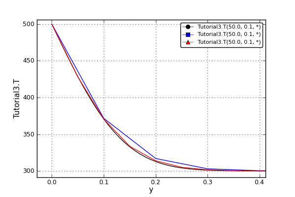
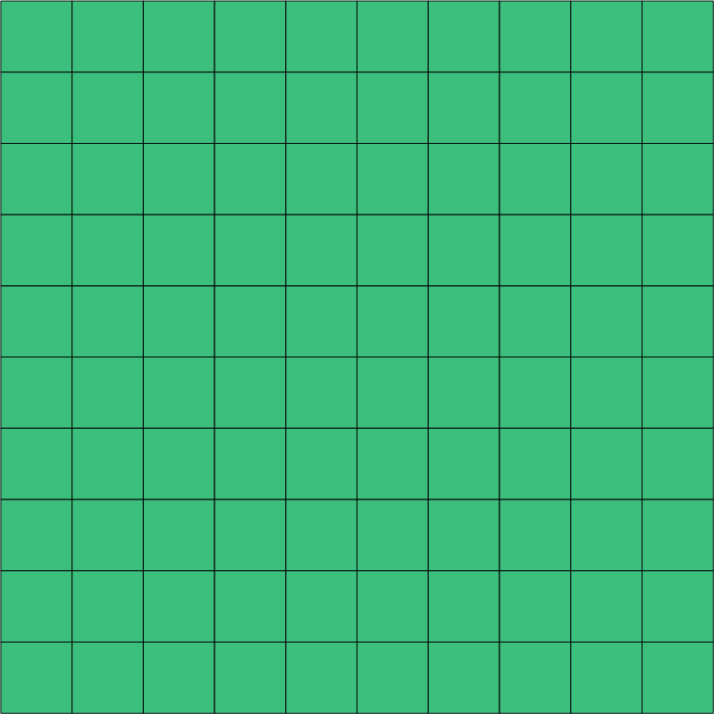
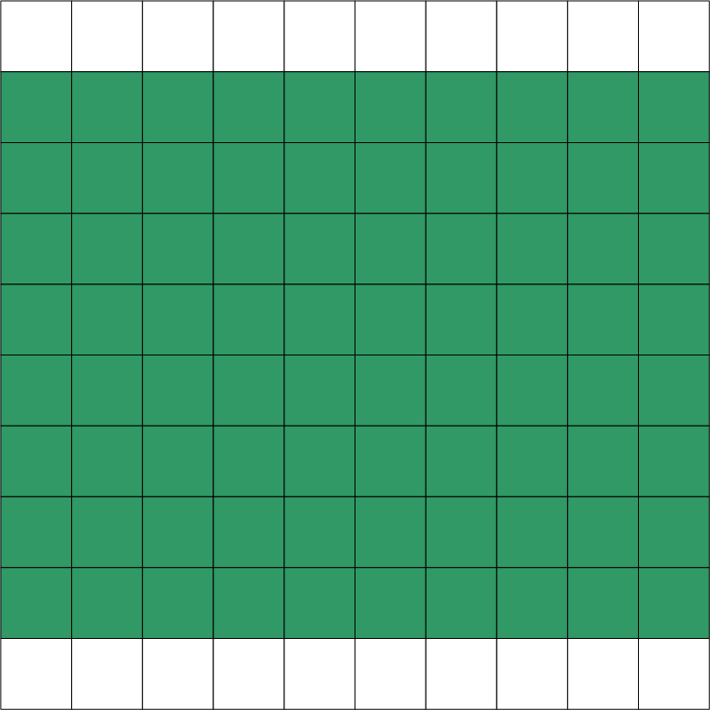
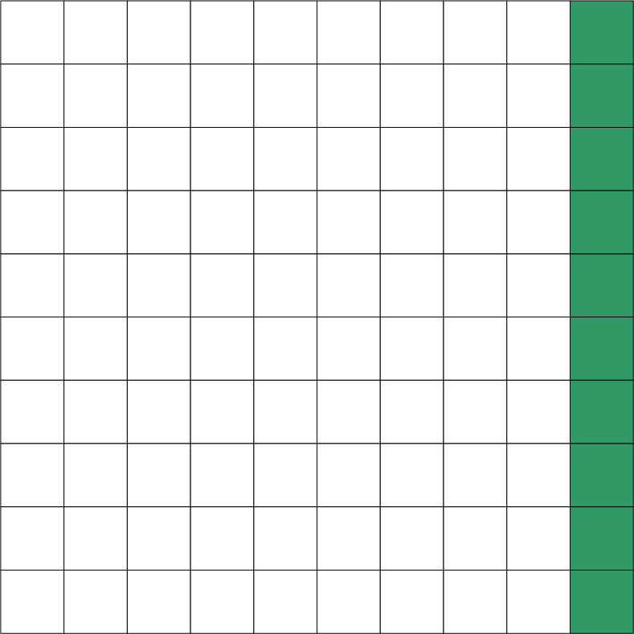
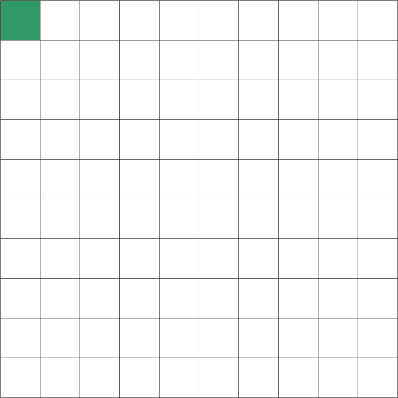

****************
pyDAE User Guide
****************
..
    Copyright (C) Dragan Nikolic, 2016
    DAE Tools is free software; you can redistribute it and/or modify it under the
    terms of the GNU General Public License version 3 as published by the Free Software
    Foundation. DAE Tools is distributed in the hope that it will be useful, but WITHOUT
    ANY WARRANTY; without even the implied warranty of MERCHANTABILITY or FITNESS FOR A
    PARTICULAR PURPOSE. See the GNU General Public License for more details.
    You should have received a copy of the GNU General Public License along with the
    DAE Tools software; if not, see <http://www.gnu.org/licenses/>.

Importing DAE Tools modules
===========================

``pyDAE`` modules can be imported in the following way:
    
.. code-block:: python

    from daetools.pyDAE import *

This will set the python ``sys.path`` for importing the platform dependent c extension modules,
import all symbols from all ``pyDAE`` modules: ``pyCore``, ``pyActivity``, ``pyDataReporting``,
``pyIDAS``, ``pyUnits`` and import some platfom independent modules: ``logs``,
``variable_types`` and ``dae_simulator``.

Alternatively, only the ``daetools`` module can be imported and classes from the ``pyDAE``
extension modules accessed using fully qualified names. For instance:

.. code-block:: python

    import daetools
    
    model = daetools.pyDAE.pyCore.daeModel("name")

Once the ``pyDAE`` module is imported, the other modules (such as third party linear solvers,
optimization solvers etc.) can be imported in the following way:

.. code-block:: python

    # Import Trilinos LA solvers (Amesos, AztecOO):
    from daetools.solvers.trilinos import pyTrilinos

    # Import SuperLU linear solver:
    from daetools.solvers.superlu import pySuperLU

    # Import SuperLU_MT linear solver:
    from daetools.solvers.superlu_mt import pySuperLU_MT

    # Import IPOPT NLP solver:
    from daetools.solvers.ipopt import pyIPOPT

    # Import BONMIN MINLP solver:
    from daetools.solvers.bonmin import pyBONMIN

    # Import NLOPT set of optimization solvers:
    from daetools.solvers.nlopt import pyNLOPT
   
Since domains, parameters and variables in **DAE Tools** have a numerical value in terms
of a unit of measurement (:py:class:`~pyUnits.quantity`) the modules containing definitions of
units and variable types must be imported. They can be imported in the following way:

.. code-block:: python

    from daetools.pyDAE.variable_types import length_t, area_t, volume_t
    from daetools.pyDAE.pyUnits import m, kg, s, K, Pa, J, W

For the complete list of units and variable types have a look in
:doc:`variable_types` and :doc:`units` modules.

Developing models
=================

In **DAE Tools** models are developed by deriving a new class from the base model class
(:py:class:`pyCore.daeModel`). A template/an empty model is given below:

.. code-block:: python

    class myModel(daeModel):
        def __init__(self, name, parent = None, description = ""):
            daeModel.__init__(self, name, parent, description)

            # Declaration/instantiation of domains, parameters, variables, ports, etc:
            ...

        def DeclareEquations(self):
            # Declaration of equations, state transition networks etc.:
            ...

The process consists of the following steps:

1. Call the base class constructor:

   .. code-block:: python

      daeModel.__init__(self, name, parent, description)
      
2. Declare all domains, parameters, variables, ports, components etc. in the
   :py:meth:`pyCore.daeModel.__init__` function:

   * One of the fundamental ideas in **DAE Tools** is separation of the model definition
     from the activities that can be carried out on that model: this way we can have one
     model definition and several simulation scenarios. Consequently, all objects are defined in
     two stages:
         
     * Declaration in the :py:meth:`pyCore.daeModel.__init__` function
     * Initialization in the :py:meth:`pyActivity.daeSimulation.SetUpParametersAndDomains` or
       :py:meth:`pyActivity.daeSimulation.SetUpVariables` functions.

     Therefore, parameters, domains and variables are only declared here, while their initialization
     (setting the value, setting up the domain, assigning or setting an initial condition) is 
     postponed and will be done in the simulation class
   
   * These objects must be declared as data members of the model since the base :py:class:`pyCore.daeModel`
     class keeps only week references and does not own them. Therefore, use:

     .. code-block:: python

        def __init__(self, name, parent = None, description = ""):
            self.domain    = daeDomain(...)
            self.parameter = daeParameter(...)
            self.variable  = daeVariable(...)
            .. etc.

     and not:

     .. code-block:: python

        def __init__(self, name, parent = None, description = ""):
            domain    = daeDomain(...)
            parameter = daeParameter(...)
            variable  = daeVariable(...)
            .. etc.
         
     because at the exit from the :py:meth:`pyCore.daeModel.__init__` function the objects
     will go out of scope and get destroyed. However, the model still holds references to them
     which will result in the segmentation fault.
    
3. Declare equations, state transition networks, OnEvent and OnCondition actions
   in the :py:meth:`pyCore.daeModel.DeclareEquations` function.

   * The :py:meth:`pyCore.daeModel.DeclareEquations` function will be called automatically
     by the framework.

     .. note:: This function is never called directly by the user!
     
   * Initialization of the simulation object is done in several phases. At the point when this function
     is called by the framework the model parameters, domains, variables etc. are fully initialized.
     Therefore, it is safe to get the values of the parameters or domain points and use them to
     create equations, for example.
     However, the **variable values** are obviously **not available** at this moment (for they get
     initialized at the later stage). Anyway, obtaining variable values while still developing a model
     is meaningless.

A simplest **DAE Tools** model with a description of all steps/tasks necessary to develop a model
can be found in the :ref:`whats_the_time` tutorial
(`whats_the_time.py <../../examples/whats_the_time.html>`_).

Parameters
----------

Parameters are time invariant quantities that do not change during
a simulation. Usually a good choice what should be a parameter is a
physical constant, number of discretization points in a domain etc.

There are two types of parameters in **DAE Tools**:

* Ordinary
* Distributed.

The process of defining parameters is two-fold:
    
* Declaring a parameter in the model
* Initialize it (by setting its value) in the simulation

Declaring parameters
~~~~~~~~~~~~~~~~~~~~
Parameters are declared in the :py:meth:`pyCore.daeModel.__init__` function.
An ordinary parameter can be declared in the following way:

.. code-block:: python

   self.myParam = daeParameter("myParam", units, parentModel, "description")

Parameters can be distributed on domains. A distributed parameter can be
declared in the following way:

.. code-block:: python

   self.myParam = daeParameter("myParam", units, parentModel, "description")
   self.myParam.DistributeOnDomain(myDomain)

   # Or simply:
   self.myParam = daeParameter("myParam", units, parentModel, "description", [myDomain])

Initializing parameters
~~~~~~~~~~~~~~~~~~~~~~~
Parameters are initialized in the :py:meth:`pyActivity.daeSimulation.SetUpParametersAndDomains`
function. To set a value of an ordinary parameter use the following:

.. code-block:: python

   myParam.SetValue(value)

while to set a value of distributed parameters (one-dimensional for example) use:

.. code-block:: python

   for i in range(0, myDomain.NumberOfPoints):
       myParam.SetValue(i, value)

where the ``value`` can be either a ``float`` or the :py:class:`pyUnits.quantity` object
(for instance ``1.34 * W/(m*K)``).

Using parameters
~~~~~~~~~~~~~~~~
The most commonly used functions are:

* The function call operator :py:meth:`pyCore.daeParameter.__call__` (``operator ()``)
  which returns the :py:class:`pyCore.adouble` object that holds the parameter value 
* The :py:meth:`pyCore.daeParameter.array` function which returns the :py:class:`pyCore.adouble_array`
  object that holds an array of parameter values
* Distributed parameters have the :py:attr:`pyCore.daeParameter.npyValues` property which
  returns the parameter values as a numpy multi-dimensional array (with ``numpy.float`` data type)
* The functions :py:class:`pyCore.daeParameter.SetValue` and :py:class:`pyCore.daeParameter.GetValue`
  which get/set the parameter value as ``float`` or the :py:class:`pyUnits.quantity` object

.. note:: The functions :py:meth:`pyCore.daeParameter.__call__` and :py:meth:`pyCore.daeParameter.array`
          can only be used to build equations' residual expressions.
          On the other hand, the functions :py:class:`pyCore.daeParameter.GetValue`
          , :py:class:`pyCore.daeParameter.SetValue` and :py:attr:`pyCore.daeParameter.npyValues`
          can be used to access the parameters real data at any point.

1. To get a value of the ordinary parameter the :py:meth:`pyCore.daeParameter.__call__`
   function (``operator ()``) can be used. For instance, if we want the variable ``myVar`` to be
   equal to the sum of the parameter ``myParam`` and ``15``:

   .. math::
        myVar = myParam + 15
   
   we can write the following:

   .. code-block:: python

     # Notation:
     #  - eq is a daeEquation object
     #  - myParam is an ordinary daeParameter object (not distributed)
     #  - myVar is an ordinary daeVariable (not distributed)
     eq.Residual = myVar() - myParam() - 15

2. To get a value of a distributed parameter the :py:meth:`pyCore.daeParameter.__call__`
   function (``operator ()``) can be used again. For instance, if we want the distributed
   variable ``myVar`` to be equal to the sum of the parameter ``myParam`` and ``15`` at each
   point of the domain ``myDomain``:

   .. math::
        myVar(i) = myParam(i) + 15; \forall i \in [0, d_n]
        
   we can write:

   .. code-block:: python

     # Notation:
     #  - myDomain is daeDomain object
     #  - n is the number of points in the myDomain
     #  - eq is a daeEquation object distributed on the myDomain
     #  - d is daeDEDI object (used to iterate through the domain points)
     #  - myParam is daeParameter object distributed on the myDomain
     #  - myVar is daeVariable object distributed on the myDomain
     d = eq.DistributeOnDomain(myDomain, eClosedClosed)
     eq.Residual = myVar(d) - myParam(d) - 15

   This code translates into a set of ``n`` equations.

   Obviously, a parameter can be distributed on more than one domain. If we want to
   write an identical equation like in the previous case:
       
   .. math::
        myVar(d_1,d_2) = myParam(d_1,d_2) + 15; \forall d_1 \in [0, d_{1n}], \forall d_2 \in [0, d_{2n}]
   
   we can write the following:

   .. code-block:: python

     # Notation:
     #  - myDomain1, myDomain2 are daeDomain objects
     #  - n is the number of points in the myDomain1
     #  - m is the number of points in the myDomain2
     #  - eq is a daeEquation object distributed on the domains myDomain1 and myDomain2
     #  - d is daeDEDI object (used to iterate through the domain points)
     #  - myParam is daeParameter object distributed on the myDomain1 and myDomain2
     #  - myVar is daeVariable object distributed on the myDomaina and myDomain2
     d1 = eq.DistributeOnDomain(myDomain1, eClosedClosed)
     d2 = eq.DistributeOnDomain(myDomain2, eClosedClosed)
     eq.Residual = myVar(d1,d2) - myParam(d1,d2) - 15

3. To get an array of parameter values the function :py:meth:`pyCore.daeParameter.array`
   can be used, which returns the :py:class:`pyCore.adouble_array` object.
   Arrays of values can only be used in conjunction with mathematical functions that operate
   on :py:class:`pyCore.adouble_array` objects such as:
   :py:meth:`pyCore.Sum`, :py:meth:`pyCore.Product`, :py:meth:`pyCore.Sqrt`, :py:meth:`pyCore.Sin`,
   :py:meth:`pyCore.Cos`, :py:meth:`pyCore.Min`, :py:meth:`pyCore.Max`, :py:meth:`pyCore.Log`, 
   :py:meth:`pyCore.Log10`, etc.

   For instance, if we want the variable ``myVar`` to be equal to the sum of values of the parameter
   ``myParam`` for all points in the domain ``myDomain``, we can use the function
   :py:meth:`pyCore.Sum` which accepts the :py:meth:`pyCore.adouble_array` objects.

   The :py:meth:`pyCore.daeParameter.array` function accepts the following arguments:

   * plain integer (to select a single index from a domain)
   * python list (to select a list of indexes from a domain)
   * python slice (to select a portion of indexes from a domain: startIndex, endIindex, step)
   * character ``*`` (to select all points from a domain)
   * integer ``-1`` (to select all points from a domain)
   * empty python list ``[]`` (to select all points from a domain)

   Basically all arguments listed above are internally used to create the
   :py:class:`pyCore.daeIndexRange` object. :py:class:`pyCore.daeIndexRange` constructor has
   three variants:
       
   1. The first one accepts a single argument: :py:class:`pyCore.daeDomain` object.
      In this case the returned :py:class:`pyCore.adouble_array` object will contain the
      parameter values at all points in the specified domain.

   2. The second one accepts two arguments: :py:class:`pyCore.daeDomain` object and a list
      of integer that represent indexes within the specified domain.
      In this case the returned :py:class:`pyCore.adouble_array` object will contain the
      parameter values at the selected points in the specified domain.

   3. The third one accepts four arguments: :py:class:`pyCore.daeDomain` object, and three
      integers: ``startIndex``, ``endIndex`` and ``step`` (which is basically a slice, that is
      a portion of a list of indexes: ``start`` through ``end-1``, by the increment ``step``).
      More info about slices can be found in the
      `Python documentation <http://docs.python.org/2/library/functions.html?highlight=slice#slice>`_.
      In this case the returned :py:class:`pyCore.adouble_array` object will contain the
      parameter values at the points in the specified domain defined by the slice object.

   Let assume that we want the variable ``myVar`` to be equal to the sum of values in
   the array ``values`` that holds values from the parameter ``myParam`` at the
   specified indexes in the domains ``myDomain1`` and ``myDomain2``:

   .. math::
        myVar = \sum values

   Now we can explore different scenarios for creating the array ``values`` from the parameter
   ``myParam`` distributed on two domains:
   
   .. code-block:: python

        # Notation:
        #  - myDomain1, myDomain2 are daeDomain objects
        #  - eq is daeEquation object
        #  - myVar is daeVariable object
        #  - myParam is daeParameter object distributed on myDomain1 and myDomain2
        #  - values is the adouble_array object 

        # Case 1. An array contains the following values from the myParam:
        #  - at the first point in the domain myDomain1
        #  - all points from the domain myDomain2
        # All expressions below are equivalent:
        values = self.T.array(0, '*')
        values = self.T.array(0, -1)
        values = self.T.array(0, [])

        eq1.Residual = myVar() - Sum(values)
            
        # Case 2. An array contains the following values from the myParam:
        #  - the first three points in the domain myDomain1
        #  - all even points from the domain myDomain2
        values = self.T.array([0,1,2], slice(0, myDomain2.NumberOfPoints+1, 2))

        eq2.Residual = myVar() - Sum(values)

   The ``case 1.`` translates into:

   .. math::
      myVar = myParam(0,0) + myParam(0,1) + ... + myParam(0,n_2)
      
   where ``n2`` is the number of points in the domain ``myDomain2``.

   The ``case 2.`` translates into:

   .. math::
      myVar = & myParam(0,0) + myParam(0,2) + myParam(0,4) + ... + \\
              & myParam(1,0) + myParam(1,2) + myParam(1,4) + ... + \\
              & myParam(2,0) + myParam(2,2) + myParam(2,4) + ...

More information about parameters can be found in the API reference :py:class:`pyCore.daeParameter`
and in :doc:`tutorials`.

Variable types
--------------

Variable types are used in **DAE Tools** to describe variables. They hold
the following information:

* Name: string
* Units: :py:class:`pyUnits.unit` object
* LowerBound: float
* UpperBound: float
* InitialGuess: float
* AbsoluteTolerance: float

Declaration of variable types is commonly done outside of the model
definition (in the module scope).

Declaring variable types
~~~~~~~~~~~~~~~~~~~~~~~~
A variable type can be declared in the following way:

.. code-block:: python

    # Temperature, units: Kelvin, limits: 100 - 1000K, Def.value: 273K, Abs.Tol: 1E-5
    typeTemperature = daeVariableType("Temperature", "K", 100, 1000, 273, 1E-5)

Distribution domains
--------------------

There are two types of domains in **DAE Tools**:
    
* Simple arrays
* Distributed domains (used to distribute variables,
  parameters and equations in space)

Distributed domains can have a uniform (default) or a user-specified non-uniform grid.
At the moment, only the following finite difference methods are implemented:

* Backward finite difference method (BFD)
* Forward finite difference method (FFD)
* Center finite difference method (CFD)

In **DAE Tools** many objects can be distributed on domains: parameters, variables, equations,
even models and ports. Obviously it does not have a physical meaning to distribute a model on
a domain. However, that can be useful for modelling of complex processes where each point in
a distributed domain have a corresponding model attached. In addition, domain points values
can be obtained as numpy one-dimensional array; this way **DAE Tools** can be easily used in
conjuction with other scientific python libraries: `NumPy <http://numpy.scipy.org>`_,
`SciPy <http://www.scipy.org>`_ and many `other <http://www.scipy.org/Projects>`_.

The process of defining domains is two-fold:

* Declaring a domain in the model
* Initialize it in the simulation

Declaring domains
~~~~~~~~~~~~~~~~~
Domains are declared in the :py:meth:`pyCore.daeModel.__init__` function.

.. code-block:: python

   self.myDomain = daeDomain("myDomain", parentModel, units, "description")

Initializing domains
~~~~~~~~~~~~~~~~~~~~
Domains are initialized in the :py:meth:`pyActivity.daeSimulation.SetUpParametersAndDomains`
function. To set up a domain as a simple array the function
:py:meth:`pyCore.daeDomain.CreateArray` can be used:

.. code-block:: python

    # Array of 10 elements
    myDomain.CreateArray(10)

while to set up a domain distributed on a structured grid the function
:py:meth:`pyCore.daeDomain.CreateStructuredGrid`:

.. code-block:: python

    # Center finite diff of the 2nd order with 10 elements and bounds: 0.0 to 1.0
    myDomain.CreateStructuredGrid(eCFDM, 2, 10, 0.0,  1.0)

It is also possible to create an unstructured grid (for use in Finite Element models). However, creation
and setup of such domains is an implementation detail of corresponding modules (i.e. deal.II).

Non-uniform structured grids
~~~~~~~~~~~~~~~~~~~~~~~~~~~~
In certain situations it is not desired to have a uniform distribution
of the points within the given interval, defined by the lower and upper bounds.
In these cases, a non-uniform structured grid can be specified using the attribute
:py:attr:`pyCore.daeDomain.Points` which contains the list of the points and that
can be manipulated by the user:

.. code-block:: python

    # First create a distributed domain (distributed on a structured grid)
    myDomain.CreateStructuredGrid(eCFDM, 2, 10, 0.0,  1.0)

    # The original 11 points are: [0.0, 0.1, 0.2, 0.3, 0.4, 0.5, 0.6, 0.7, 0.8, 0.9, 1.0]
    # If we are have a stiff profile at the beginning of the domain,
    # then we can place more points there
    myDomain.Points = [0.0, 0.05, 0.10, 0.15, 0.20, 0.25, 0.30, 0.35, 0.40, 0.60, 1.00]

The comparison of the effects of uniform and non-uniform grids is given
in :ref:`Figure-non_uniform_grid` (a simple heat conduction problem from the :ref:`tutorial_3`
has been served as a basis for comparison). Here we have the following
cases:

* Blue line (10 intervals): uniform grid - a very rough prediction
* Red line (10 intervals): non-uniform grid - more points at the beginning of the domain
* Black line: the analytical solution

.. _Figure-non_uniform_grid:

   Effect of uniform and non-uniform grids on numerical solution

We can clearly observe that much more precise results are obtained by using
denser grid at the beginning of the domain.

Using domains
~~~~~~~~~~~~~
The most commonly used functions are:

* The functions :py:meth:`pyCore.daeDomain.__call__` (``operator ()``) and
  :py:meth:`pyCore.daeDomain.__getitem__` (``operator []``)
  which return the :py:class:`pyCore.adouble` object that holds the value of the point
  at the specified index within the domain. Both functions have the same functionality.
* The :py:meth:`pyCore.daeDomain.array` function which returns the :py:class:`pyCore.adouble_array`
  object that holds an array of points values
* The :py:attr:`pyCore.daeDomain.npyPoints` property which returns the points in the domain
  as a numpy one-dimensional array (with ``numpy.float`` data type)

.. note:: The functions :py:meth:`pyCore.daeDomain.__call__`, :py:meth:`pyCore.daeDomain.__getitem__`
          and :py:meth:`pyCore.daeDomain.array` can only be used to build equations' residual expressions.
          On the other hand, the function :py:attr:`pyCore.daeDomain.npyPoints` can be used to access the
          domain points at any point.

The function :py:meth:`pyCore.daeDomain.array` is called in the same way as explained in
`Using parameters`_.

1. To get a point at the specified index within the domain the :py:meth:`pyCore.daeDomain.__getitem__`
   function (``operator []``) can be used. For instance, if we want the variable ``myVar`` to be
   equal to the sixth point in the domain ``myDomain``:

   .. math::
        myVar = myDomain[5]

   we can write the following:

   .. code-block:: python

     # Notation:
     #  - eq is a daeEquation object
     #  - myDomain is daeDomain object
     #  - myVar is an daeVariable object
     eq.Residual = myVar() - myDomain[5]

More information about domains can be found in :py:class:`pyCore.daeDomain`
and in on :doc:`tutorials`.

    
Variables
---------
There are various types of variables in **DAE Tools**.
They can be:

* Ordinary
* Distributed

and:

* Algebraic
* Differential
* Constant (that is their value is assigned by fixing the number of degrees of freedom)

The process of defining variables is two-fold:

* Declaring a variable in the model
* Initialize it (by assigning its value or setting an initial condition) in the simulation

Declaring variables
~~~~~~~~~~~~~~~~~~~
Variables are declared in the :py:meth:`pyCore.daeModel.__init__` function.
An ordinary variable can be declared in the following way:

.. code-block:: python

   self.myVar = daeVariable("myVar", variableType, parentModel, "description")

Variables can be distributed on domains. A distributed variable can be
declared in the following way:

.. code-block:: python

   self.myVar = daeVariable("myVar", variableType, parentModel, "description")
   self.myVar.DistributeOnDomain(myDomain)

   # Or simply:
   self.myVar = daeVariable("myVar", variableType, parentModel, "description", [myDomain])
   
Initializing variables
~~~~~~~~~~~~~~~~~~~~~~
Variables are initialized in the :py:meth:`pyActivity.daeSimulation.SetUpVariables`
function:

* To assign the variable value/fix the degrees of freedom use the following:

  .. code-block:: python

     myVar.AssignValue(value)

  or, if the variable is distributed: 

  .. code-block:: python

     for i in range(0, myDomain.NumberOfPoints):
         myVar.AssignValue(i, value)

  where the ``value`` can be either a ``float`` or the :py:class:`pyUnits.quantity` object
  (for instance ``1.34 * W/(m*K)``).

* To set an initial condition use the following:

  .. code-block:: python

     myVar.SetInitialCondition(value)

  or, if the variable is distributed:

  .. code-block:: python

     for i in range(0, myDomain.NumberOfPoints):
         myVar.SetInitialCondition(i, value)

  where the ``value`` can again be either a ``float`` or the :py:class:`pyUnits.quantity` object.

* To set an absolute tolerance the following can be used:

  .. code-block:: python

     myVar.SetAbsoluteTolerances(1E-5)

* To set an initial guess use the following:

  .. code-block:: python

     myVar.SetInitialGuess(value)

  or, if the variable is distributed:

  .. code-block:: python

     for i in range(0, myDomain.NumberOfPoints):
         myVar.SetInitialGuess(i, value)

  where the ``value`` can again be either a ``float`` or the :py:class:`pyUnits.quantity` object.

Using variables
~~~~~~~~~~~~~~~
The most commonly used functions are:

* The function call operator :py:meth:`pyCore.daeVariable.__call__` (``operator ()``)
  which returns the :py:class:`pyCore.adouble` object that holds the variable value
  
* The function :py:meth:`pyCore.daeVariable.dt` which returns the :py:class:`pyCore.adouble` object
  that holds the value of a time derivative of the variable
  
* The functions :py:meth:`pyCore.daeVariable.d` and :py:meth:`pyCore.daeVariable.d2` which return
  the :py:class:`pyCore.adouble` object that holds the value of a partial derivative of the variable
  of the first and second order, respectively
  
* The functions :py:meth:`pyCore.daeVariable.array`, :py:meth:`pyCore.daeVariable.dt_array`,
  :py:meth:`pyCore.daeVariable.d_array` and :py:meth:`pyCore.daeVariable.d2_array` which return the
  :py:class:`pyCore.adouble_array` object that holds an array of variable values, time derivatives,
  partial derivative of the first order and partial derivative of the second order, respectively
  
* Distributed parameters have the :py:attr:`pyCore.daeVariable.npyValues` property which
  returns the variable values as a numpy multi-dimensional array (with ``numpy.float`` data type)
  
* The functions :py:class:`pyCore.daeVariable.SetValue` and :py:class:`pyCore.daeVariable.GetValue`
  which get/set the variable value as ``float`` or the :py:class:`pyUnits.quantity` object

* The functions :py:meth:`pyCore.daeVariable.ReAssignValue` and
  :py:meth:`pyCore.daeVariable.ReSetInitialCondition` can be used to re-assign or re-initialize
  variables **only during a simulation** (in the function :py:meth:`pyActivity.daeSimulation.Run`)

.. note:: The functions :py:meth:`pyCore.daeVariable.__call__`, :py:meth:`pyCore.daeVariable.dt`
          , :py:meth:`pyCore.daeVariable.d`, :py:meth:`pyCore.daeVariable.d2`, :py:meth:`pyCore.daeVariable.array`
          , :py:meth:`pyCore.daeVariable.dt_array`, :py:meth:`pyCore.daeVariable.d_array` 
          and :py:meth:`pyCore.daeVariable.d2_array` can only be used to build equations' residual expressions.
          On the other hand, the functions :py:class:`pyCore.daeVariable.GetValue` 
          , :py:class:`pyCore.daeVariable.SetValue` and :py:attr:`pyCore.daeVariable.npyValues` can be used
          to access the variables real data at any point.

All above mentioned functions are called in the same way as explained in `Using parameters`_.
More information will be given here on getting time and partial derivatives.

1. To get a time derivative of the ordinary variable the function :py:meth:`pyCore.daeVariable.dt`
   can be used. For instance, if we want a time derivative of the variable ``myVar`` to be equal
   to some constant, let's say 1.0:

   .. math::
        { d(myVar) \over {d}{t} } = 1

   we can write the following:

   .. code-block:: python

     # Notation:
     #  - eq is a daeEquation object
     #  - myVar is an ordinary daeVariable (not distributed)
     eq.Residual = myVar.dt() - 1.0

2. To get a time derivative of a distributed variable the :py:meth:`pyCore.daeVariable.dt`
   function can be used again. For instance, if we want a time derivative of the distributed variable
   ``myVar`` to be equal to some constant at each point of the domain ``myDomain``:

   .. math::
        {\partial myVar(i) \over \partial t} = 1; \forall i \in [0, d_n]

   we can write:

   .. code-block:: python

     # Notation:
     #  - myDomain is daeDomain object
     #  - n is the number of points in the myDomain
     #  - eq is a daeEquation object distributed on the myDomain
     #  - d is daeDEDI object (used to iterate through the domain points)
     #  - myVar is daeVariable object distributed on the myDomain
     d = eq.DistributeOnDomain(myDomain, eClosedClosed)
     eq.Residual = myVar.dt(d) - 1.0

   This code translates into a set of ``n`` equations.
   
   Obviously, a variable can be distributed on more than one domain. If we want to
   write an identical equation like in the previous case:

   .. math::
        {d(myVar(d_1, d_2)) \over dt} = 1; \forall d_1 \in [0, d_{1n}], \forall d_2 \in [0, d_{2n}]

   we can write the following:

   .. code-block:: python

     # Notation:
     #  - myDomain1, myDomain2 are daeDomain objects
     #  - n is the number of points in the myDomain1
     #  - m is the number of points in the myDomain2
     #  - eq is a daeEquation object distributed on the domains myDomain1 and myDomain2
     #  - d is daeDEDI object (used to iterate through the domain points)
     #  - myVar is daeVariable object distributed on the myDomaina and myDomain2
     d1 = eq.DistributeOnDomain(myDomain1, eClosedClosed)
     d2 = eq.DistributeOnDomain(myDomain2, eClosedClosed)
     eq.Residual = myVar.dt(d1,d2) - 1.0

3. To get a partial derivative of a distributed variable the functions :py:meth:`pyCore.daeVariable.d`
   and :py:meth:`pyCore.daeVariable.d2` can be used. For instance, if we want a partial derivative of
   the distributed variable ``myVar`` to be equal to 0.0 at each point of the domain ``myDomain``:

   .. math::
        {\partial myVar(i) \over \partial myDomain} = 0.0; \forall i \in [0, d_n]

   we can write:

   .. code-block:: python

     # Notation:
     #  - myDomain is daeDomain object
     #  - n is the number of points in the myDomain
     #  - eq is a daeEquation object distributed on the myDomain
     #  - d is daeDEDI object (used to iterate through the domain points)
     #  - myVar is daeVariable object distributed on the myDomain
     d = eq.DistributeOnDomain(myDomain, eClosedClosed)
     eq.Residual = myVar.d(myDomain, d) - 0.0

   Again, this code translates into a set of ``n`` equations.

More information about variables can be found in the API reference :py:class:`pyCore.daeVariable`
and in :doc:`tutorials`.

Ports
-----

Ports are used to connect two models. Like models, ports
can contain domains, parameters and variables.

In **DAE Tools** ports
are defined by deriving a new class from the base port class
(:py:class:`pyCore.daePort`). A template/an empty port is given below:

.. code-block:: python

    class myPort(daePort):
        def __init__(self, name, parent = None, description = ""):
            daePort.__init__(self, name, type, parent, description)

            # Declaration/instantiation of domains, parameters and variables
            ...

The process consists of the following steps:

1. Call the base class constructor:

   .. code-block:: python

      daePort.__init__(self, name, type, parent, description)

2. Declare all domains, parameters and variables in the
   :py:meth:`pyCore.daePort.__init__` function

   The same rules apply as described in the `Developing models`_ section.

Two ports can be connected by using the :py:meth:`pyCore.daeModel.ConnectPorts` function.

Instantiating ports
~~~~~~~~~~~~~~~~~~~
Ports are instantiated in the :py:meth:`pyCore.daeModel.__init__` function:

.. code-block:: python

   self.myPort = daePort("myPort", eInletPort, parentModel, "description")

Event ports
-----------

Event ports are also used to connect two models; however, they allow sending of discrete messages
(events) between models. Events can be triggered manually or when a specified condition
is satisfied. The main difference between event and ordinary ports is that the former allow a discrete
communication between models while latter allow a continuous exchange of information.
Messages contain a floating point value that can be used by a recipient. Upon a reception of an event
certain actions can be executed. The actions are specified in the :py:meth:`pyCore.daeModel.ON_EVENT` function.

Two event ports can be connected by using the :py:meth:`pyCore.daeModel.ConnectEventPorts` function.
A single outlet event port can be connected to unlimited number of inlet event ports. 

Instantiating event ports
~~~~~~~~~~~~~~~~~~~~~~~~~
Event ports are instantiated in the :py:meth:`pyCore.daeModel.__init__` function:

.. code-block:: python

   self.myEventPort = daeEventPort("myEventPort", eOutletPort, parentModel, "description")

Equations
---------

There are three types of equations in **DAE Tools**:
    
* Ordinary
* Distributed
* Discontinuous

Distributed equations are equations which are distributed on one or more domains
and valid on the selected points within those domains.
Equations can be distributed on a whole domain, on a portion of it or even on
a single point (useful fsor specifying boundary conditions).

Declaring equations
~~~~~~~~~~~~~~~~~~~
Equations are declared in the :py:meth:`pyCore.daeModel.DeclareEquations` function.
To declare an ordinary equation the :py:meth:`pyCore.daeModel.CreateEquation`
function is used:

.. code-block:: python

    eq = model.CreateEquation("MyEquation", "description")

while to declare a distributed equation:

.. code-block:: python

    eq = model.CreateEquation("MyEquation")
    d = eq.DistributeOnDomain(myDomain, eClosedClosed)

Equations can be distributed on a whole domain or on a portion of it.
Currently there are 7 options:

-  Distribute on a closed (whole) domain - analogous to: :math:`x \in [x_0, x_n]`
-  Distribute on a left open domain - analogous to: :math:`x \in (x_0, x_n]`
-  Distribute on a right open domain - analogous to: :math:`x \in [x_0, x_n)`
-  Distribute on a domain open on both sides - analogous to: :math:`x \in (x_0, x_n)`
-  Distribute on the lower bound - only one point: :math:`x \in \{ x_0 \}`
-  Distribute on the upper bound - only one point: :math:`x \in \{ x_n \}`
-  Custom array of points within a domain: :math:`x \in \{ x_0, x_3, x_7, x_8 \}`

where :math:`x_0` stands for the LowerBound and :math:`x_n` stands for the UpperBound of the domain.

An overview of various bounds is given in the table below.
Assume that we have an equation which is distributed on two domains: ``x`` and ``y``.
The table shows various options while distributing an equation. Green squares
represent portions of a domain included in the distributed equation, while
white squares represent excluded portions.

+-------------------------------------------------+---------------------------------------------------+
| | |EquationBounds_CC_CC|                        | | |EquationBounds_OO_OO|                          |
| |  x = eClosedClosed; y = eClosedClosed         | |  x = eOpenOpen; y = eOpenOpen                   |
| |  :math:`x \in [x_0, x_n], y \in [y_0, y_n]`   | |  :math:`x \in ( x_0, x_n ), y \in ( y_0, y_n )` |
+-------------------------------------------------+---------------------------------------------------+
| | |EquationBounds_CC_OO|                        | | |EquationBounds_CC_OC|                          |
| |  x = eClosedClosed; y = eOpenOpen             | |  x = eClosedClosed; y = eOpenClosed             |
| |  :math:`x \in [x_0, x_n], y \in ( y_0, y_n )` | |  :math:`x \in [x_0, x_n], y \in ( y_0, y_n ]`   |
+-------------------------------------------------+---------------------------------------------------+
| | |EquationBounds_LB_CO|                        | | |EquationBounds_LB_CC|                          |
| |  x = eLowerBound; y = eClosedOpen             | |  x = eLowerBound; y = eClosedClosed             |
| |  :math:`x = x_0, y \in [ y_0, y_n )`          | |  :math:`x = x_0, y \in [y_0, y_n]`              |
+-------------------------------------------------+---------------------------------------------------+
| | |EquationBounds_UB_CC|                        | | |EquationBounds_LB_UB|                          |
| |  x = eUpperBound; y = eClosedClosed           | |  x = eLowerBound; y = eUpperBound               |
| |  :math:`x = x_n, y \in [y_0, y_n]`            | |  :math:`x = x_0, y = y_n`                       |
+-------------------------------------------------+---------------------------------------------------+

.. |EquationBounds_OO_OO| image:: _static/EquationBounds_OO_OO.png
    :width: 250pt

.. |EquationBounds_CC_OC| image:: _static/EquationBounds_CC_OC.png
    :width: 250pt

.. |EquationBounds_LB_CO| image:: _static/EquationBounds_LB_CO.png
    :width: 250pt

.. |EquationBounds_LB_CC| image:: _static/EquationBounds_LB_CC.png
    :width: 250pt

    

Defining equations (equation residual expression)
~~~~~~~~~~~~~~~~~~~~~~~~~~~~~~~~~~~~~~~~~~~~~~~~~
Equation in **DAE Tools** are given in implicit form. Therefore, it is necessary to specify its residual.
For instance, to define a residual expression of an ordinary equation:

.. math::
    {\partial V_{14} \over \partial t} + {V_1 \over V_{14} + 2.5} + sin(3.14 \cdot V_3) = 0

we can write the following:
    
.. code-block:: python

    # Notation:
    #  - V1, V3, V14 are ordinary variables
    eq.Residal = V14.dt() + V1() / (V14() + 2.5) + sin(3.14 * V3())

To define a residual expression of a distributed equation:

.. math::
    {\partial V_{14}(x,y)) \over \partial t} + {V_1 \over V_{14}(x,y) + 2.5} + sin(3.14 \cdot V_3(x,y)) = 0;
    \forall x \in [0, x_n], \forall y \in (0, x_y)

we can write the following:
    
.. code-block:: python

    # Notation:
    #  - V1 is an ordinary variable
    #  - V3 and V14 are variables distributed on domains x and y
    eq = model.CreateEquation("MyEquation")
    dx = eq.DistributeOnDomain(x, eClosedClosed)
    dy = eq.DistributeOnDomain(y, eOpenOpen)
    eq.Residal = V14.dt(dx,dy) + V1() / ( V14(dx,dy) + 2.5) + sin(3.14 * V3(dx,dy) )

where ``dx`` and ``dy`` are :py:class:`pyCore.daeDEDI` (which is short for
``daeDistributedEquationDomainInfo``) objects. These objects are used internally by the framework
to iterate over the domain points when generating a set of equations from a distributed equation.
If a :py:class:`pyCore.daeDEDI` object is used as an argument of the ``operator ()``, ``dt``,
``d``, ``d2``, ``array``, ``dt_array``, ``d_array``, or ``d2_array`` functions, it represents a
current index in the domain which is being iterated. Hence, the equation above is equivalent to writing:

.. code-block:: python

    # Notation:
    #  - V1 is an ordinary variable
    #  - V3 and V14 are variables distributed on domains x and y
    for dx in range(0, x.NumberOfPoints): # x: [x0, xn]
        for dy in range(1, y.NumberOfPoints-1): # y: (y0, yn)
            eq = model.CreateEquation("MyEquation_%d_%d" % (dx, dy) )
            eq.Residal = V14.dt(dx,dy) + V1() / ( V14(dx,dy) + 2.5) + sin(3.14 * V3(dx,dy) )
    
However, the former is much more elegant and we do not have to take care of indexing etc.

Details on autodifferentiation support
^^^^^^^^^^^^^^^^^^^^^^^^^^^^^^^^^^^^^^
To calculate a residual and its gradients (which represent a single row in the Jacobian matrix)
**DAE Tools** combine the 
`operator overloading <http://en.wikipedia.org/wiki/Automatic_differentiation#Operator_overloading>`_
technique for `automatic differentiation <http://en.wikipedia.org/wiki/Automatic_differentiation>`_
(adopted from `ADOL-C <https://projects.coin-or.org/ADOL-C>`_ library) using the concept of representing
equations as **evaluation trees**.
Evaluation trees consist of binary or unary nodes, each node representing a basic mathematical
operation (``+, -, *, /, **``) or a standard mathematical function
(``sin, cos, tan, sqrt, pow, log, ln, exp, min, max, floor, ceil, abs, sum, product, ...``).
The basic mathematical operations and functions are re-defined to operate on **a heavily
modified ADOL-C** class :py:class:`~pyCore.adouble` (which has been extended to contain information about
domains/parameters/variables etc). In adition, a new :py:class:`~pyCore.adouble_array` class has been
introduced to support all above-mentioned operations on arrays of parameters and variables.
What is different here is that :py:class:`~pyCore.adouble`/:py:class:`~pyCore.adouble_array` classes
and mathematical operators/functions work in two modes; they can either **build-up an evaluation tree**
or **calculate a value/derivative of an expression**.
Once built, the evaluation trees can be used to calculate equation residuals or derivatives to fill
a Jacobian matrix necessary for a Newton-type iteration.
A typical evaluation tree is presented in the figure below:

.. _Figure-EvaluationTree:
.. figure:: _static/EvaluationTree.png
    :width: 250 pt
    :figwidth: 300 pt
    :align: center

    Equation evaluation tree in DAE Tools

As it has been described in the previous sections, domains, parameters, and variables contain functions
that return :py:class:`~pyCore.adouble`/:py:class:`~pyCore.adouble_array` objects used to construct the
evaluation trees. These functions include functions to get a value of
a domain/parameter/variable (``operator ()``), to get a time or a partial derivative of a variable
(functions :py:meth:`~pyCore.daeVariable.dt`, :py:meth:`~pyCore.daeVariable.d`, or :py:meth:`~pyCore.daeVariable.d2`)
or functions to obtain an array of values, time or partial derivatives (:py:meth:`~pyCore.daeVariable.array`,
:py:meth:`~pyCore.daeVariable.dt_array`, :py:meth:`~pyCore.daeVariable.d_array`,
and :py:meth:`~pyCore.daeVariable.d2_array`).

Another useful feature of **DAE Tools** equations is that they can be
exported into MathML or Latex format and easily visualized.

For example, the equation ``F`` in :ref:`the figure above <Figure-EvaluationTree>`
is a result of the following **DAE Tools** equation:

.. code-block:: python

    eq = model.CreateEquation("F", "F description")
    eq.Residal = V14.dt() + V1() / (V14() + 2.5) + Sin(3.14 * V3())

Defining boundary conditions
~~~~~~~~~~~~~~~~~~~~~~~~~~~~
Assume that we are modelling a simple heat conduction through a very thin
rectangular plate. At one side (y = 0) we have a constant temperature
(500 K) while at the opposide end we have a constant flux (1E6 W/m2).
The problem can be described by a single distributed equatoin:

.. code-block:: python

    # Notation:
    #  - T is a variable distributed on domains x and y
    #  - ro, k, and cp are parameters
    eq = model.CreateEquation("MyEquation")
    dx = eq.DistributeOnDomain(x, eClosedClosed)
    dy = eq.DistributeOnDomain(y, eOpenOpen)
    eq.Residual = ro() * cp() * T.dt(dx,dy) - k() * ( T.d2(y, dx,dy) + T.d2(y, dx,dy) )

The equation is defined on the domain ``y`` open on both ends. Consequently, we have
to specify some additional equations (boundary conditions, for the ``y = y0`` and
``y = yn``) to make our system well posed:

.. math::
    T(x,y) = 500; \forall x \in [0, x_n], y = 0

    -k \cdot {\partial T(x,y) \over \partial y} = 1E6; \forall x \in [0, x_n], y = y_n

To do so, the following equations can be used:

.. code-block:: python

    # "Left" boundary conditions:
    lbc = model.CreateEquation("Left_BC")
    dx = lbc.DistributeOnDomain(x, eClosedClosed)
    dy = lbc.DistributeOnDomain(y, eLowerBound)
    lbc.Residal = T(dx,dy) - 500  # Constant temperature (500 K)

    # "Right" boundary conditions:
    rbc = model.CreateEquation("Right_BC")
    dx = rbc.DistributeOnDomain(x, eClosedClosed)
    dy = rbc.DistributeOnDomain(y, eUpperBound)
    rbc.Residal = - k() * T.d(y, dx,dy) - 1E6  # Constant flux (1E6 W/m2)

    
PDE on unstructured grids using the Finite Elements Method
-----------------------------------------------------------
DAE Tools support numerical simulation of partial differential equations on adaptive
unstructured grids using Finite Elements Method. Currently, DAE Tools use `deal.II`_ library
for low-level tasks such as mesh loading and refinement, assembly of the system
stiffness and mass matrices and the system load vector, and the generation of the results.
After an initial assembly phase the `deal.II`_ structures are used to
generate daetools equations which are solved together with the rest of the model
equations. All details about the mesh, basis functions, quadrature rules, refinement
etc. are handled by the `deal.II`_ library and can be to some extent configured by the users.
The advantage of this concept are:

* that the generated equations (linear, nonlinear or differential -
  depending on the class of the system) can be coupled with other FE-unrelated equations and solved
  together by daetools solvers
* system discontinuities can be handled as usual in daetools
* modelled processes can be optimized

Support for FE is provided through the following DAE Tools classes:

* :py:class:`~pyCore.daeFiniteElementObject` (abstract class)
* :py:class:`~pyCore.daeFiniteElementModel`
* :py:class:`~pyCore.daeFiniteElementEquation`

and the :py:class:`~pyCore.daeFiniteElementObject` implementation based on the `deal.II`_ library:

* :py:class:`~pyDealII.dealiiFiniteElementSystem_1D`, :py:class:`~pyDealII.dealiiFiniteElementSystem_2D`,
  :py:class:`~pyDealII.dealiiFiniteElementSystem_3D`
* :py:class:`~pyDealII.dealiiFiniteElementEquation_1D`, :py:class:`~pyDealII.dealiiFiniteElementEquation_2D`,
  :py:class:`~pyDealII.dealiiFiniteElementEquation_3D`
* large number of auxiliary classes and functions

:py:class:`~pyDealII.dealiiFiniteElementSystem_nD` is a generic wrapper around the `deal.II`_ library (more specifically
around `FESystem<dim, spacedim>` class) capable to solve systems of scalar/vector FE equations. *This class
provides an interface to group several elements together into one. To the outside world, the resulting object
looks just like a usual finite element object, which is composed of several other finite elements that are possibly of
different type. The result is then a vector-valued finite element.* More information can be found in `deal.II`_
online documentation: `FESystem`_.

A typical use-case scenario consists of the following steps:

1. Instantiation of the :py:class:`~pyDealII.dealiiFiniteElementSystem_nD` object. The constructor accepts the following
   arguments:
      
   - ``meshFilename``
   
     Path to the mesh file. For the list of supported formats check the `GridIn<dim, spacedim>` class
     in `deal.II`_ online documentation: `GridIn`_
   
   - ``polynomialOrder``

     Polynomial order. At the momnt only `FE_Q`_ finite elements are supported that represnt *implementation of a
     scalar Lagrange finite element ``Qp`` that yields the finite element space of continuous, piecewise polynomials
     of degree ``polynomialOrder`` in each coordinate direction. This class is realized using tensor product
     polynomials based on equidistant or given support points*
   
   - ``quadrature``

     Quadrature formula (`Quadrature<dim>` derived object). For the list of supported quadrature formulas
     check the `deal.II`_ online documentation: `Quadrature`_
   
   - ``faceQuadrature``

     Face quadrature formula (`Quadrature<dim-1>` derived object)
 
   - ``functions``

     Dictionary of space dependant functions ``{'Name':Function<dim>}``
 
   - ``equations``

     A list of :py:class:`~pyDealII.dealiiFiniteElementEquation_nD` objects that define
     contributions to the element's stiffness and mass matrices, element's load vector etc.

.. _deal.II: http://dealii.org
.. _FESystem: http://www.dealii.org/developer/doxygen/deal.II/classFESystem.html
.. _FE_Q: http://www.dealii.org/developer/doxygen/deal.II/classFE__Q.html
.. _GridIn: http://www.dealii.org/developer/doxygen/deal.II/classGridIn.html
.. _Quadrature: http://www.dealii.org/developer/doxygen/deal.II/group__Quadrature.html

State Transition Networks
-------------------------
Discontinuous equations are equations that take different forms subject to certain conditions. For example,
if we want to model a flow through a pipe we may observe three different flow regimes:

* Laminar: if Reynolds number is less than 2,100
* Transient: if Reynolds number is greater than 2,100 and less than 10,000
* Turbulent: if Reynolds number is greater than 10,000

What we can see is that from any of these three states we can go to any other state.
This type of discontinuities is called a **reversible discontinuity** and can be described using
:py:meth:`~pyCore.daeModel.IF`, :py:meth:`~pyCore.daeModel.ELSE_IF`, :py:meth:`~pyCore.daeModel.ELSE`
functions:

.. code-block:: python

    IF(Re() <= 2100)                    # (Laminar flow)
    #... (equations go here)

    ELSE_IF(Re() > 2100 & Re() < 10000) # (Transient flow)
    #... (equations go here)

    ELSE()                              # (Turbulent flow)
    #... (equations go here)

    END_IF()

To define conditions the following comparison operators:

- ``<`` (less than)
- ``<=`` (less than or equal)
- ``==`` (equal)
- ``!=`` (not equal)
- ``>`` (greater)
- ``>=`` (greater than or equal)

and the following logical operators:
    
- ``&`` (logical AND)
- ``|`` (logical OR)
- ``~`` (logical NOT)

can be used.

.. note:: Since it is not allowed to overload Python's operators ``and``, ``or`` and ``not`` they
          cannot be used to define logical conditions; therefore, the custom operators ``&``, ``|`` and ``~`` are defined
          and should be used instead.

The comparison operators operate on :py:class:`pyCore.adouble` objects and ``Float`` values.
Units consistency is strictly checked and expressions including ``Float`` values
are allowed only if a variable or parameter is dimensionless.
The following expressions are valid:

.. code-block:: python

   # Notation:
   #  - T is a variable with units: K
   #  - m is a variable with units: kg
   #  - p is a dimensionless parameter

   # T < 0.5 K
   T() < Constant(0.5 * K)

   # (T >= 300 K) or (m < 1 kg)
   T() >= Constant(300 * K) | m < Constant(0.5 * kg)

   # p <= 25.3 (use of the Constant function not necessary)
   p() <= 25.3
   

**Reversible discontinuities** can be **symmetrical** and **non-symmetrical**. The above example is **symmetrical**.
However, if we have a CPU and we want to model its power dissipation we may have three operating modes with the
following state transitions:

* **Normal** mode

  * switch to **Power saving** mode if CPU load is below 5%
  * switch to **Fried** mode if the temperature is above 110 degrees

* **Power saving** mode

  * switch to **Normal** mode if CPU load is above 5%
  * switch to **Fried** mode if the temperature is above 110 degrees

* **Fried** mode

  * Damn, no escape from here... go to the nearest shop and buy a new one!
    Or, donate some money to DAE Tools project :-)

What we can see is that from the **Normal** mode we can either go to the **Power saving** mode or to the **Fried** mode.
The same stands for the **Power saving** mode: we can either go to the **Normal** mode or to the **Fried** mode.
However, once the temperature exceeds 110 degrees the CPU dies (let's say we heavily overclocked it) and there
is no return. This type of discontinuities is called an **irreversible discontinuity** and can be described
using :py:meth:`~pyCore.daeModel.STN`, :py:meth:`~pyCore.daeModel.STATE`, :py:meth:`~pyCore.daeModel.END_STN`
functions:

.. code-block:: python

    STN("CPU")

    STATE("Normal")
    #... (equations go here)
    ON_CONDITION( CPULoad() < 0.05,       switchToStates = [ ("CPU", "PowerSaving") ] )
    ON_CONDITION( T() > Constant(110*K),  switchToStates = [ ("CPU", "Fried") ] )

    STATE("PowerSaving")
    #... (equations go here)
    ON_CONDITION( CPULoad() >= 0.05,      switchToStates = [ ("CPU", "Normal") ] )
    ON_CONDITION( T() > Constant(110*K),  switchToStates = [ ("CPU", "Fried") ] )

    STATE("Normal")
    #... (equations go here)

    END_STN()

The function :py:meth:`pyCore.daeModel.ON_CONDITION` is used to define actions to be performed
when the specified conditon is satisfied. In addition, the function :py:meth:`pyCore.daeModel.ON_EVENT`
can be used to define actions to be performed when an event is trigerred on a specified event port.
Details on how to use :py:meth:`pyCore.daeModel.ON_CONDITION` and :py:meth:`pyCore.daeModel.ON_EVENT`
functions can be found in the `OnCondition actions`_ and `OnEvent actions`_ sections, respectively.

More information about state transition networks can be found in :py:class:`pyCore.daeSTN`,
:py:class:`pyCore.daeIF` and in :doc:`tutorials`.

OnCondition actions
-------------------
The function :py:meth:`~pyCore.daeModel.ON_CONDITION` can be used to define actions to be performed
when a specified conditon is satisfied. The available actions include:

* Changing the active state in specified State Transition Networks (argument ``switchToStates``)
* Re-assigning or re-ininitializing specified variables (argument ``setVariableValues``)
* Triggerring an event on specified event ports (argument ``triggerEvents``)
* Executing user-defined actions (argument ``userDefinedActions``)

.. note:: OnCondition actions can be added to models or to states in State Transition Networks
          (:py:class:`pyCore.daeSTN` or :py:class:`pyCore.daeIF`):

          - When added to a model they will be active throughout the simulation
          - When added to a state they will be active only when that state is active
            
.. note:: ``switchToStates``,  ``setVariableValues``, ``triggerEvents`` and ``userDefinedActions``
          are empty by default. The user has to specify at least one action.
          
For instance, if we want to execute some actions when the temperature becomes greater
than 340 K we can write:
    
.. code-block:: python

    def DeclareEquations(self):
        ...
        
        self.ON_CONDITION( T() > Constant(340*K), switchToStates     = [ ('STN', 'State'), ... ],
                                                  setVariableValues  = [ (variable, newValue), ... ],
                                                  triggerEvents      = [ (eventPort, eventMessage), ... ],
                                                  userDefinedActions = [ userDefinedAction, ... ] )

where the first argument of the :py:meth:`~pyCore.daeModel.ON_CONDITION` function is a condition
specifying when the actions will be executed and:
  
* ``switchToStates`` is a list of tuples (string 'STN Name', string 'State name to become active')

* ``setVariableValues`` is a list of tuples (:py:class:`~pyCore.daeVariable` object, :py:class:`~pyCore.adouble` object)

* ``triggerEvents`` is a list of tuples (:py:class:`~pyCore.daeEventPort` object, :py:class:`~pyCore.adouble` object)

* ``userDefinedActions`` is a list of user defined objects derived from the base :py:class:`~pyCore.daeAction` class

For more details on how to use :py:meth:`~pyCore.daeModel.ON_CONDITION` function have a look
on :ref:`tutorial_13`.

OnEvent actions
---------------
The function :py:meth:`~pyCore.daeModel.ON_EVENT` can be used to define actions to be performed
when an event is triggered on the specified event port. The available actions are the same as
in the :py:meth:`~pyCore.daeModel.ON_CONDITION` function.

.. note:: OnEvent actions can be added to models or to states in State Transition Networks
          (:py:class:`pyCore.daeSTN` or :py:class:`pyCore.daeIF`):

          - When added to a model they will be active throughout the simulation
          - When added to a state they will be active only when that state is active

.. note:: ``switchToStates``,  ``setVariableValues``, ``triggerEvents`` and ``userDefinedActions``
          are empty by default. The user has to specify at least one action.

For instance, if we want to execute some actions when an event is trigerred on an event port
we can write:

.. code-block:: python

    def DeclareEquations(self):
        ...

        self.ON_EVENT( eventPort, switchToStates     = [ ('STN', 'State'), ... ],
                                  setVariableValues  = [ (variable, newValue), ... ],
                                  triggerEvents      = [ (eventPort, eventMessage), ... ],
                                  userDefinedActions = [ userDefinedAction, ... ] )

where the first argument of the :py:meth:`~pyCore.daeModel.ON_EVENT` function is the
:py:class:`~pyCore.daeEventPort` object to be monitored for events, while the rest of the arguments
is the same as in the :py:meth:`~pyCore.daeModel.ON_CONDITION` function.

For more details on how to use :py:meth:`~pyCore.daeModel.ON_EVENT` function have a look
on :ref:`tutorial_13`.

Code generators
===============

Modelica
--------

gPROMS
------

c99
---

Co-Simulation
=============

FMI
---

Matlab MEX-functions
--------------------

Simulink S-functions
--------------------
..
    Simulation
    ==========

    Setting up a simulation
    -----------------------

    Setting up a data reporter
    --------------------------

    Setting up a DAE solver
    -----------------------

    Setting up a log
    ----------------

    Optimization
    ============

    Parameter estimation
    ====================

    
