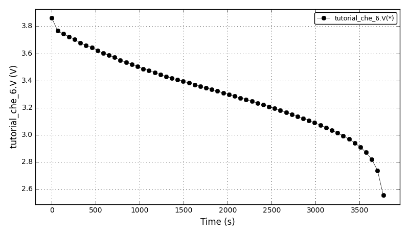
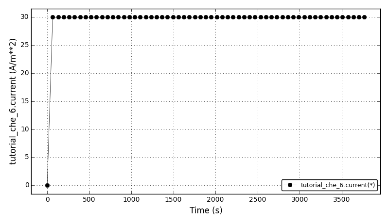

******************************
Chemical Engineering Examples
******************************
..
    Copyright (C) Dragan Nikolic
    DAE Tools is free software; you can redistribute it and/or modify it under the
    terms of the GNU General Public License version 3 as published by the Free Software
    Foundation. DAE Tools is distributed in the hope that it will be useful, but WITHOUT
    ANY WARRANTY; without even the implied warranty of MERCHANTABILITY or FITNESS FOR A
    PARTICULAR PURPOSE. See the GNU General Public License for more details.
    You should have received a copy of the GNU General Public License along with the
    DAE Tools software; if not, see <http://www.gnu.org/licenses/>.

.. begin-command

=======================   =================================================================
:ref:`tutorial_che_1`     |tce_1|
-----------------------   -----------------------------------------------------------------
:ref:`tutorial_che_2`     |tce_2|
-----------------------   -----------------------------------------------------------------
:ref:`tutorial_che_3`     |tce_3|
-----------------------   -----------------------------------------------------------------
:ref:`tutorial_che_4`     |tce_4|
-----------------------   -----------------------------------------------------------------
:ref:`tutorial_che_5`     |tce_5|
-----------------------   -----------------------------------------------------------------
:ref:`tutorial_che_6`     |tce_6|
-----------------------   -----------------------------------------------------------------
:ref:`tutorial_che_7`     |tce_7|
-----------------------   -----------------------------------------------------------------
:ref:`tutorial_che_8`     |tce_8|
=======================   =================================================================

.. |tce_1| replace:: Continuously Stirred Tank Reactor (CSTR) with energy balance and Van de Vusse reactions.

.. |tce_2| replace:: Binary distillation column model.

.. |tce_3| replace:: Batch reactor seeded crystallisation using the method of moments.

.. |tce_4| replace:: Solution of a discretized population balance using high resolution upwind schemes with flux limiter.
                     Effect of flux limiters on the quality of prediction (Case I).

.. |tce_5| replace:: Solution of a discretized population balance using high resolution upwind schemes with flux limiter.
                     Effect of flux limiters on the quality of prediction (Case II).

.. |tce_6| replace:: Model of a lithium-ion battery based on porous electrode theory as developed by John Newman and coworkers.

.. |tce_7| replace:: Steady-state Plug Flow Reactor (PFR) with energy balance and first order reaction.

.. |tce_8| replace:: Gas separation using a porous membrane on a metal support.
                     The model applies generalised Maxwell-Stefan equations to predict the fluxes and the selectivities.
                     The problem modelled is separation of CH4+C2H6 mixture on a zeolite (silicalite-1) membrane.

.. _tutorial_che_1:

Chem. Eng. Example 1
=====================

.. automodule:: daetools.examples.tutorial_che_1
   :no-members:
   :no-undoc-members:

.. rubric:: Files

=====================   =================================================================
Model report            `tutorial_che_1.xml <../examples/tutorial_che_1.xml>`_
Runtime model report    `tutorial_che_1-rt.xml <../examples/tutorial_che_1-rt.xml>`_
Source code             `tutorial_che_1.py <../examples/tutorial_che_1.html>`_
=====================   =================================================================

.. _tutorial_che_2:

Chem. Eng. Example 2
=====================

.. automodule:: daetools.examples.tutorial_che_2
   :no-members:
   :no-undoc-members:

.. rubric:: Files

=====================   =================================================================
Model report            `tutorial_che_2.xml <../examples/tutorial_che_2.xml>`_
Runtime model report    `tutorial_che_2-rt.xml <../examples/tutorial_che_2-rt.xml>`_
Source code             `tutorial_che_2.py <../examples/tutorial_che_2.html>`_
=====================   =================================================================

.. _tutorial_che_3:

Chem. Eng. Example 3
=====================

.. automodule:: daetools.examples.tutorial_che_3
   :no-members:
   :no-undoc-members:

.. rubric:: Files

=====================   =================================================================
Model report            `tutorial_che_3.xml <../examples/tutorial_che_3.xml>`_
Runtime model report    `tutorial_che_3-rt.xml <../examples/tutorial_che_3-rt.xml>`_
Source code             `tutorial_che_3.py <../examples/tutorial_che_3.html>`_
=====================   =================================================================

.. _tutorial_che_4:

Chem. Eng. Example 4
=====================

.. automodule:: daetools.examples.tutorial_che_4
   :no-members:
   :no-undoc-members:

.. rubric:: Files

=====================   =================================================================
Source code             `tutorial_che_4.py <../examples/tutorial_che_4.html>`_
Analytical solution     `fl_analytical.py <../examples/fl_analytical.html>`_
Flux limiters           `flux_limiters.py <../examples/flux_limiters.html>`_
=====================   =================================================================

.. _tutorial_che_5:

Chem. Eng. Example 5
=====================

.. automodule:: daetools.examples.tutorial_che_5
   :no-members:
   :no-undoc-members:

.. rubric:: Files

=====================   =================================================================
Source code             `tutorial_che_5.py <../examples/tutorial_che_5.html>`_
Analytical solution     `fl_analytical.py <../examples/fl_analytical.html>`_
Flux limiters           `flux_limiters.py <../examples/flux_limiters.html>`_
=====================   =================================================================

.. _tutorial_che_6:

Chem. Eng. Example 6
=====================

.. automodule:: daetools.examples.tutorial_che_6
   :no-members:
   :no-undoc-members:

The up to date version of the model is available at Raymond's GitHub repository:
`<https://github.com/raybsmith/daetools-example-battery>`_.

The voltage plot:

The current plot:

.. rubric:: Files

=====================   =================================================================
Model report            `tutorial_che_6.xml <../examples/tutorial_che_6.xml>`_
Runtime model report    `tutorial_che_6-rt.xml <../examples/tutorial_che_6-rt.xml>`_
Source code             `tutorial_che_6.py <../examples/tutorial_che_6.html>`_
=====================   =================================================================

.. _tutorial_che_7:

Chem. Eng. Example 7
=====================

.. automodule:: daetools.examples.tutorial_che_7
   :no-members:
   :no-undoc-members:

.. rubric:: Files

=====================   =================================================================
Model report            `tutorial_che_7.xml <../examples/tutorial_che_7.xml>`_
Runtime model report    `tutorial_che_7-rt.xml <../examples/tutorial_che_7-rt.xml>`_
Source code             `tutorial_che_7.py <../examples/tutorial_che_7.html>`_
=====================   =================================================================

.. _tutorial_che_8:

Chem. Eng. Example 8
====================

.. automodule:: daetools.examples.tutorial_che_8
   :no-members:
   :no-undoc-members:

.. rubric:: Files

=====================   =================================================================
Model report            `tutorial_che_8.xml <../examples/tutorial_che_8.xml>`_
Runtime model report    `tutorial_che_8-rt.xml <../examples/tutorial_che_8-rt.xml>`_
Source code             `tutorial_che_8.py <../examples/tutorial_che_8.html>`_
Membrane unit           `membrane_unit.py <../examples/membrane_unit.html>`_
Variable types          `membrane_variable_types.py <../examples/membrane_variable_types.html>`_
Membrane model          `membrane.py <../examples/membrane.html>`_
Support model           `support.py <../examples/support.html>`_
In/out compartment      `compartment.py <../examples/compartment.html>`_
=====================   =================================================================

.. end-command
